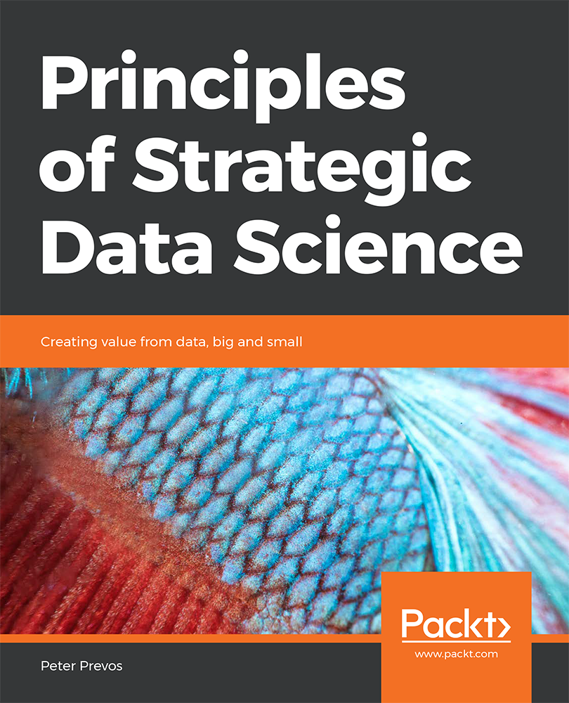
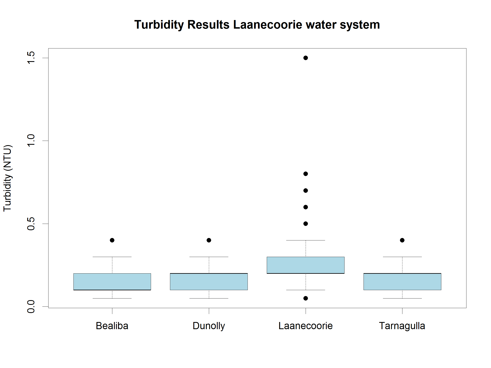
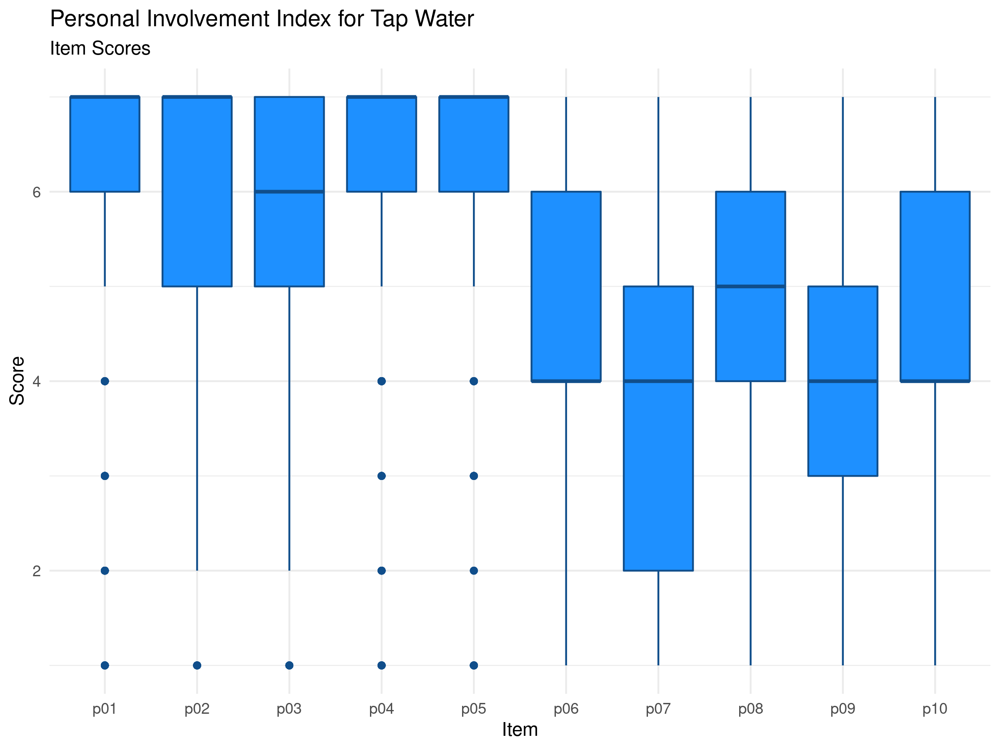
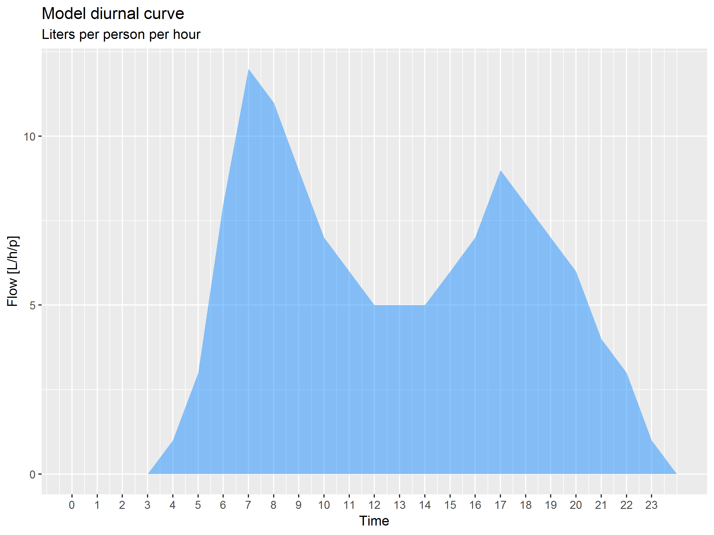
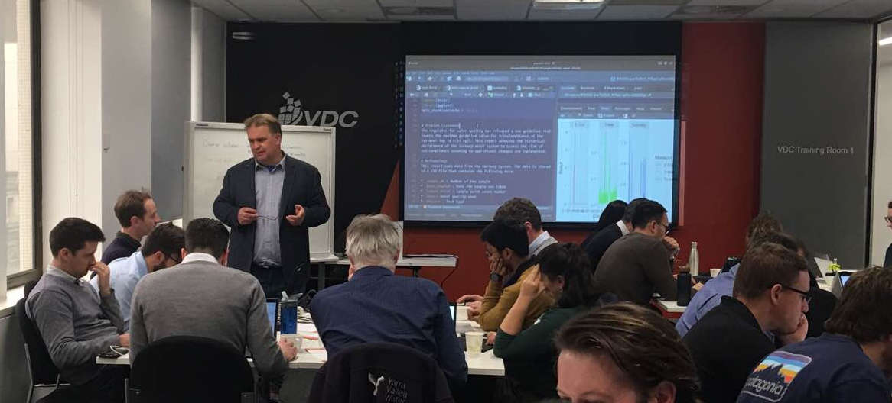

# R for Water Professionals {#introduction}
{width: "100%"}

Managing reliable water services requires not only a sufficient volume of water but also significant amounts of data. Water professionals continuously measure the flow and quality of water and asses how customers perceive their service. Water utilities are awash, or even flooded with data. Data professionals use data pipelines and data lakes and make data flow from one place to another.

Data and water are, as such, natural partners. Professionals in the water industry rarely directly interact with water or customers, but they are constantly analysing data that describes these realities. The purpose of collecting and analysing this data is to maintain or improve the level of service to customers and to minimise the impact on the natural environment.

Most professionals use spreadsheets to collect and analyse data and present the results. While these tools are convenient, they are not ideal when working with large and complex sets of data. Specialists in data analysis prefer to write code in one of the many available computing languages.

This course introduces water utility professionals to the [R language](https://en.wikipedia.org/wiki/R_(programming_language)) for data science. This language is one of the most popular and versatile tools among data scientists to create value from data.

The content of this course represents a steep learning curve because we take a deep dive into the functionalities of the R language. Just keep in mind that the steeper the leanring curve, the bigger to payoff!

This workshop is not an exhaustive introduction into data science programming but a teaser to inspire water professionals to ditch their spreadsheets and instead write code to analyse data. The best way to learn to solve problems with computer code is to start with practical examples and learn the principles as you progress through ever more complex cases.

This course only discusses the basics of using the R language with a limited scope. This course does not include advanced techniques such as machine learning. All data used in this course is tabular, text analysis and other unstructured data are not part of the curriculum.

The course consists of an introduction and three case studies. The introduction introduces the principles of data science within the context of managing a water utility. The three case studies look at water quality data, customer perception and digital metering data. The case studies are based on material previously published on [The Devil is in the Data](https://lucidmanager.org/data-science/), a blog about creating value and having fun with the R language.

Each of the case studies starts with a problem statement and introduces participants to the relevant aspects of the R language. Participants have to load, transform, explore and analyse the data to solve the stated problem.

## Introduction: Principles of Water Utility Data Science
The first session defines data science as an evolution of traditional analysis. The greater availability of data, enhanced computer capacity and tools to analyse this information have revolutionised the industry. 

This course is not only about the vocabulary and syntax of R but also about producing good data science. The second part of this session introduces a framework for best practice in analysing data and sharing the results. This framework derives from the book [Principles of Strategic Data Science](https://www.packtpub.com/big-data-and-business-intelligence/principles-strategic-data-science) by Peter Prevos. The three case studies each implement aspects of this framework.

{width: "25%", alt: "Principles of Strategic Data Science.", align: "middle"}

## Case Study 1: Introduction to the R Language --- Water Quality Regulations
This first session introduces the basics of the R language to undertake statistical analysis. Participants apply these skills to laboratory testing data from a drinking water network. The case study revolves around checking the data for compliance with water quality regulations.

{width: "80%", alt: "Distribution of turbidity results.", align: "middle"}

## The Tidyverse
The  is an extension of the R language that provides additional functionality to simplify manipulating, analysing and presenting data science. The fourth session delves into the basic principles of visualising data with the ggpot2 library of the Tidyverse, using data from the first case study.

## Case Study 2: Processing Data --- Understanding Customer Perception
The data for the second case study consists of the results of a survey of American consumers about their perception of tap water services. Participants use the Tidyverse to clean, transform and visualise this data.

{width: "80%", alt: "Consumer involvement with tap water.", align: "middle"}

## Data Products
The fifth session focuses on the data science workflow as an iterative process to solve a data problem. A data product is the result of a data science project, which can be a report, website or an application.

This session also introduces R Markdown as a tool to report on the results of a data science project. In this session, students prepare a report to summarise the impact of proposed changes to water regulations on the data in the first case study.

## Case Study 3: Creating Data Products --- Analysing Water Consumption
In the last case study, participants use the analytical functionalities of the Tidyverse to analyse data from smart meters to find anomalies in water consumption. 

{width: "80%", alt: "Digital metering diurnal curve.", align: "middle"}

## Participant Activities
Besides the case studies, the content of this course contains several activities for participants. These icons are used throughout the text to indicate these activities:

Q> Questions to apply the course content (The answers are available at the end of each lesson).

X> Tasks to undertake to progress the course.

D> Points of discussion for face-to-face workshops. If you follow the online version, then add your answer to the [course community](https://community.leanpub.com/c/r4h2o).

T> Tips and suggestions for further study.

## Face-to-Face Sessions
This course is occasionally also provided in face-to-face sessions. This one-day session covers the first case study and the chapters on ggplot visualisation and data products.

{width: "100%", alt: "R for Water Professionals workshop (Melbourne, 2019).", align: "middle"}

## Discussion Forum
This course includes a [discussion forum](https://community.leanpub.com/c/r4h2o) where participants can ask questions and share the results of their work to get feedback. 

X> Go to the discussion forum and introduce yourself. 

## Prerequisites
To participate in this workshop, you need to have some understanding of the issues surrounding water management. Experience with analysing data is also preferred. This course is designed with spreadsheet users in mind. Experience with writing computer code is helpful, but not required.

You also need access to a recent version of the R language and RStudio. RStudio is an IDE (Integrated Development Environment) that simplifies working with R and data. To install this software, follow these steps:

* Go to the [R Project download](https://cran.r-project.org/) site.
* Download the *base* version for your operating system.
* Install the software.
* Go to the [RStudio download page](https://www.rstudio.com/products/rstudio/download/).
* Download the installer for the free version for your operating system.
* Install the software.

You will also need to be able to install extensions of the R language through the package manager. If you are not using your own computer, check with the administrator to obtain this access.

Alternatively, you can sign-up for a free account to access the [cloud version](https://rstudio.cloud/) of R Studio. This account gives you full access to R Studio and R in your browser without the need to install any software. The cloud version is fully functional but not very fast. Installing R and RStudio on your laptop is the preferred method.

## Workshop materials
All resources for this workshop (text, images, code and data) are available on the [GitHub](https://github.com/pprevos/r4h2o/) website. GitHub is a repository for computer code and associated information for developers to share and collaborate.

You can download the documents by clicking on the 'clone or download' button and extract the files to your computer. You can open the RStudio project file to begin the workshop and start playing with the data and code.

If you use Git, then fork or clone the repository. Feel free to create an issue or pull request if you find errors or like to provide additional content.

For those using the cloud version of RStudio, click on the arrow next to the 'New Project' button and select 'New Project from GitHub Repo'. Copy the URL ([`https://github.com/pprevos/r4h2o/`](https://github.com/pprevos/r4h2o/)) to the text field and hit enter. After a little while, RStudio opens the project.

The repository contains several folders:
* The `manuscript` folder source files of the course text, images and videos.
* The `basicr` and case study folders contain the data and code for each of the chapters.

The [next chapter](#datascience) introduces the principles of data science and presents a framework for good data science. This framework forms the foundation of the case studies.
