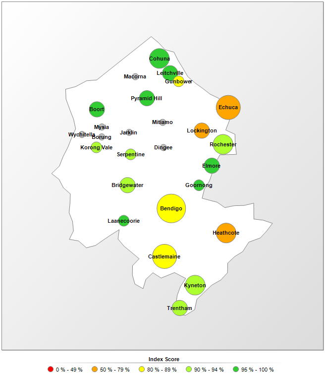

# R for Water Professionals {#introduction}
{width: "100%"}

Managing reliable water services requires not only a sufficient volume of water but also significant amounts of data. Water professionals continuously measure the flow and quality of water and asses how customers perceive their service. Water utilities are awash, or even flooded with data. Data professionals use data pipelines and data lakes and make data flow from one place to another.

Data and water are, as such, natural partners. Professionals in the water industry rarely directly interact with water or customers, but they are constantly analysing data that describes these realities. The purpose of collecting and analysing this data is to maintain or improve the level of service to customers and to minimise the impact on the natural environment.

Most professionals use spreadsheets to work with data. While these tools are handy, they are not ideal when working with large and complex sets of data. Specialists in data analysis prefer to write code in one of the many available computing languages. 

This course introduces water utility professionals to the [R language](https://en.wikipedia.org/wiki/R_(programming_language)) for statistical computing. This language is one of the most popular and versatile tools among data scientists to create value from data.

This workshop is not an exhaustive introduction into data science programming but a teaser to inspire water professionals to ditch their spreadsheets and start writing code to analyse data. The best way to learn to solve problems with code is to solve these problems and learn as you need new skills.

This course only discusses the basics of using the R language with a limited scope. This course does not include advanced techniques such as machine learning. All data used in this course is tabular, text analysis and other unstructured data are not part of the curriculum.

The course consists of seven sessions and a capstone project. The first session introduces the principles of data science within the context of managing a water utility. Following a case-study approach, this course includes three realistic water management problems. The case studies are based on mterial previosly published on [The Devil is in the Data](https://lucidmanager.org/data-science/) blog, a blog about creating value and having fun with the R language.

The case studies start with a problem statement and introduce participants to the relevant aspects of the R language. Participants have to load, transform, explore and analyse the data to solve the problem. The course closes with a capstone project where participants develop a water quality dashboard.

## Introduction to Water Utility Data Science
The first session defines data science as an evolution of traditional analysis. The greater availability of data, enhanced computer capacity and tools to analyse this information have revolutionised the industry. The second part of this session introduces a framework for best practice in data science.

The content of this session is based on the ebook *Principles of Strategic Data Science*. Participants of this course can download a [discounted copy](http://leanpub.com/strategic_data_science/c/r4h2o) of this book.

{width: "25%", alt: "Principles of Strategic Data Science."}

## Case Study 1: Introduction to the R Language --- Water Quality Regulations
This first session introduces the basics of the R language to undertake simple statistical analysis. Participants apply these skills to laboratory testing data from a drinking water network. The case study revolves around checking the data for compliance with water quality regulations.

{width: "80%", alt: "Distribution of turbidity results.", align: "middle"}

## Case Study 2: Processing Data --- Understanding Customer Perception
The Tidyverse is an extension of the R language that provides additional functionality to simplify analysing manipulating and data. In the second session, participants learn how to clean and explore data.

The case study for this data are the results of a survey among American consumers about their perception of water services. Participants use this data set to clean, transform and visualise the data.

{width: "80%", alt: "Consumer involvement with tap water.", align: "middle"}

## Case Study 3: Creating Data Products --- Analysing Water Consumption
In the last session, participants learn about the data science workflow and creating data products for end-users. Participants analyse an extensive data set to find anomalies in water consumption. This session closes with an introduction to literate programming to present results.

The case study for this session is smart meter data for a simulated
water system, including leaks and other anomalies.

{width: "80%", alt: "Digital metering diurnal curve.", align: "middle"}

## Capstone project
The capstone project involves developing a water quality dashboard for the Board of Directors of a water utility. The capstone project includes a problem statement, data sets and guidance on how to complete this challenge.

The capstone can be completed in many different ways, so participants need to use other resources to learn new techniques in the R language. The capstone chapter explains how to use the extensive help functionality within R and the best way to find assistance online.

The course closes with references to free and paid resources to systematically learn how to apply the R language.

{width: "50%", alt: "Water Quality Index.", align: "middle"}

## Participant Activities
Besides the case studies, the content of this course contains several activities for participants. These icons are used throughout the text to indicate these activities:

Q> Questions (The answers are available at the end of each lesson).

X> Tasks.

D> Points of discussion for face-to-face workshops. If you follow the online version, then you can add your answer to the course community.

T> Optional additional information to consider.

Each case study ends with a multiple-choice quiz for participants to test their knowledge and skills. Participants that achieve a score of 80% or higher receive a PDF certificate for this course.

## Prerequisites
To participate in this workshop, you need to have some understanding of the issues surrounding water management. Experience with analysing data is also preferred. This course is designed with spreadsheet users in mind. Experience with writing computer code is helpful, but not required. 

You also need access to a recent version of the R language and RStudio. RStudio is an IDE (Integrated Development Environment) that simplifies working with R and data. To install this software, follow these steps:

* Go to the [R Project download](https://cran.r-project.org/) site
* Download the *base* version for your operating system (approximately 80 megabytes)
* Install the software
* Go to the [RStudio download page](https://www.rstudio.com/products/rstudio/download/)
* Download the installer for the free version for your operating system
* Install the software

Alternatively, you can sign-up for a free account to access the [cloud version](https://rstudio.cloud/) of R Studio. This account gives you full access to R Studio and R in your browser without the need to install any software. The cloud version is fully functional but not very fast. Installing R and RStudio on your laptop is the preferred method.

## Workshop materials
All resources for this workshop are available on the [GitHub](https://github.com/pprevos/r4h2o/) website. GitHub is a repository for computer code and associated information for developers to share and collaborate.

You can download the documents by clicking on the 'clone or download' button and extract the files to your computer. You can open the RStudio project file to begin the workshop and start playing with the data and code.

If you use Git, then fork or clone the repository. Feel free to create an issue or pull request if you find errors or like to provide additional content.

For those using the cloud version of RStudio, click on the arrow next to the 'New Project' button and select 'New Project from GitHub Repo'. Copy the URL ([`https://github.com/pprevos/r4h2o/`](https://github.com/pprevos/r4h2o/)) to the text field and hit enter. After a little while, RStudio opens the project.

The repository contains several folders:
* The manuscript folder source files of the course text, images and videos.
* The session folders contain the data and code for each of the sessions and case studies.

The [next chapter](#datascience) introduces the principles of data science and presents a framework for good data science.
