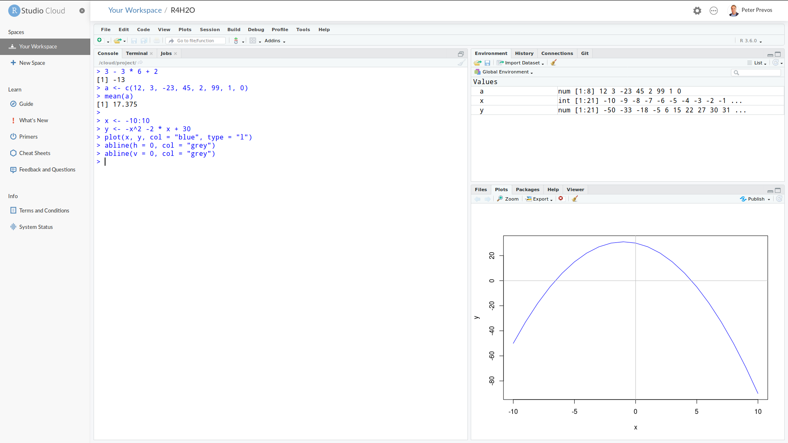

# Introduction to the R Language {#basics}
R is a programming language for statistical computing and visualisation. This language is developed and maintained through the [R Foundation for Statistical Computing](https://www.r-project.org/foundation/). The R software is open source, which means that anyone can freely download, use, modify and share the software. The open source model relies on communities of developers that continuously improve the software.

Open source software is free. Not free as in free beer, but free as in [freedom](https://www.gnu.org/philosophy/free-sw.html). The people developing open source software also need to be paid, and most projects are not-for-profit organisations funded by organisations that use the software commercially. If your organisation uses R commercially, then I highly recommend considering supporting the R Foundation.

The R language is one of the most popular tools for analysing data. This language includes advanced mathematical capabilities, missing from general-purpose languages. This language also has extensive built-in visualisation capabilities. Furthermore, R can be integrated with many other data science software systems, such as *Power BI*, *Tableau*, *Mathematica*, *MATLAB* and do so on.

The name statistical programming is deceptive. The R language can facilitate almost every type of analysis, from basic mathematics to text analysis, spatial pattern recognition and everything else you might need to create value from data. R is the Swiss army chainsaw of data tools.

This session only gives a cursory overview of the R language with just enough theory to work on the case study. To get the most value out of this session you should spend some time playing with the functionality that is explained to ensure you have a good grasp of the basics.

## Basic principles of a programming language
Hollywood movies often portray programmers as smart geeks with minimal social skills. This archetype of the computer geek does not do justice to reality and causes people to hold the incorrect belief that writing computer code is beyond their skills.

In simple terms, a computer program is a set of instructions to transforms input into output. This might sound complex and abstract, but that is exactly what you do in a spreadsheet. Analysing data with a spreadsheet is also about writing code. Spreadsheet instructions are not sequential, which is one of the greatest issues with this software.

A computer language just like a human language that consists vocabulary, grammar and context. In computing therms this is the syntax. Computer language syntax is generally distinguished into three levels:
* Words: The functions of a language.
* Phrases: The grammar of computer code.
* Context: Do the instructions make sense?

The biggest problem with writing code is that the computer will execute your instructions exactly as they are written. When the results of your analysis don't make sense or don't work at all, blame yourself and not the language or the computer. Even a tiny mistake, such as a misplaced bracket, will cause the program to fail.

Another important aspect in writing code is that there are many ways to solves a problem. Just like there are many ways to say the same thing in natural language, a data scientist needs to make lots of decisions on how to solve a problem.

Although there is no right or wrong method to solve a problem, some methods are better than others. Firstly, code needs to be optimised to run fast. Some of the methods are slower than other methods, or they require a lot more memory. The solutions provided in this course are as such opinionated in that they are just one way to solve the problem. This course is not concerned with optimisation because the data sets are small.

Computer code also needs to be elegant, it needs to be easy to read and to follow by another person who might want to reuse your amazing solution. Computer science guru Donald Knuth said in this respect that computer code is a lot like poetry. The session about [data products](#dataproducts) delves a bit deeper into writing elegant code.

## Understanding code
This course contains code examples that are not explained in excruciating detail. To understand how the code functions, you need to reverse-engineer it. Looking at existing code and figuring out how it works is a productive method to learn the R language.

The best way to reverse-engineer code is to execute each line separately and inspect the intermediate results. Another simple technique is to run parts of complex statements or change the options in a statement to see the difference.

Only if you understand the parts can you grasp the whole. The best way to learn how to write code is to play!

Just like learning a human language, studying a computer language means that you need to memorise the vocabulary and grammar (syntax). While mastering the syntax of R might seem daunting, the RStudio development environment helps you with writing code.

## Using R and RStudio
The best way is to use R in combination with an *Integrated Development Environment* (IDE). The most popular IDE for the R language is [RStudio](https://rstudio.com/). This software is also an open source project, with free and paid versions. 

An Integrated Development Environment is a software application with comprehensive functionality for developing software. An IDE typically consists of a source code editor, automation tools, and functionality to simplify writing and running code.

X> Before you continue, make sure you have access to R and RStudio and have downloaded the course files from GitHub.

When you open RStudio for the first time, the window is divided into three panes, each with various tabs. The left pane is the console. The top right pane shows the system environment and the one below that shows a list of files and folders (Figure 2.1).

You can change the default fonts and colours in the *Tools > Global Options > Appearance* menu. Most developers prefer a dark theme with light text because it is more gentle on the eyes than a stark white background. You can also set default font size and magnification to your liking.

X> Open the appearance menu and change the settings to your personal preferences.

{width: 100%}


## Basics of R
Now we are ready to write some code. Move your cursor to the console and type the code examples listed below. Don't copy and paste them because typing the code develops your muscle memory for the R syntax and you some of the experience the features of the text editor.

The `>` sign at the start of each line is the prompt to tell you where the cursor is at. The prompt is not included in any of the examples below.

X> Type the following code, or variations thereof into the console and review the results.

{format: r, line-numbers: false}
```r
3 - 3 * 6 + 2

a <- c(12, 3, -23, 45, 2, 99, 1, 0)
mean(a)

x <- -10:10
y <- -x^2 -2 * x + 30

plot(x, y, type = "l", col = "blue")
abline(h = 0, col = "grey")
abline(v = 0, col = "grey")
```

The video below explains the basic principles of RStudio.

{width: 100%}


In its most basic form, R is a calculator that uses arithmetic operators as listed in the table below.

| Operator | Function       | Example        |
| :---:    | :---           | :---           |
|----------|----------------|----------------|
| +        | Addition       | `6 + 5 = 11`$  |
| -        | Subtraction    | `6 - 5 = 1`$   |
| *        | Multiplication | `6 * 5 = 30`$  |
| /        | Division       | `6 / 5 = 1.2`$ |
| ^        | Exponentiation | `6^5 = 7776`$  |
| %%       | Modulo         | `6 mod 5 = 1`$ |

Variables are the basic building blocks of computational analysis. A variable can store numbers, text, image, matrix or any other kind of information that needs to be analysed. In a spreadsheet, a variable is a cell or a group of cells.

You can give variables any name you like, as long as they only contain letters, numbers, dots and underscores. When you name a variable, try to give a meaningful noun that describes its content.

R uses the `<-` operator to assign values to a variable, for example `a <- 6` assigns the number 6 to the variable `a`, `a <- "R"` assigns the letter R to the variable `a`.

Vectors are the last important principle in R. A vector is a sequence of values, which can be defined with the `c()` function, as shown in the example. The colon is a shortcut to creating a vector of integers. The two expressions `1:3` and `c(1, 2, 3)` have the same result.

Functions are the powerhouse of R. In basic terms, a function converts the input to an output. Simple function parameters undertake mathematical operations such as mean, median, square root, and so on. Functions can also perform complex tasks such as visualising and analysing data. A function is indicated with a word and empty brackets, such as `sqrt()` to determine the square root of a number or variable, e.g. `sqrt(25)`.

Functions or mathematical operators can be applied to single numbers and to vectors. This makes it easy to apply a mathematical operation to a large set of numbers with one line of code. You can, for example, run `sqrt(c(1, 4, 9, 16, 25))` to obtain a new vector with the square roots of these five numbers.

The table below shows some of the mathematical operators available in R.

| Function           | Operation   |
|--------------------|-------------|
| `abs(x)`           | `abs{x}`$   |
| `exp(x)`           | `e^x`$      |
| `factorial(x)`     | `x!`$       |
| `log(x, base = b)` | `log _b x`$ |
| `sqrt(x)`          | `x^2`$      |
	
This example code demonstrates some basic features of the language. The first line is a simple, arithmetic problem. After you hit enter, R displays the answer below the line.

The next two lines define the variables `x` and `y`. The values -10 to + 10 are assigned (`<-`) to variable `x`. The `y` variable is given the value of `x^2`$.

The `sum()` function adds all the members of the `x` vector. The `length()` function determines the number of elements in a vector.

The third part plots the variables `x` and `y` as a line, showing the parabola in the plot window. Without the `type = "l"` parameter, the plot consists of points.

X> Try the same plot without the `type` parameter, or with `type = "b"` and review the difference.

The variable `a` is assigned a vector of eight numbers using the `c()` function. The `mean()` function shows the arithmetic mean of the vector `a`. Some other arithmetic function in R are:

| Function    | Operation                                 |
|-------------|-------------------------------------------|
| `sum(x)`    | Sum of all elements in the vector `x`     |
| `prod(x)`   | Product of all elements in the vector `x` |
| `min(x)`    | Minimum value of vector `x`               |
| `max(x)`    | Minimum value of vector `x`               |
| `median(x)` | median value of vector `x`                |

Q> Apply the functions in the previous two tables to the following vector and inspect the result: `c(12, 3, -23, 45, 2, 99, 1, 0)`.

You should notice a few things when you start typing:
* When you hit enter, the result of any expressions without the assignment symbol (`<-`) is shown in the console.
* When you type `plot()`,  `mean()`, or other functions, RStudio gives you suggestions on how to continue.
* When typing brackets or quotation marks, RStudio includes the closing bracket or quotation mark.
* The variables you declared (`x`, `y` and `a`) are shown in the Environment window.
* The plot appears in a tab of the bottom-right window.

Now retype the plot command, but only type the first two letters and then hit the TAB key. R now gives you suggested functions that start with `pl`. You can use the cursor keys to select the plot function. You can continue this way, and R guides you through the function. This functionality is great for when you forget the specific syntax when writing code.

Another useful function of the console is to use the arrow keys to repeat or modify previous commands.

### Quiz 1
Now it is your turn to play with the basic syntax of R and functionality of RStudio. The answers are at the end of this chapter.

You need to measure the flow in a rural channel with a rectangular weir. You take three measurements: 125, 100, and 50mm. The width of the weir is 300mm. To calculate the flow, use a simplified version of the Kindsvater-Carter rectangular weir equation ([ISO 1438: 2017](https://www.iso.org/standard/66463.html)):

```$
q = \frac{2}{3} C_d \sqrt{(2g)} bh^{(3/2)}
```

- `q`$: Flow rate (m^3^/s).
- `C_d`$: Discharge constant (assume 0.6).
- `g`$: Gravitation (9.81 m/s^2^).
- `b`$: Width of the weir [m].
- `h`$: Measured head at the weir [m].

The value for `C_d`$ is approximated because it depends on the dimensions of the weir. Follow [this link](https://www.engineeringexcelspreadsheets.com/tag/kindsvater-carter-formula/) for a detailed discussion on using this formula. The photo below shows what such a weir looks like in practice. 

{width: 100%}


{quiz, id: channel, attempts: 10}
You are processing measurements from a channel operator and need to calculate various flow rates. You can use the Kindsvater-Carter formula: 

```$
q = \frac{2}{3} C_d \sqrt{(2g)} bh^{(3/2)}
```

The discharge factor `C_d = 0.6`$. 

The gravity constant `g = 9.81 m/s^2`$.

The width of the weir `b = 0.6m`$.

One megalitre is one million litres (1000 cubic metres). This is a unit of volume measurement commonly used in Australia.


Answer the quiz questions below with this information. Remember to use the arrow button to retrieve previous commands. 

? What is the flow in the channel in megalitres per day when the height `h = 100mm`$?

A) 2.9045 ML
b) 0.033 ML
c) 121.02 ML

? What is the average flow for these three heights: 150mm, 136mm, 75mm in litres per second? Ensure that you only use the formula once by using a vector for the data.

a) 0.0456
b) 394.30
C) 45.637

? Which of these expressions calculates the flow in cubic meters per second for all heights (`h`$) between 50mm and 500mm? 

a) `(2/3) * Cd * sqrt(2 * 9.81) * b * (0.05:0.50)^(3/2)`
B) `(2/3) * Cd * sqrt(2 * 9.81) * b * ((50:500)/1000)^(3/2)`
c) Repeat for each value of `h`$: `(2/3) * Cd * sqrt(2 * 9.81) * b * h^(3/2)`
 
You can find the answers are in the `channel.R` script in the `basicr` folder.
{/quiz}

## RStudio scripts and projects
The console provides a running record of the actions taken by R. While this is great, using the console makes it hard to reconstruct what steps you have taken to get to your result. To create reproducible code, you need to write your code in a file. 

Create a new R script by going to *File > New File > R Script* or by hitting Control-Shift N. You can open an existing file from the same menu.

X> Review the code in the `channel.R` file in the `basicr` folder.

When you hit enter within a script, nothing happens. To execute a line of code in the editor, you need to type Control-Enter. When you hit the Source button to run all code in the script. Note that you don't have to use the `print()` function to show results. 

A project is a set of files that relate to each other. RStudio projects divide your work into multiple contexts, each with their own working directory, workspace, history, and source documents. Every time you open a project file, it will be in the same state where you left it when you last closed the program. There are several ways to open a project:

* Open Project command (File menu or Projects toolbar) to browse for and select an existing project file (e.g. `r4h2o.Rproj`).
* Selecting a project from the list of most recently opened projects (also available from both the File menu and toolbar).
* Double-clicking on the project file within Windows Explorer, OSX Finder, or another file manager.

After you open this file, you see the relevant files in the bottom-left window. When you close the project after this session, all variables, the history of your commands and open files are stored for use in a later session.

X> Review the function at the end of the channel script. Can you reverse-engineer and understand the code?

### Finding help
The R language has a built-in help function for every function. For example, type `help(mean)` to learn everything about the mean function. One of the weaknesses of R is that the help files can be quite cryptic to beginning users.

The first section describes the function in words. The second section shows how to use the function. The arguments of the function are listed in the third section.

The following sections in the help function provide background information and links to other similar functions. Most help entries also show examples that help you to reverse-engineer the functionality.

X> Open the help file for the `plot()` function. How do you plot a function with dots and lines? 

X> Plot the flow values calculated in the quiz and plot them.

## Answers
These are the answers to the questions in this chapter.

### Apply functions to the vector `a`
These are only some of the mathematical functions available in R. When you enter these, make sure you understand the output.

{format: r, line-numbers: false}
```R
a <- c(12, 3, -23, 45, 2, 99, 1, 0)

abs(a)
exp(a)
factorial(a)
log(a, base = 10)
sqrt(a)
sum(a)
prod(a)
min(a)
max(a)
```
