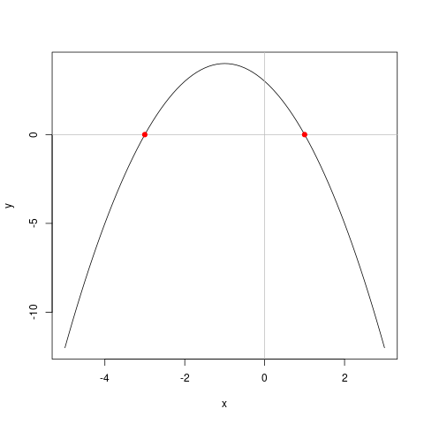

# Introduction to the R Language {#basics}
R is a programming language for statistical computing and visualisation. This language is developed and maintained through the [R Foundation for Statistical Computing](https://www.r-project.org/foundation/). The R software is open source, which means that anyone can freely download, use, modify and share the software. The open source model relies on communities of developers that continuously improve the software.

Open source software is free. Not free as in free beer, but free as in [freedom](https://www.gnu.org/philosophy/free-sw.html). The people developing open source software also need to be paid, and most projects are not-for-profit organisations funded by organisations that use the software commercially. If your organisation uses R commercially, then I highly recommend considering supporting the R Foundation.

The R language is one of the most popular tools for analysing data. This language includes advanced mathematical capabilities, missing from general-purpose languages. This language also has extensive built-in visualisation capabilities. Furthermore, R can be integrated with many other data science software systems, such as *Power BI*, *Tableau*, *Mathematica*, *MATLAB* and do so on.

The name statistical programming is deceptive. The R language can facilitate almost every type of analysis, from basic mathematics to text analysis, spatial pattern recognition and everything else you might need to create value from data. R is the Swiss army chainsaw of data tools.

This session only gives a cursory overview of the R language with just enough theory to work on the case study. To get the most value out of this session you should spend some time playing with the functionality that is explained to ensure you have a good grasp of the basics.

## Using R and RStudio
The best way is to use R in combination with an *Integrated Development Environment* (IDE). The most popular IDE for the R language is [RStudio](https://rstudio.com/). This software is also an open source project, with free and paid versions. 

An Integrated Development Environment is a software application with comprehensive functionality for developing software. An IDE typically consists of a source code editor, automation tools, and functionality to simplify writing and running code.

X> Before you continue, make sure you have access to R and RStudio and have downloaded the course files from GitHub.

When you open RStudio for the first time, the window is divided into three panes, each with various tabs. The left pane is the console. The top right pane shows the system environment and the one below that shows a list of files and folders (Figure 2.1).

You can change the default fonts and colours in the *Tools > Global Options > Appearance* menu. Most developers prefer a dark theme with light text because it is more gentle on the eyes than a stark white background. You can also set default font size and magnification to your liking.

X> Open the appearance menu and change the settings to your personal preferences.

{width: 100%}


## Basics of R
Now we are ready to write some code. Move your cursor to the console and type the code examples listed below. Don't copy and paste them because typing the code develops your muscle memory for the R syntax and you some of the experience the features of the text editor.

X> Type the following code, or variations thereof into the console and review the results.

{format: r, line-numbers: false}
```r
3 - 3 * 6 + 2

x <- -10:10
y <- x^2

sum(x)

plot(x, y, type = "l")

a <- c(12, 3, 23, 45, 2, 99, 1, 0)
mean(a)

a * 2
```

In its most basic form, r is a calculator that uses the following arithmetic operators:
* `+`: Addition
* `-`: Subtraction
* `*`: Multiplication
* `/`: Division
* `^`: Exponentiation (rasing to a power)
* `%%`: Modulo (division without remainder)

Variables are the basic building blocks of computational analysis. A variable can store numbers, text, image, matrix or any other kind of information that needs to be analysed.

R uses the `<-` operator to assign values to a variable, for example `a <- 6` assigns the number 6 to the variable `a`, `a <- "R"` assigns the letter R to the variable `a`.

Vectors are the last important principle in R. A vector is a sequence of values, which can be defined with the `c()` function, as shown in the example. The colon is a shortcut to creating a vector of integers. The two expressions `1:3` and `c(1, 2, 3)` have the same result.

Functions are the powerhouse of R. In basic terms, a function converts the input to an output. Simple function parameters undertake mathematical operations such as mean, median, square root, and so on. Functions can also perform complex tasks such as visualising and analysing data. A function is indicated with a word and empty brackets, such as `sqrt()` to determine the square root of a number or variable, e.g. `sqrt(25)`.

Functions or mathematical operators can be applied to vectors. This makes it easy to apply a mathematical operation to a large set of numbers with one line of code.

{type: video, align: middle, poster: "https://www.youtube.com/watch?v=roTCgjxpMEg/mqdefault.jpg"}


This example code demonstrates some basic features of the language. The first line is a simple, arithmetic problem. After you hit enter, R displays the answer below the line.

The next two lines define the variables `x` and `y`. The values -10 to + 10 are assigned (`<-`) to variable `x`. The `y` variable is given the value of `x^2`$.

The `sum()` function adds all the members of the `x` vector. The `length()` function determines the number of elements in a vector.

The third part plots the variables `x` and `y` as a line, showing the parabola in the plot window. Without the `type = "l"` parameter, the plot consists of points.

X> Try the same plot without the parameter, or with `type = "b"`.

The variable `a` is assigned a vector of eight numbers using the `c()` function. The `mean()` function shows the arithmetic mean of the vector `a`.

Q> Determine the total of this vector using the `sum()` function.

You should notice a few things when you start typing:
* When you hit enter, the result of the expressions without the `<-` symbol is shown in the console
* When you type plot and mean, R gives you suggestions on how to continue
* When typing brackets or quotation marks, RStudio includes the closing bracket or quotation mark
* The variables you declared (`x`, `y` and `a`) are shown in the Environment window
* The plot appears in a tab of the bottom-right window.

Now retype the plot command, but only type the first two letters and then hit the TAB key. R now gives you suggested functions that start with `pl`. You can use the cursor keys to select the plot function. You can continue this way, and R guides you through the function. This functionality is great for when you forget the specific syntax when writing code.

Another useful function of the console is to use the arrow keys to repeat or modify previous commands.

Now it is your turn to play with the basic syntax of R and functionality of RStudio. The answers are at the end of this chapter.

Q> Produce a plot of the function `y=-x^2-2x+3`$.

The formula for determining where the parabola intersects the x-axis is:

```$
x = \frac{-b \pm \sqrt{b^2 - 4ac}}{2a}
```

Q> Use the quadratic formula in the R console. Where does this parabola intersect with the x-axis?

## RStudio scripts and projects
The console provides a running record of the actions taken by R. While this is great, using the console makes it hard to reconstruct what steps you have taken to get to your result. To create reproducible code, you need to write your code in a file. 

Create a new R script by going to *File > New File > R Script* or by hitting Control-Shift N.

X> Add the same code as above in the script.

When you hit enter within a script, nothing happens. To execute a line of code in the editor, you need to type Control-Enter. When you hit the Source button to run all code in the script.

A project is a set of files that relate to each other. RStudio projects divide your work into multiple contexts, each with their own working directory, workspace, history, and source documents. Every time you open a project file, it will be in the same state where you left it when you last closed the program. There are several ways to open a project:

* Open Project command (File menu or Projects toolbar) to browse for and select an existing project file (e.g. `r4h2o.Rproj`).
* Selecting a project from the list of most recently opened projects (also available from both the File menu and toolbar).
* Double-clicking on the project file within Windows Explorer, OSX Finder, or another file manager.

X> Open the project file for this course.

After you open this file, you see the relevant files in the bottom-left window. When you close the project after this session, all variables, the history of your commands and open files are stored for use in a later session.

## Answers
These are the answers to the questions in this chapter.

### Determine the total of this vector using the `sum()` function
Most R functions take a vector as a parameter.

{format: r, line-numbers: false}
```R
a <- c(12, 3, 23, 45, 2, 99, 1, 0)
sum(a)
```

### Produce a plot of the function `y=-x^2-2x+3`$.
To plot this function, we can use the same approach as in the example, with some enhancement.

{format: r, line-numbers: false}
```R
x <- seq(-5, 3, .1)
y <- -x^2 - 2 * x + 3
plot(x, y, type = "l")
```

This code uses the `seq()` function to create a smoother line than an integer sequence (`-5:3`). This function creates a vector from -5 to 1 with steps of 0.1.

The formula for determining where the parabola intersects with the x-axis is:

```$
x = \frac{-b \pm \sqrt{b^2 - 4ac}}{2a}
```

### Use the quadratic formula in the R console. Where does this parabola intersect with the x-axis?
We can assign the appropriate numbers to the variables `a`$, `b`$ and `c`$ and enter them into the formula.

We can enhance the basic plot to visualise the solution. The `abline()` function adds a horizontal and vertical grey line to indicate the axes. The `points()` function adds red points at the calculated intersects. Both functions add elements to an existing plot instead of creating a new one.

{format: r, line-numbers: false}
```
a <- -1 
b <- -2
c <- 3

x1 <- (-b + sqrt(b^2 - 4 * a * c)) / (2 * a)
x2 <- (-b - sqrt(b^2 - 4 * a * c)) / (2 * a)

abline(h = 0, col = "grey")
abline(v = 0, col = "grey")
points(c(x1, x2), c(0, 0), col = "red", pch = 19)
```

{width: 50%}


Now it is time to apply these basic skills to the first [case study](#casestudy1).
