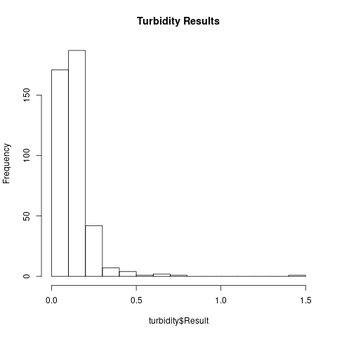
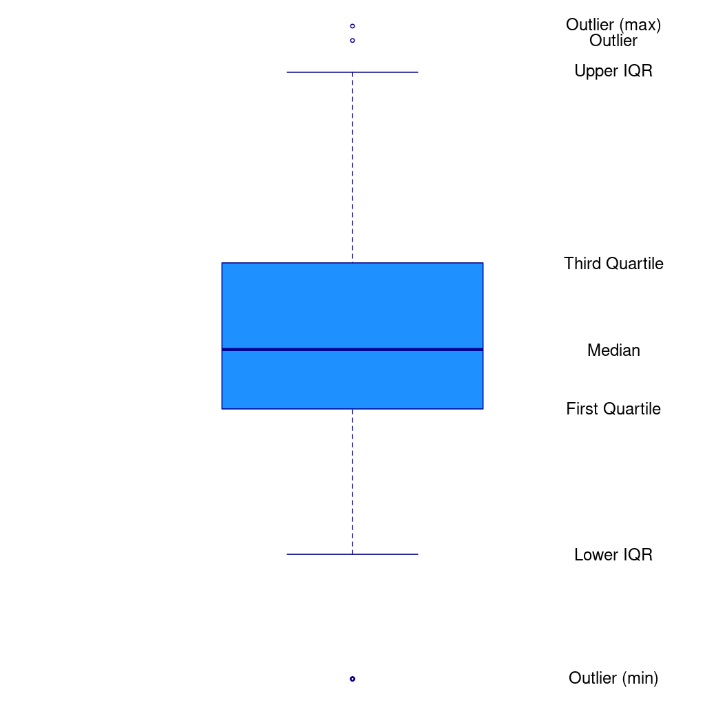

# Case Study: Water Quality Regulations {#casestudy1}
The case study for this first session is about assessing compliance with water quality regulations. The data for this case study is a set of turbidity measurements for the [Laanecoorie water network](https://www.coliban.com.au/site/root/your_town/loddon/laanecoorie.html), situated just over 100 km North of Melbourne in Victoria, Australia. The plant extracts water from the Laanecoorie reservoir, located on the Loddon River.

The water network is divided into four zones, each of which has a set of sample points installed just upstream of the water meter. Each of these sample points has a unique identifier that consists of three digits (090 for the Laanecoorie system), a letter to indicate the zone, and two digits to indicate the number of the sample point.

The laboratory service provider regularly samples these taps and tests the water for a range of parameters, including turbidity. All turbidity measurements are recorded for a specific sample point at a certain date. The data set is already cleaned and is ready for analysis.

The states of Australia each have their own water quality regulations. The state regulations refer to the federal [Australian Drinking Water Quality Guidelines](https://www.nhmrc.gov.au/about-us/publications/australian-drinking-water-guidelines).

The Victorian regulations for water quality, the [Safe Drinking Water Regulations](https://www2.health.vic.gov.au/public-health/water/drinking-water-in-victoria/drinking-water-legislation) 2015, specify that "the 95^th^ percentile of results for samples in any 12 months must be less than or equal to 5.0 Nephelometric Turbidity Units".

In a separate [guidance document](https://www2.health.vic.gov.au/Api/downloadmedia/%7BA1F6D255-D5C7-4B7E-AAE5-8B7451EDE81A%7D), the Victorian regulator also specifies that the percentile for turbidity should be calculated with the 'Weibull Method'.

## Turbidity
Turbidity is a measurement of the cloudiness of the water. In drinking water, the higher the turbidity level, the higher the risk that consumers develop gastrointestinal diseases. Particles in the water scatter light, which is used to measure turbidity with a nephelometer (from the Greek nephéla, "cloud"). Turbidity is expressed in dimensionless Nephelometric Turbidity Units (NTU). The video below gives a detailed overview of how to measure turbidity in liquids.

{type: video, align: middle, poster: "https://www.youtube.com/watch?v=qz8xHQJw6qY/mqdefault.jpg"}

    
## Problem Statement
You are writing the annual report to the regulator about the Laanecoorie system. What was the 95^th^ percentile of turbidity for each of the water zones in the system?

## Methodology
Good data science needs to be valid and reliable. The validity and reliability of the measurements in this case study relate to the design, installation and maintenance of the instrument to measure turbidity.

The soundness of good data science also requires an appropriate methodology to analyse the data. This case study has some specific requirements concerning how to analyse the data. The guidance document from the regulator raises two questions: What is the Weibull method? How do you implement this method in R?

The process to determine a percentile consists of three steps (McBride, [2005](http://amzn.to/2k8shr8)):

1. Rank the data into ascending order (`X_1, X_2, \ldots , X_n`$).
2. Determine the rank (`r`$) of the percentile.
3. The percentile is the value in position `r`$. When the rank is not an integer, interpolate between two values `X_{r-1}`$ and `X_{r+1}`$.

With 52 ranked weekly turbidity samples, the 95^th^ percentile is between sample 49 and 50 (`0.95 \times 52`$). However, this method is only valid for normally-distributed samples. 

Statisticians have defined several methods to determine percentiles. The difference between these methods is the method to determine the rank `r`$. Hyndman & Fan ([1996](https://www.researchgate.net/publication/222105754_Sample_Quantiles_in_Statistical_Packages)) give a detailed overview of nine methods of calculating percentiles or quantiles. This paper gives the Weibull method the less poetic name `\hat{Q}_6(p)`$ because it is the sixth option in their list. Waloddi Weibull, a Swedish engineer famous for his statistical distribution, was one of the first to describe this method. The rank of a percentile `p`$ is given by:

```$
r_{weibull} = p(n + 1)
```

For a sample of 52 turbidity tests, the percentile thus lies between ranked result number 50 and 51. This method is suitable for highly skewed samples, as is often the case with water quality data.

Please note that there is no correct way to calculate percentiles. The most suitable method depends on the distribution of the population and the purpose of the analysis. In this case study, the method is prescribed by the regulator.

Q> You have received 99 turbidity results from the laboratory. The first 94 are 0.1 NTU, and the last five are 5 NTU. What is the 95^th^ percentile using the Weibull method? Solve this with and without using R code.

## Analysing the case study
The sections below explain how to analyse an example data set with turbidity data for compliance with the Victorian Safe Drinking Water Regulations. The data and the code is available in the [GitHub](https://github.com/pprevos/r4h2o/casestudy1) repository. Before we determine the relevant statistics, we need to load and explore the data. 

The code is available in the `casestudy1` folder in the `casestudy1.R` file. You can find the answers to the questions at the end of this module. The best way to learn the material is to type all the examples and assignments in your file, run the code and explore the results. Playing with the code and trying different variations is the best way to become familiar with the vocabulary and syntax.

X> Create a new R file for this case study in RStudio.

### Load the data
The data is stored in a CSV file. The `read.csv()` function reads CSV files and stores them in a data frame.

{format: r, line-numbers: false}
```
turbidity <- read.csv("casestudy1/turbidity_laanecoorie.csv")
```

The text between quotation marks is the path to the file. Note that R uses the forward slash `/`, common in Unix systems, and not the Windows backslash (`\`) to form a path. The path is relative to the working directory. Every R session has a working directory, and all paths are relative to that folder. When you work in a project, RStudio saves the working directory for future sessions. You can find see the current working directory with the `getwd()` function. Without a working directory, you would have to specify the complete path, such as: `"C:/Users/peterp/R4H2O/session2/turbidity_laanecoorie.csv`. In this instance, the working directory is `C:/Users/peterp/R4H2O/`.

The turbidity data is now visible in the *Environment* tab. The turbidity variable is a data frame, which is a tabular set of data with rows (observations) and columns (variables), very much like a spreadsheet.

R can read many types of data. Some specialised extensions can connect R to Excel spreadsheets, SQL databases, scrape data from websites, and many other sources. The `extract_data.R` file in the case study folder shows how the turbidity data was extracted from a corporate SQL server.

Many organisations maintain spreadsheets as their single source of truth. If a spreadsheet is indeed your only solution to store data, you should stick to some simple rules to be able to easily use it in R, or any other data science package:

* Use only the top row as a header.
* Don't use colours to indicate values.
* Prevent using spaces in column names.
* Don't add any calculations in the data tab.
* Every cell below a column should be a data point or empty

Following these guidelines, you can store your data in a clean way that makes analysing the results with R much more straightforward. The data in this case study has the following fields:

* `Sample_No`: Reference number of the sample.
* `Date_Sampled`: The sampling date.
* `Sample_Point`: The reference number of the sample point.
* `Zone`: The zone within the water system.
* `Result`: The result of the laboratory test.
* `Units`: The units of the result (NTU).

### Inspect the data
The next step is to explore the data. When you type the name of the variable in the console, RStudio displays the data up to the first 1000 rows. This method is not ideal for viewing large sets because the data scrolls quickly across the screen. R has a series of functions to inspect data frames in more detail.

The `head()` function only shows the first half dozen rows of the data, which prevents the screen from scrolling away. R also includes the `tail()` function, that shows the last rows of a data frame.

The `names()` function displays the names of the columns as a vector of character strings. You can also use this function to rename the variables in a data frame.

The `dim()` function shows the number of rows and columns.

The `View()` function (note the capital V) opens the data in a separate read-only window. This function is the most convenient way to inspect the data. You can also view the data this way by clicking on the variable name in the Environment tab. You cannot edit the data, but you can sort the information by column by clicking on the variable name.

{format: r, line-numbers: false}
```
head(turbidity)

names(turbidity)

dim(turbidity)

View(turbidity)
```

Q> Use the `nrow` and `ncol` functions to determine the size of the data frame.

Lastly, the `str` function provides a succinct overview of the fields in the data set, including the data types. When executing this function on the turbidity data we see:

{format: r, line-numbers: false}
```
> str(turbidity)
'data.frame':    416 obs. of  6 variables:
 $ Sample_No   : int  5890125 5890123 5890124 5765903 5765904 5734990 5582194 5582195 5798895 5798554 ...
 $ Date_Sampled: Factor w/ 104 levels "2017-01-04","2017-01-10",..: 104 104 104 88 88 85 76 76 95 94 ...
 $ Sample_Point: Factor w/ 23 levels "090A01","090A02",..: 21 14 17 13 18 8 2 8 19 17 ...
 $ Zone        : Factor w/ 4 levels "Bealiba","Dunolly",..: 1 2 4 2 4 2 3 2 1 4 ...
 $ Result      : num  0.1 0.05 0.1 0.1 0.1 0.1 0.2 0.2 0.1 0.2 ...
 $ Units       : Factor w/ 1 level "NTU": 1 1 1 1 1 1 1 1 1 1 ...
```

You can also obtain this information by clicking on the triangle next to the variable name in the Environment tab in RStudio.

This overview contains a lot of information:
* Total number of observations (e.g. 416 laboratory test results)
* Total number of variables (e.g. 6 variables)
* Full list of the variables names (e.g. Sample_No, Zone ...)
* Data type of each variable (e.g. int, Factor, num)
* First observations

R uses many different types of variables. In a data frame, each variable can be a different type. When R reads the file, it assigns the most likely class. 

Numeric (num) values and integers (int) are numbers that can be used in calculations using the arithmetic operators and functions. 

The `Date_Sampled`, `Zone`, `Sample_Point` and `Units` are factors. The term factor refers to a statistical data type used to store categorical variables. A categorical variable can belong to a limited number of categories. Factors are useful when finding relationships between numbers and categories, such as age groups or gender, or in this case study types of measurements. 

Factors are beneficial in repetitive data. The levels of the factors are the unique values within the data. In this data, there is only one system, and there are four zones and 24 sample points. R converts most character strings to factors to save memory and to assist with analysis. The levels are numbered in alphabetical order by default. Factors can also be placed in a specific order, using the `levels()` function.

The sample date is expressed in a factor because R sees it as a character string in the first instance. The dates are formatted following the [ISO 8601](https://www.iso.org/iso-8601-date-and-time-format.html) standard (YYYY-MM-DD). For example, 27 September 2012 is represented as 2012-09-27. In the third case study, we see how to convert data types to time and date variables.

### Explore the data
To view any of the variables within a data frame, you need to add the column name after a `$`, e.g. `turbidity$Result`. When you execute this command, R shows a vector of the selected variable. You can use this vector in calculations, as explained below.

If you want to use only a subset of a vector, you can indicate the index number between square brackets. For example: `turbidity$Results[1:10]` shows the first ten results.

R has various ways to view or analyse a subset of the data. The most basic approach is to add the number of the row and column between square brackets. For example, `turbidity[1:10, 4:5]` shows the first ten rows and the fourth and fifth variable. When there is no value in either the place for the rows or the columns, R shows all values. 

{format: r, line-numbers: false}
```
turbidity[, 4:5]  ## Show all rows with column four and five
turbidity[1:10, ] ## Show all variables for the first ten rows
```

This syntax can also include the names of variables, e.g. `turbidity[1:10, c("Zone", "Result")]` shows the first ten rows of the one and the result.

In summary, you can subset a vector data frame by adding an index number between square brackets. For vectors, you add one number to indicate the element number. For a data frame, you use two numbers: `[rows, columns]`. When you omit either the row or column number, R shows all available rows or columns.

Besides numerical values, you can also add formulas as indices. Please note that R is a mathematical language and the index numbers thus start at one. In generic programming languages, the index starts at zero. 

Q> What is the result of the last sample taken in the turbidity? Hint, use the `nrow()` function.

You can also filter the data using conditions. If, for example, you like to see only the turbidity data for the Bealiba water quality zone, then you can use the following two methods:

{format: r, line-numbers: false}
```
turbidity[turbidity$Zone == "Bealiba", ]
subset(turbidity, Zone == "Bealiba")
```

The first method looks similar to what we discussed above. The row indicator now shows an equation. When you execute the line between brackets separately, you see a list of values that are either `TRUE` or `FALSE`. These values indicate whether the variable at that location meets the condition. For example, the following code results in a vector with the values TRUE and FALSE.

{format: r, line-numbers: false}
```
a <- 1:2
a == 1
```

Variables that are either TRUE or FALSE are called logical. These are useful to indicate conditions. These variables can also be used in calculations. The code below results in a vector with the values 2 and 0.

{format: r, line-numbers: false}
```
a <- c(TRUE, FALSE)
a * 2
```

The second method uses the `subset()` function, which is a bit more convenient than using square brackets. The first parameter in this function is the data frame, and the second parameter is the condition. Note that this method is tidier than the brackets method because we don't have to add the data frame name and `$` to the variables.

You can use all the common relational operators to test for conditions:

* `x < y` less than
* `x > y ` greater than
* `x <= y` less than or equal to
* `x >= y` greater than or equal to
* `x == y` equal to each other
* `x != y` not equal to each other

These relations result in a Boolean value of TRUE or FALSE, for example `1 == 2` results in `FALSE`. R also evaluates relations between character strings, using alphabetical order. In R, `"small" > "large"` results in TRUE because b comes before l.

When you apply these operators to a vector, then R assess all elements in the vector. The expression `c(2, 3) > 2` results in a vector with TRUE and FALSE as elements.

You can build elaborate conditionals by combining more than one condition with logical operations. Some of the most common options are:

* `! x`: not
* `x & y`: logical and
* `x | y`: logical or

An example of this would be the expression `"small" > "large" & 1 == 2`, which results in FALSE because the first condition is true, but the second one is false so they are not both true.

We can apply this knowledge to our case study to test subsets of the data:, `turbidity[turbidity$Zone == "Laanecoorie" & turbidity$Result > 1, ]` shows the samples in the Laanecoorie zone with a result greater than 1 NTU. Note that testing for equality requires two equal signs.

In the next case study, we dig deeper into manipulating and filtering data using the Tidyverse libraries.

Q> How many turbidity results in all zones, except Bealiba, are lower than to 0.1 NTU?

### Visualise the data
The fastest way to explore data is to visualise it. R has extensive built-in visualisation function, some of which we explore below. The [R Graph Gallery](https://www.r-graph-gallery.com/) provides some guidance on the available methods.

X> Use the Chart Chooser or the R Graph Gallery to determine the best way to visualise the data.

Given the requirements n the regulations, we need to visualise the distribution of the results for each zone. We only have a single variable, which leads us to a histogram.

The `hist()` function plots a histogram of a vector of integers or numerical values. The breaks option in this function defines the number of bars in the graph. The results of the turbidity tests have a maximum value of 1.5 NTU, so to get bars at 0.1 NTU, the number of breaks needs to be 15. The variable `b` in the code below calculates the size of the bars by dividing the maximum value by the desired resolution (Figure 2.1).

{format: r, line-numbers: false}
```
b <- max(turbidity$Result) / 0.1
hist(turbidity$Result, breaks = b, main = "Turbidity Results")
```
{width: 60%, alt: "Histogram of turbidity results."}


The regulations apply separately to each water quality zone, so we need to subset the data before plotting.

Q> Plot the histogram of each of the Laanecoorie water quality zone.

Sub-setting each zone is tedious. One of the visualisations not listed on the *Chart Chooser* is the boxplot. This versatile visualisation summarises the distribution of numerical data (Figure 2.2).

{width: 60%, alt: "Boxplot anatomy."}


* The line that divides the box indicates the median.
* The ends of the box shows the upper (`Q3`$) and lower (`Q1`$) quartiles. The difference between quartiles 1 and 3 is the interquartile range (`IQR`$)
* The lines show `Q3-1.5 \times IQR`$ to `Q1+1.5 \times IQR`$ (the highest and lowest value, excluding outliers).
* Dots beyond the lines shows outliers.

The boxplot function includes a convenient way to group the results by a factor variable. To achieve this, use the tilde `~` symbol to indicate the variable that is analysed and the variable by which it is grouped, as shown below. Because the data option indicates the data frame, we don't have to use the `$` indicator. The `main` and `ylab` options add text to the plot, as shown below and in figure 2.3.

{format: r, line-numbers: false} 
```
boxplot(Result ~ Zone, data = turbidity, col = "lightblue",
        main = "Turbidity Results Laanecoorie water system",
        ylab = "Turbidity (NTU)")
```

{width: 50%, alt: "Distribution of turbidity results."}


Each of these visualisation functions has extensive options to change the plot, which are outside the scope of this course. In the next two case studies, we explore the powerful visualisation functionality of the Tidyverse extension to the R language.

### Analyse the data
While a plot provides a quick overview of the data, we need to numerically analyse the results to find the values to report to the regulator. R has extensive functionality to analyse data. We already saw the `mean()` function that calculates the arithmetic mean of a vector.

Q> What is the mean turbidity value for the samples in Bealiba?

Another important function is `summary()` which shows six basic statistics: the minimum value, the first quartile, median, mean, third quartile and the maximum, for example:

{format: r, line-numbers: false} 
```
summary(turbidity$Result)

   Min. 1st Qu.  Median    Mean 3rd Qu.    Max. 
 0.0500  0.1000  0.2000  0.1789  0.2000  1.5000 
```

Q> What is the third quartile for the turbidity of sample point 090A01?

The `quantile()` function calculates the percentiles of a vector of numbers. The default setting gives five values, similar to the `summary()` function. The quantile function can also take a vector of one or more probabilities to calculate different outcomes, for example `quantile(turbidity$Result, c(0.50, 0.95))` results in:

{line-numbers: false} 
```
50% 95% 
0.2 0.3
```

The regulator has specified that we need to calculate the 95^th^ percentile with the Weibull method. The quantile function has access to all nine formulas described by Hyndman & Fan (1996). As we saw above, the Weibull method is the sixth option, which we can pass as a parameter.

{format: r, line-numbers: false} 
```
quantile(turbidity$Result, 0.95, method = 6)
```

In this particular case, the results are not very skewed, so all methods give the same result. 

One last function to review is a more convenient way to analyse subsets of the data. The `aggregate()` function splits the data into subsets, computes summary statistics for each, and returns the result in a data frame. For example, to determine the maximum turbidity value for each water quality zone, we use:

{format: r, line-numbers: false} 
```
aggregate(turbidity$Result, list(turbidity$Zone), max)
```

The first argument in this function is the data vector, and the second argument is a list of the grouping variables. In this case, we only have one, but it can be more. The function that is applied to the groups is the third parameter, followed by this function's parameters.

We now have all the knowledge to answer the original question.

Q> Determine the 95^th^percentile using the Weibull method for all water quality zones in Laanecoorie.


## Answers to the questions

### You have 99 turbidity results. The first 94 are 0.1 NTU, and the last five are 5 NTU. What is the 95^th^ percentile using the Weibull method?
Answer without using any code:
1. Rank the results in ascending order: `0.1, 0.1, \ldots , 5, 5, 5`$.
2. Determine the percentile rank: `0.95 \times (99 + 1) = 95`$.
3. The 95^th^ percentile is the 95^th^ result, which is 5 NTU.

We can also answer this question using R code:

{format: r, line-numbers: false}
```
results <- c(rep(0.1, 94), rep(5, 5))
rank <- 0.95 * (length(results) + 1)
rank_frac <- (rank - floor(rank))
(1 - rank_frac) * results[floor(rank)] + rank_frac * results[floor(rank) + 1]
```

The first line creates the results. The `rep()` function repeats a variable, in this case, 94 times and 5 times. The two vectors are concatenated in one vector, using the `c()` function.

The second line determines the rank of the 95^th^ percentile following the Weibull method. 

The last line interpolates between the results in case the rank is not an integer. If the rank is an integer, then that value is used because the fraction is 0. The `floor()` function removes the decimals from a number.

### Use the `nrow` and `ncol` functions to determine the size of the data frame.
The `nrow()` and `ncol()` functions list the number of rows and columns for a data frame. The result is a single number. The dim function shows both results in a vector of two numbers.

{format: r, line-numbers: false}
```
nrow(turbidity)
ncol(turbidity)
dim(turbidity)
```

### What is the result of the last sample taken in the turbidity? Hint, use the `nrow()` function.
To find the last element of the data frame, use the `nrow()` function within square brackets.

{format: r, line-numbers: false}
```
turbidity$Results[nrow(turbidity)]
```

### How many turbidity results, except in Bealiba, are lower than to 0.5 NTU?
We subset the data for all results less than 0.5 and where the zone is not Bealiba. The nrow function counts the results.

{format: r, line-numbers: false}
```
nrow(subset(turbidity, Results < 0.5 & Zone != "Bealiba"))
```

### Plot the histogram of each of the Laanecoorie water quality zone.
To plot a part of the data, we first need to create a subset.

{format: r, line-numbers: false}
```
l <- subset(turbidity, Zone = "Laanecoorie")
b <- max(l$Result) / 0.1
hist(l$Result, breaks = b)
```

It can be tedious to have to repeat this several times for the same data. A more advanced method is to use a loop. R can also display more than one plot on one screen using the `par()` function. This function modifies various aspects of the plot screen. The `mfrow` option defines how the screen is split. In this case, the screen is divided in two by two plots.

The `for` function lets you loop through a vector, in this case, the unique values of the water quality zone. The variable `z` is assigned each of the values of the water quality zones, which are then plotted as above.

{format: r, line-numbers: false} 
```
par(mfrow = c(2, 2))
for (z in unique(turbidity$Zone)) {
    l <- subset(turbidity, Zone = z)
    b <- max(l$Result) / 0.1
    hist(l$Result, breaks = b, main = z)
}
```

### What is the mean turbidity value for the samples in Bealiba?
Use the `mean()` function to calculate the value. Select all results where the zone variable is Bealiba.

{format: r, line-numbers: false} 
```
mean(turbidity$Result[turbidity$Zone == "Bealiba"])
```

### What is the third quartile for the turbidity of sample point 090A01?

{format: r, line-numbers: false} 
```
summary(turbidity$Result[turbidity$Sample_Point == "090A01"])
```

### Determine the 95^th^percentile using the Weibull method for all water quality zones in Laanecoorie.

{format: r, line-numbers: false} 
```
quantile(turbidity$Result, 0.95, method = 6) ## Weibull method
```

## Quiz 1: Water Quality Regulations
The project folder for this case study includes a file named `gormsey.csv` with fictitious water quality data. 

The data is extracted from a real system but modified to provide more variability in the data. The names of the towns were randomly generated using the [Fantasy Names Generator](https://www.fantasynamegenerators.com/town_names.php) website. 

This file contains samples for turbidity, [Escherichia coli](https://en.wikipedia.org/wiki/Escherichia_coli) and [trihalomethanes](https://en.wikipedia.org/wiki/Trihalomethane) (THMs). E Coli is a coliform bacterium that can cause gastroenteritis. THMs are chemical compounds that are predominantly formed as a by-product when chlorine is used to disinfect drinking water. Turbidity was described in detail earlier in the case study description.

The Victorian *Safe Drinking Water Regulations* sets limits for each of these three parameters:
* *Escherichia coli*: All samples of drinking water collected are found to contain no Escherichia coli per 100 millilitres of drinking water, except false positive samples.
* *Total trihalomethanes*: Less than or equal to 0.25 milligrams per litre of drinking water.
* *Turbidity*: The 95^th^ percentile of results for samples in any 12 months must be less than or equal to 5.0 Nephelometric Turbidity Units.

You can assume that all reported samples in the data are verified results. 

X> Load the Gormsey data and explore it using the tools described in this lesson.

After you have explored the data, you can complete the first quiz to test your proficiency. 

X> Click on the link to complete the quiz or move the [next chapter](#tidyverse).

{quiz, id: casestudy1, attempts: 10}
Load the Gormsey water quality data from the first case study and answer these ten questions.

? How many results does the Gormsey data contain?

a) 7
B) 2879
c) 516
d) 3

? How many E Coli results were recorded in the Gormsey system?

a) 1145
B) 1470
c) 264
d) 2879

? What is the data type of the Zone field?

a) Integer
b) Numeric
C) Factor
d) Character

? How many E Coli results breached the regulations?

a) 1
b) 0
c) 1468
D) 2

? What is the median THM value for the Gormsey system?

A) 0.008
b) 0
c) 0.1
d) 0.25

? Which zone has breached the Victorian regulations for THM?

a) Gormsey
b) Bellmoral
c) Wakefield
D) Merton

? How many sample points have been used in the Pontybridge zone?

a) 1
b) 2
c) 4
D) 9

? Which zone in the Gormsey system shows the highest level of turbidity?

a) Swadlincote
b) Pontybridge
C) Strathmore
d) Bealiba

? What is the lowest level of turbidity measured in the system?

a) 0
b) 0.1
C) 0.05
d) 5

? What is the highest 95^th^ percentile of the turbidity for each zone in the Gormsey system, using the Weibull method?

A) 5.62
b) 8.82
c) 0.30
d) 5

Thanks for answering these questions.

You can find the answers and workings for each of the questions at the end of the course.

That's it for the first quiz. Now on to the next [chapter](#tidyverse) where we will look at visualising data with the *ggplot* library of the Tidyverse.

{/quiz}
