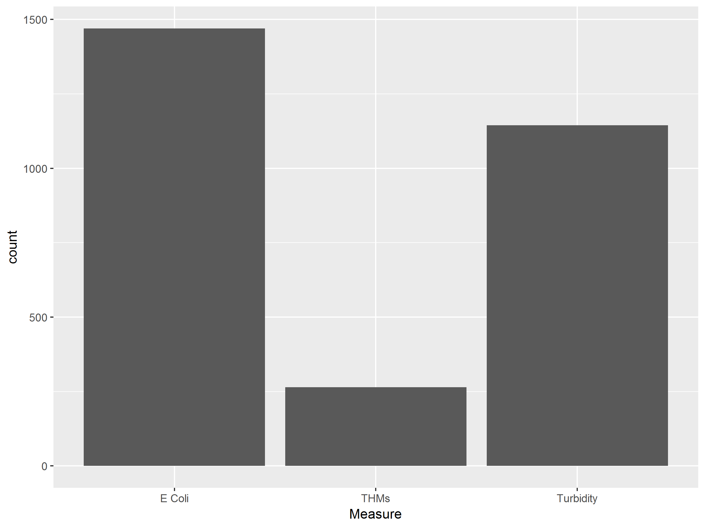
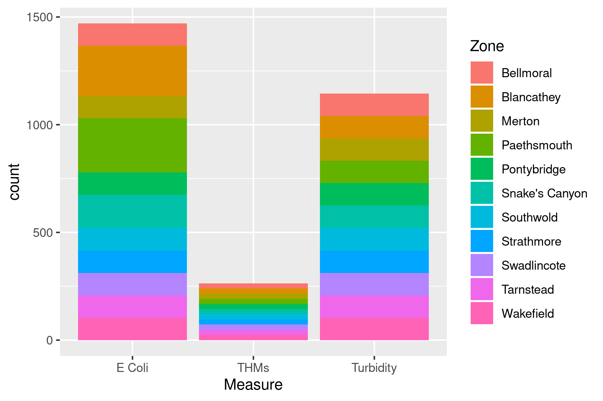
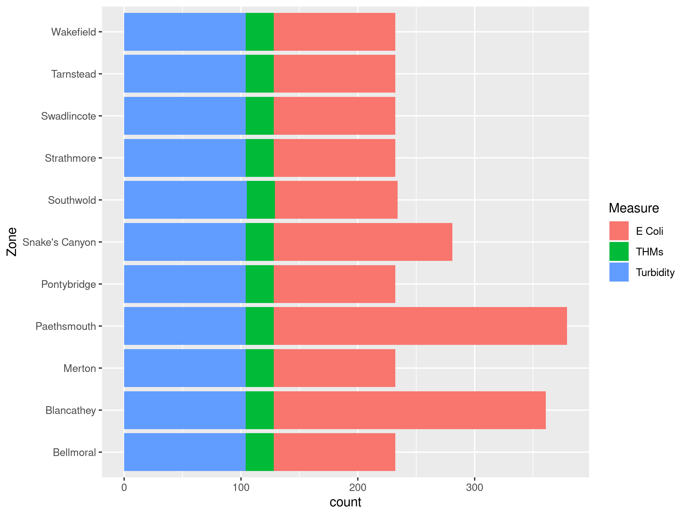
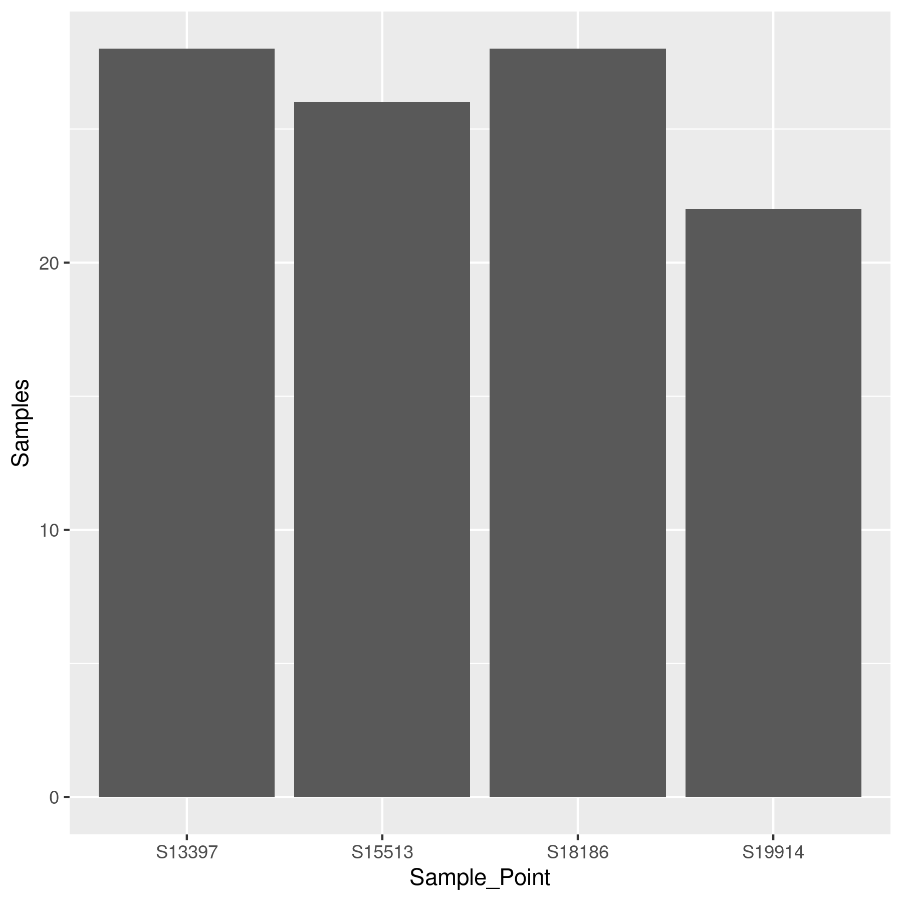
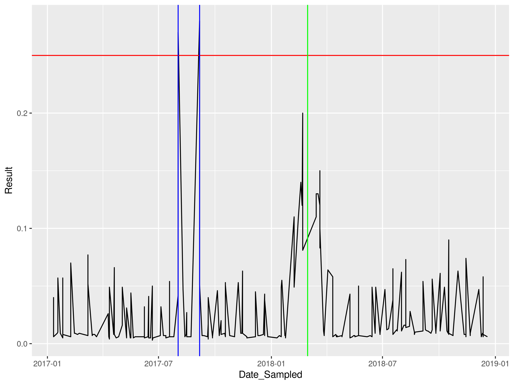
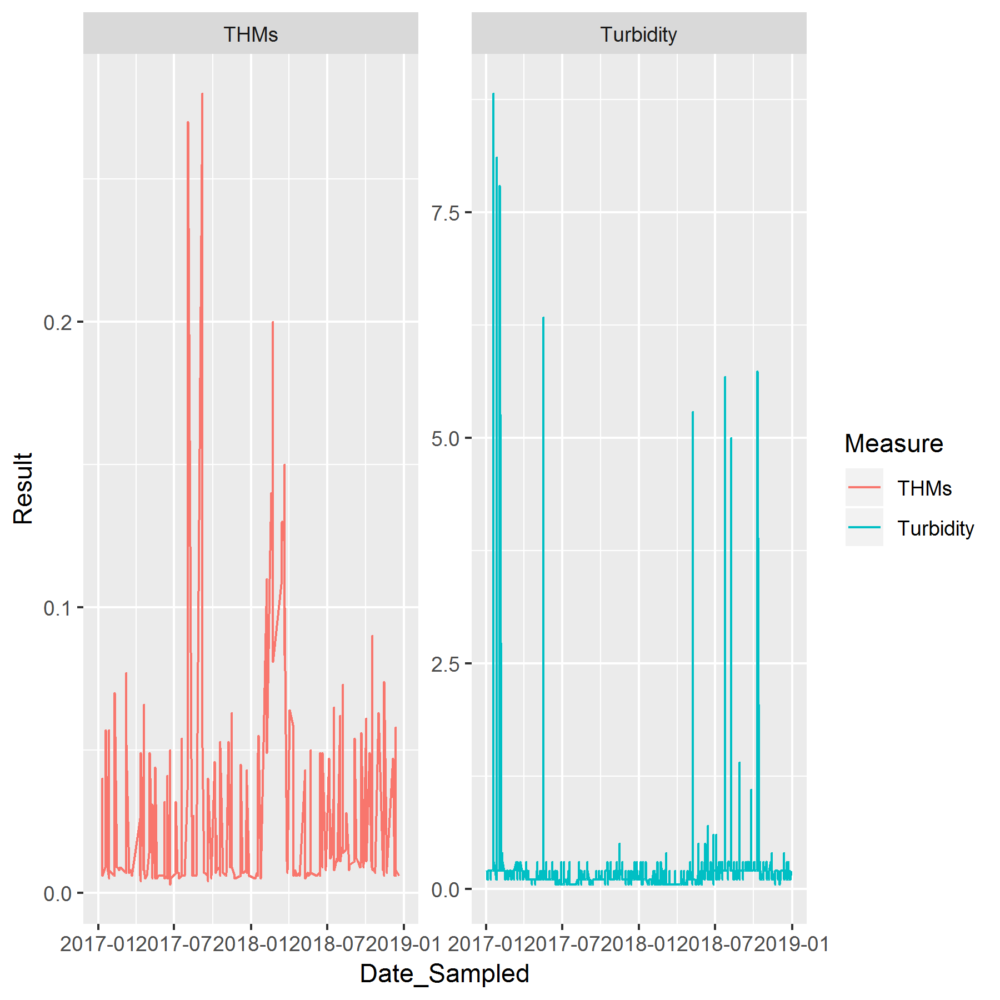
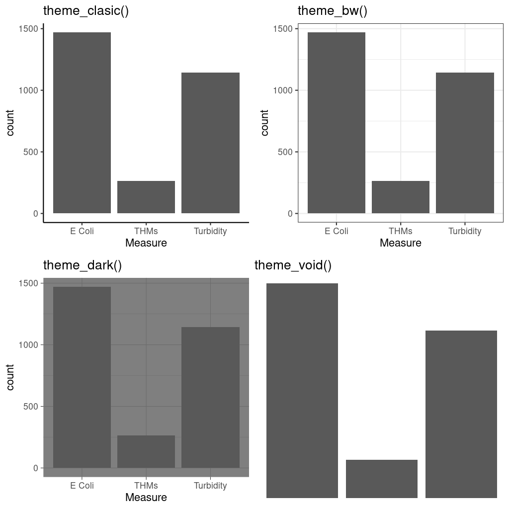
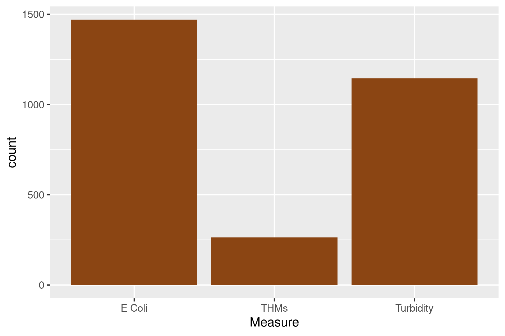
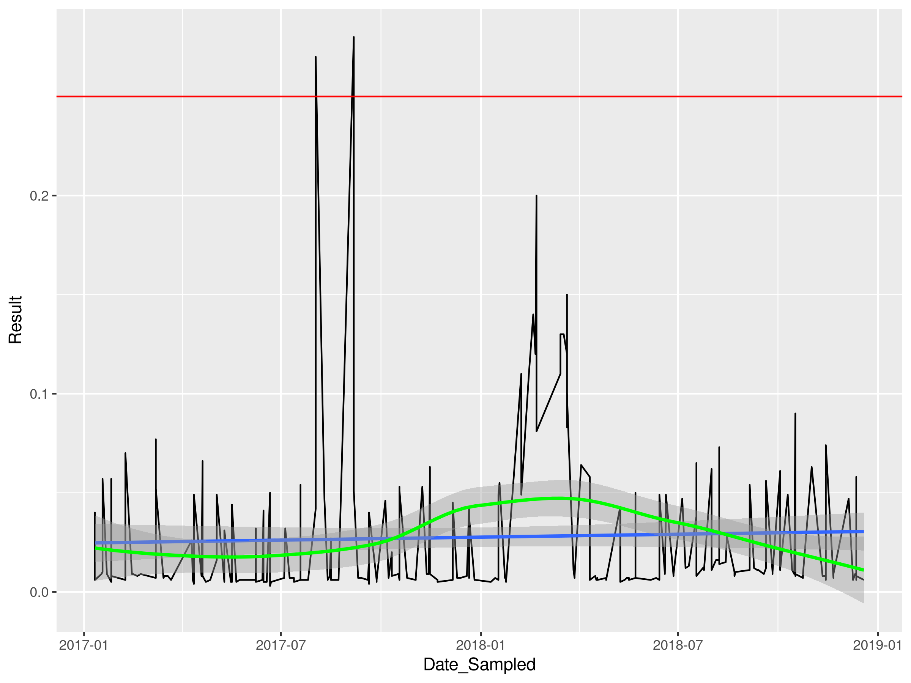
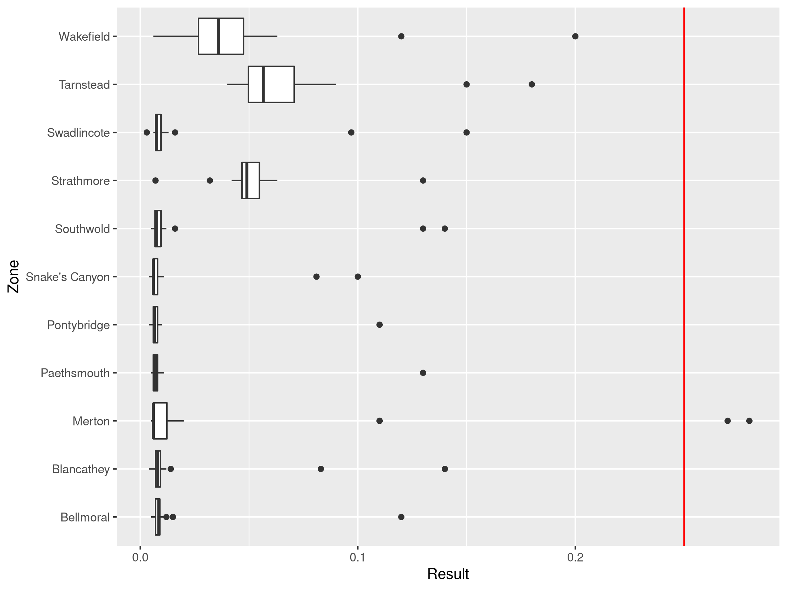

# Visualisations with Tidyerse {#tidyverse}
One of the most exciting aspects of the R language is that developers can write extensions, the so-called packages or libraries. R has a large community of users who develop code and make it freely available to other users in the form of packages. 

Thousands of specialised packages undertake a vast range of specialised tasks. You can, for example, use R as a GIS and analyse spatial data or implement machine learning. Other packages help you to access data from various sources, such as SQL databases.

The majority of R packages are available on [CRAN](https://cran.r-project.org/), the *Comprehensive R Archive Network*.

## Packages for water management
The CRAN library contains many packages with functions to analyse water. This workshop does not cover any of these packages. The list below gives some examples:

* [baytrends](https://cran.r-project.org/web/packages/baytrends/index.html): Long Term Water Quality Trend Analysis.
* [biotic](https://cran.r-project.org/web/packages/biotic/index.html): Calculation of Freshwater Biotic Indices.
* [CityWaterBalance](https://cran.r-project.org/web/packages/CityWaterBalance/index.html): Track Flows of Water Through an Urban System.
* [driftR](https://cran.r-project.org/web/packages/driftR/index.html): Drift Correcting Water Quality Data.
* [EmiStatR](https://cran.r-project.org/web/packages/EmiStatR/index.html): Emissions and Statistics in R for Wastewater and Pollutants in Combined Sewer Systems.

## The Tidyverse
One of the most popular series of packages is the [Tidyverse](https://www.tidyverse.org/), developed by R guru Hadley Wickham and many others.

The Tidyverse packages provide additional functionality to extract, transform, visualise and analyse data. The features offered by these packages are easier to use and understand than the base R code.

This case study discusses cleaning and visualising customer data. The next case study uses Tidyverse to analyse smart metering data.

You can install packages in R with the `install.packages()` function. Within RStudio you can install packages in the *Tools* menu. Before you can start using a library, you need to initiate it with the `library()` command.

T> Install the Tidyverse collection of packages using `install.packages(tidyverse)`. When completed, initiate it with `library(tidyverse)`.

Installing the complete Tidyverse can take a little while, depending on your computer and the operating system. If you have problems installing, make sure that you are connected to the internet, and that your firewall or proxy don't block [cloud.r-project.org](https://cloud.r-project.org/).

When you load the Tidyverse, the following packages are loaded by default:
* [dplyr](https://dplyr.tidyverse.org/): Data manipulation.
* [ggplot2](https://ggplot2.tidyverse.org/): Visualise data.
* [forcats](https://forcats.tidyverse.org/): Working with factor variables.
* [purrr](https://purrr.tidyverse.org/): Functional programming. 
* [readr](https://readr.tidyverse.org/): Read and write CSV files.
* [stringr](https://stringr.tidyverse.org/): Manipulate text.
* [tibble](https://tibble.tidyverse.org/): Replacement for data frames.
* [tidyr](https://tidyr.tidyverse.org/): Data transformation.

Some data scientists prefer not to load the complete set of packages and choose to load each one separately to spare computer memory. This course does not discuss the *purrr*, *stringr* or *forcats* libraries. Many other packages are available that follow the principles of the Tidyverse.

The startup message also shows some warnings about conflicts with some of the base functionality, which we can ignore for now. 

The Tidyverse developers frequently update the software. You can see if updates are available, and optionally install them, by running `tidyverse_update()`. You can also upgrade packages in the *Tools > Check for Package Updates* in RStudio.

The following section introduces data visualisation using the *ggplot2* library from the Tidyverse collection. 

The next [case study](#casestudy2) looks at data collected from tap water consumers in the United States and introduces the Tidyverse principles using this data. The [last case study](#casestudy3) in this course uses various Tidyverse functions to analyse smart meter data.

## Visualising data with ggplot
The Tidyverse set of packages contains *ggplot2*, one of the most powerful data visualisation tools. This package follows a layered approach to visualising data, which simplifies the process of producing sophisticated graphics. This session introduces the basics of *ggplot2* using the Gormsey water quality data from the first case study.

The primary *ggplot* function starts with the name of the data frame, followed by the aesthetics. The aesthetics consist of the fields used to visualise the data. The second part tells *ggplot* which geometry to use, such as lines or bars.

{format: r, line-numbers: false}
```
ggplot(gormsey, aes(Measure)) + 
    geom_bar()
```



The example shows a simple bar plot for the number of samples taken for each measure in Gormsey. This code plots data from the Gormsey data frame and visualises the `Measure` variable. The first part of the function call (before the plus sign) defines the context for the plot. The function calls after the plus sign defines the geometry (geom) and other possible elements of the visualisation, explained in more detail below. 

This example produces a bar chart of the number of observations for each measure. The *ggplot* function passes the variable in the aesthetics to the bar chart geom, counts the number of elements for each category in the Measure variable (Figure 4.1).

This function creates a simple grey plot because we only should add colour to expresses data or complying with a style guide. You can force *ggplot* to use colour by using `geom_bar(fill = "blue")`, or any other colour you might fancy. The paradigm of maximising the data-pixel ratio suggests that colour should be used sparingly. As a general rule, only use multiple colours when they express a variable.

R understands colours in HTML [hex codes](https://www.w3schools.com/colors/colors_picker.asp), or one of the many colour names available in R. The [University of Columbia](http://www.stat.columbia.edu/~tzheng/files/Rcolor.pdf) hosts a useful PDF document with a list of the available colours. Which one is your favourite?

Q> Add your favourite colour to the bar plot.

The *ggplot2* library implements the principles of the [Grammar of Graphics](http://vita.had.co.nz/papers/layered-grammar.pdf). This method follows a structured approach to visualising data using four elements:
* The data and it's aesthetic mapping
* Geometric objects (lines, bars and so on)
* Scales
* Facets of the visualisation

The next sections discuss each of these step by step to build a complete visualisation of the water quality data.

### Data and aesthetic mapping
The *ggplot* function always takes a data frame as its first option, as shown in the previous example. The aesthetic mapping is listed between brackets and defines which variables in the data frame are visualised.

The aesthetics option can also add colour by another variable. The example below creates a bar chart of the number of observations for each measure and colours the bars depending on the zone in which they were taken, creating a stacked bar chart.

{format: r, line-numbers: false}
```
ggplot(gormsey, aes(Measure, fill = Zone)) + 
    geom_bar()
```

This code is the same as the first version but with the option `fill = Zone` added. If you use `col = Zone`, *ggplot* will change the colour of lines, which is not very useful for bar charts. 

This example is not an optimal use of this functionality because there are too many zones, which results in cacophony colours. The sections below revisit this graph to improve the aesthetics using other methods.

Note how this code is written over two lines, with the second part indented. This is standard practice in writing code to improve readability and ensure it is reproducible. RStudio can automatically indent code by selecting the relevant lines and pressing Control-I.



### Geometric objects (lines, bars and so on)
The *ggplot2* package can produce many geometric objects, or *geoms*, for the various types of visualisations. As mentioned in the first chapter, the geometry of a graph depends on the story you want to tell. This section discusses some of the most common geometries.

A bar chart is ideal for comparing values within categories. Many people use pie charts for this purpose, but this design is generally frowned-upon by visualisation exerts because the human eye struggles to spot subtle differences between the sizes of the slices.

The `geom_bar()` function produces a bar chart and requires one variable in the aesthetics. This function counts the number of occurrences of each of the unique elements in the data and plots the bar chart. When the number of elements is too large to display on one axis, then you can flip the graph by adding the `coords_flip()` function. This next visualisation (Figure 4.3) is an improved version of the previous multicoloured figure as it is easier to read while preserving the same information.

{format: r, line-numbers: false}
```
ggplot(gormsey, aes(Zone, fill = Measure)) + 
    geom_bar() + 
    coord_flip()
```



The column geometry, expressed as `geom_col()`, also produces a bar chart, but for a different type of data. While the bar geom counts the number of occurrences of the variable, the column version reads the number from the data. The little example below creates a data frame of the number of turbidity samples in Merton and visualises the result.

{format: r, line-numbers: false}
```
turbidity_merton <- subset(gormsey, Zone == "Merton" & Measure == "Turbidity")
samples <- as.data.frame(table(turbidity_merton$Sample_Point))
names(samples) <- c("Sample_Point", "Samples")
samples <- subset(samples, Samples != 0)
                  
ggplot(samples, aes(Sample_Point, Samples)) +
    geom_col() 
```



X> Recreate this code in RStudio and reverse engineer it to understand how it works.

Q> Recreate this chart using the bar geom.

Q> Use the aggregate and length functions to create a data frame with the number of samples for each analyte (measure) and visualise it with a bar chart.

Laboratory data is a time series, which means that we measure a variable over time. The line chart is one of the most common methods to visualise a time series. Before we can do this for the Gormsey data, we need to convert the sample date field to a data variable.

The `read.csv()` function imports the `Date_Sampled` variable as a Factor. The `as.Date()` function converts the factor into a proper date, which we can plot.

{format: r, line-numbers: false}
```
class(gormsey$Date_Sampled)
gormsey$Date_Sampled <- as.Date(gormsey$Date_Sampled)
class(gormsey$Date_Sampled)
thm <- subset(gormsey, Measure == "THMs")

ggplot(thm, aes(Date_Sampled, Result)) +
    geom_line()
```

X> Create the line chart with the `turbidity_merton` data frame without first converting the data field. What is the difference?

The *ggplot2* library can also add additional lines to the chart. In this case, we are interested in samples that exceeded the 0.2 mg/l limit. This is easy to achieve due to the layered approach of this package. 

The `geom_hline()` adds a horizontal line in the graph at a given intercept with the y-axis. In the same way, the `geom_vline()` adds a line at a given intercept with the x-axis.

The location of the vertical line is the location where the highest results were measured. The `which()` function helps to determine the date when this occurred. This function results in the index number of those elements in a vector that meet a condition. The code below assigns that location to the variable `mx`. 

{format: r, line-numbers: false}
```
mx <- which(thm$Result == max(thm$Result))

ggplot(thm, aes(Date_Sampled, Result)) +
    geom_line() +
    geom_hline(yintercept = .25, col = "red") +
    geom_vline(xintercept = thm$Date_Sampled[mx], col = "blue")
```


The data is quite spikey, and it is not easy to recognise a pattern, other than the outliers. The `geom_smooth()` function can be added to display a trend line in a time series. This function can show a trend using several methods. The method is indicated with the `method` option. Two basic options are:
* `lm`: Linear model
* `loess`: Local Polynomial Regression Fitting

Q> Add the trend line the THM time series. Experiment with the two different methods.

The last geom discussed in this section is the boxplot, considered in the first [case study](#casestudy1). To create a boxplot, just follow the same principles. The code below selects the turbidity measures for the Merton and Southwold zones.
    
{format: r, line-numbers: false}
```
turbidity <- subset(gormsey, Measure == "Turbidity" & 
                    (Zone == "Merton" | Zone == "Southwold"))
ggplot(turbidity, aes(Zone, Result)) + 
    geom_boxplot()
```

Q> Create boxplot of the THM levels for each zone in the Gomsey system.

### Scales
Every visualisation is plotted on a canvas with a certain scale. The *ggplot* function is quite intelligent in determining the optimal scaling for a graph. The functionalities to change scales, including the scaling of colours is quite extensive and fall outside the scope of this lesson.

### Facets of the visualisation
When visualising data from grouped data, such as water quality per zone or several individual time series in one chart. The code below subsets the data into THM and turbidity results and plots the time series for both. 

The `facet_wrap()` function takes a variable, preceded by a tilde `~` and creates individual plots for each of these variables, within the same window. 

{format: r, line-numbers: false}
```
ggplot(subset(gormsey, Measure == "THMs" | Measure == "Turbidity"), 
       aes(Date_Sampled, Result, col = Measure)) + 
    geom_line() + 
    facet_wrap(~Measure, scales = "free_y")
```

X> Repeat this same visualisation without the facet and note the difference.



### Themes
The *ggplot2* library has extensive options to change the theme of a graph. Every aspect of the canvas colours and lines, text sizes, fonts, and so on can be changed. This is quite a complex topic due to the countless variations in what can e changed. 

The *ggplot2* package also has themes with predefined designs. The image in Figure 4.* shows four of these themes. To use one of these themes, simply add `theme_name()` to the *ggplot* call and replace 'name' with the name of the theme, for example:.

{format: r, line-numbers: false}
```
ggplot(gormsey, aes(Measure)) + 
    geom_bar() + 
    theme_bw()
```



### Saving visualisations
Showing the graphs on the screen is fine, but you will most likely want to share it with colleagues. The `ggsave()` function provides a convenient method to save a *ggplot2* graph to a file in png, pdf, jpg or many other formats. The default settings save the figure at a resolution of 300 dpi. The width and height default to inches. This method does not work for graphs created with the base functions discussed in the previous chapters.

{format: r, line-numbers: false}
```
ggsave("resources/session4.test.png", dpi = 100, width = 6, height = 4)
```

X> Save one of your visualisations as a png file and share it with fellow course participants on the online community.

This ends the short introduction into the functionality of the *ggplot2* library. This chapter is only a very brief overview of the principles as the capabilities of this package are extensive.

In the next chapter, we discuss a [case study](#casestudy2) about customer perception where we practice visualisation and dig deeper into analysing data with the Tidyverse.
    
## Answers
This last section contains all the answers to the questions posed in this lesson.

### Add your favourite colour to the bar plot
You can add any colour you like. I choose to use chocolate as inspiration.

{format: r, line-numbers: false}
```
ggplot(gormsey, aes(Measure)) + 
    geom_bar(fill = "chocolate4")
```


### Recreate this chart using the bar geom.
{format: r, line-numbers: false}
```
ggplot(turbidity_merton, aes(Sample_Point)) + geom_bar()
```

### Use the aggregate and length functions to create a data frame that counts the number of samples for each analyte (measure) and visualises it with a bar chart
The code below is effectively the same as using the bar geom. The first line uses the aggregate function we saw earlier to create a data frame with the number of samples in each zone. The function counts the lengths of the measure vector for each zone. Note how the variables are named in the function options.

{format: r, line-numbers: false}
```
measures <- aggregate(list(Samples = gormsey$Sample_No), 
                      list(Measure = gormsey$Measure), length)
ggplot(measures, aes(Measure, Samples)) + 
    geom_col()
```

### Add the trend line the THM time series. Experiment with the two different methods
You can keep adding layers to a *ggplot* visualisation, as shown below.

{format: r, line-numbers: false}
```
ggplot(subset(gormsey, Measure == "THMs"), aes(Date_Sampled, Result)) +
    geom_line() +
    geom_hline(yintercept = .25, col = "red") +
    geom_smooth(method = lm) +
    geom_smooth(method = loess, col = "green") 
```


### Create boxplot of the THM levels for each zone in the Gomsey system
Adding two variables to the aesthetics in a boxplot groups the data by the first variable. The plot is rotated to prevent overlapping text. Note that the line is still a horizontal line although the x-axis is now vertical.

{format: r, line-numbers: false}
```
ggplot(thm, aes(Zone, Result)) +
    geom_boxplot() +
    coord_flip() + 
    geom_hline(yintercept = 0.25, col = "red")
```


