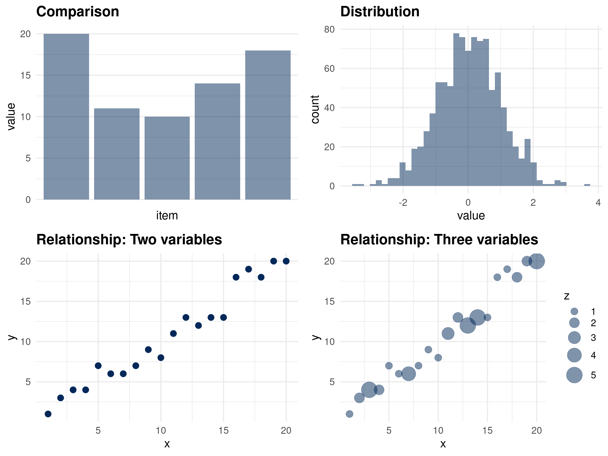
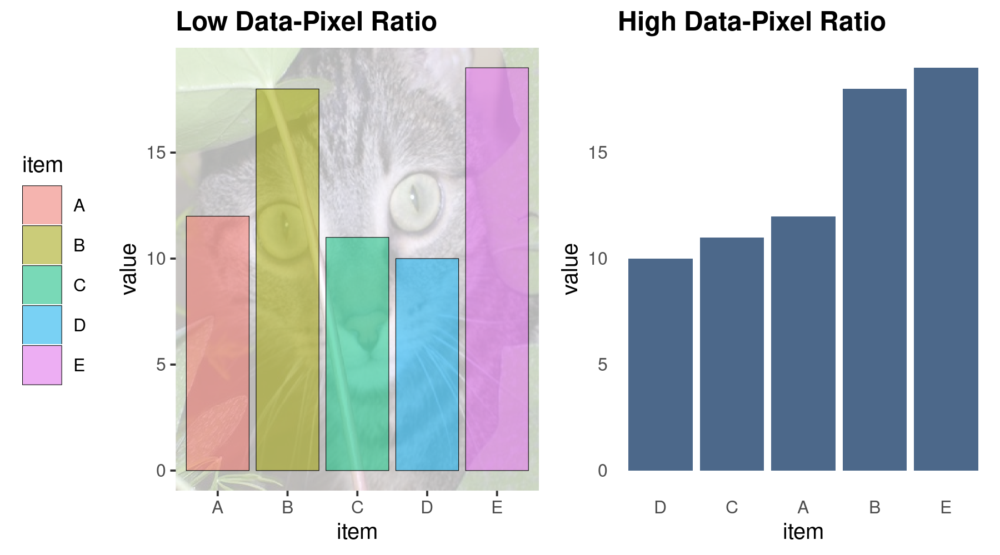
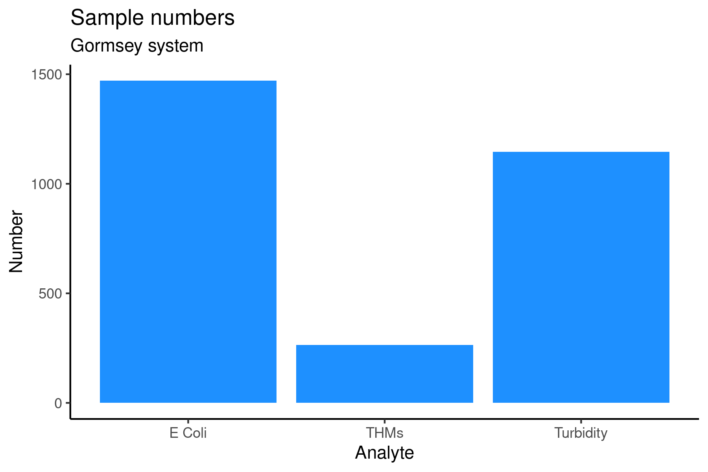

# Visualisations with Tidyerse {#tidyverse}

### Visualise the data
The fastest way to explore data is to visualise it. R has extensive built-in visualisation function, some of which we explore below. The [R Graph Gallery](https://www.r-graph-gallery.com/) provides some guidance on the available methods.

X> Use the Chart Chooser or the R Graph Gallery to determine the best way to visualise the data.

Given the requirements n the regulations, we need to visualise the distribution of the results for each zone. We only have a single variable, which leads us to a histogram.

The `hist()` function plots a histogram of a vector of integers or numerical values. The breaks option in this function defines the number of bars in the graph. The results of the turbidity tests have a maximum value of 1.5 NTU, so to get bars at 0.1 NTU, the number of breaks needs to be 15. The variable `b` in the code below calculates the size of the bars by dividing the maximum value by the desired resolution (Figure 2.1).

{format: r, line-numbers: false}
```
b <- max(turbidity$Result) / 0.1
hist(turbidity$Result, breaks = b, main = "Turbidity Results")
```
{width: 60%, alt: "Histogram of turbidity results."}


The regulations apply separately to each water quality zone, so we need to subset the data before plotting.

Q> Plot the histogram of each of the Laanecoorie water quality zone.

Sub-setting each zone is tedious. One of the visualisations not listed on the *Chart Chooser* is the boxplot. This versatile visualisation summarises the distribution of numerical data (Figure 2.2).

{width: 60%, alt: "Boxplot anatomy."}


* The line that divides the box indicates the median.
* The ends of the box shows the upper (`Q3`$) and lower (`Q1`$) quartiles. The difference between quartiles 1 and 3 is the interquartile range (`IQR`$)
* The lines show `Q3-1.5 \times IQR`$ to `Q1+1.5 \times IQR`$ (the highest and lowest value, excluding outliers).
* Dots beyond the lines shows outliers.

The boxplot function includes a convenient way to group the results by a factor variable. To achieve this, use the tilde `~` symbol to indicate the variable that is analysed and the variable by which it is grouped, as shown below. Because the data option indicates the data frame, we don't have to use the `$` indicator. The `main` and `ylab` options add text to the plot, as shown below and in figure 2.3.

{format: r, line-numbers: false} 
```
boxplot(Result ~ Zone, data = turbidity, col = "lightblue",
        main = "Turbidity Results Laanecoorie water system",
        ylab = "Turbidity (NTU)")
```

{width: 50%, alt: "Distribution of turbidity results."}


Each of these visualisation functions has extensive options to change the plot, which are outside the scope of this course. In the next two case studies, we explore the powerful visualisation functionality of the Tidyverse extension to the R language.


The next [case study](#casestudy2) looks at data collected from tap water consumers in the United States and introduces the Tidyverse principles using this data. This chapter introduces data visualisation using *ggplot2* from the Tidyverse collection of libraries. 

#### Visualising Data
Data visualisations are everywhere. They are no longer the domain of scientific publications and business reports. Publications in every medium use graphs to tell stories. The internet is awash with infographics on a wide range of topics. These popular images are often data science porn because they are designed to entertain and titillate, with limited usability from a business perspective. They are a fantastic tool to supply information to customers but should not be used to report data science.

Aesthetics and usefulness go hand in hand. Some data visualisations in engineering remind me of a [Jackson Pollock](https://en.wikipedia.org/wiki/Jackson_Pollock) painting, with multitudes of lines and colours splashed over the screen. Adding too much information to a graph and using too many colours reduces its usability. When visualisation is not aesthetic, it becomes harder to interpret, which leads to the wrong conclusions and can even deceive the user.

{width: 80%}


A data scientist needs to be aware of cognitive biases to prevent them and create data products that don't deceive. Many of these biases relate to how information is presented.

Our perception is not always an accurate representation of reality, and we often misinterpret the images that our retina collects. Optical illusions are funny internet memes, but they also occur in real life. Besides optical illusions, messy visualisations are hard to interpret because our mind does not know what element to focus on. A messy graphic confuses the brain so that it starts to form its interpretations.

Perhaps a good data visualisation should look more like a painting by [Piet Mondrian](https://en.wikipedia.org/wiki/Piet_Mondrian) who is famous for his austere compositions with straight lines and primary colours. Using art to explain data visualisation is not an accidental metaphor because visual art represents how the artist perceives reality. This comparison between Pollock and Mondrian is not a judgement of their artistic abilities. For Pollock, reality was chaotic and messy, while Mondrian saw a geometric order behind the perceived world.

{width: 50%, alt: "Piet Mondrian, Composition in Red, Yellow and Blue."}


Although visualising data has some parallels with art, it is very different. All works of art are a form of deception. The artist paints a three-dimensional image on a flat canvas, and although we see people, we are just looking at blobs of paint. Data visualisation as an art form needs to be truthful and not deceive, either intentionally or accidentally. The purpose of any graph is to validly and reliably reflect reality.

Aesthetic data science is not so much an art as it is a craft. Following some basic rules prevents confusing the consumers of data products. Firstly, visualisation needs to have a straightforward narrative. Secondly, visualising data should be as simple as possible, minimising elements that don't add to the story.

#### Telling Stories
First and foremost, visualisation needs to tell a story. The story in data visualisation should not be a mystery novel. A visualisation should not have suspense but get straight to the point. Trying to squeeze too much information into one graph confuses the reader. Ideally, each visualisation should contain only one or two narratives. If there is more to tell, then use more charts and create a dashboard.

Numerical data can contain several types of narratives. A graph can compare data points to show a trend among items or communicate differences between them. Bar charts are the best option to compare data points with each other. A line graph is possibly your best option to compare data points over time. The distribution of data points is best visualised using a histogram. Scatter plots or bubble charts show relationships between two or three variables (Figure 1.9).

{width: 80%}


The detailed considerations of choosing the most suitable visualisation are outside the scope of this book. The [Chart Chooser](http://labs.juiceanalytics.com/chartchooser/index.html) website provides a dynamic interface to select the best graph to tell a story. This website uses a method developed by [Andrew Abela](https://extremepresentation.typepad.com/blog/2008/06/visualization-taxonomies.html). You can download a high-resolution poster of the Chart Chooser from his website. The main point is that every visualisation needs to tell a story and not just summarise a bunch of data.

X> You are writing a new water resource plan and like to visualise the relationship between daily consumption per property, the size of the property and the number of inhabitants. Use the Chart Chooser website or poster and choose the most suitable visualisation.

Visualising qualitative information is a language with many options to tell a story. Displaying qualitative information is more an art than a craft because there is less reliance on mathematics. Network diagrams are another common visualisation tool. Networks are a convenient method to analyse relationships between people or other qualitative entities such as journal articles.

#### Visualisation Design
Beauty is in the eye of the beholder, and there are no formulas or algorithms to ensure perfect visualisations. The social network Reddit has two groups dedicated to visualisations. Users members of the [Data is Ugly](https://reddit.com/r/dataisugly/) and [Data is Beautiful](https://reddit.com/r/dataisbeautiful/) groups share images of visualisations they consider ugly or beautiful. These two groups sometimes share the same visualisations because of different interpretations of aesthetics in data. What is a beautiful visualisation to one person, is an abomination to somebody else. The aesthetics of data visualisation is for a significant part in the eye of the beholder. However, when viewing aesthetics from a practical perspective, we can define what this means with a simple heuristic.


Edward Tufte is an American statistician who is famous for his work on visualisation. Tufte introduced the concept of the data-ink ratio. In simple terms, this ratio expresses the relationship between the ink on the paper that tells a story and the total amount of ink on the paper. Tufte argues that this ratio should be as close to one as possible. In other words, we should not use any graphical elements that don't communicate any information, such as background images, superfluous lines and text.

Now that we are in the paperless era, we can use the data-pixel ratio as a generic measure for the aesthetics of visualisations. The principle is the same as in the analogue days. Unnecessary lines, multiple colours or multiple narratives risk confusing the user of the report.

The data-ink ratio is not a mathematical concept that needs to be expressed in exact numbers. This ratio is a guideline for designers of visualisations to help them decide what to include and, more importantly, what to exclude from an image.

Figure 1.10 shows an example of maximising the data-ink ratio. The bar chart on the left has a meagre data-pixel ratio. The background image of a cat might be cute and possibly even related to the topic of the visualisation, but it only distracts from the message. Using colours to identify the variables is unnecessary because the labels are at the bottom of the graph. The legend is not very functional because it also duplicates the labels. Lastly, the lines around the bars have no function.

To improve this version, all unnecessary graphical elements have been removed. Assuming that the story of this graph is to compare variables, the columns have been ranked from large to small. If the narrative of this graph was to compare one or more of the variables with other variables, then groups of bars can be coloured to indicate the categories.

The basic rule of visually communicating data is to not 'pimp' your visualisations with unnecessary graphical elements or text that does not add to the story. When visualising data, austerity is best-practice.

{width: 80%}


## Visualising data with ggplot
The Tidyverse set of packages contains *ggplot2*, one of the most powerful data visualisation tools. This package follows a layered approach to visualising data, which simplifies the process of producing sophisticated graphics. This session introduces the basics of *ggplot2* using the Gormsey water quality data from the first case study.

The primary *ggplot* function starts with the name of the data frame, followed by the aesthetics. The aesthetics consist of the fields used to visualise the data. The second part tells *ggplot* which geometry to use, such as lines or bars.

{format: r, line-numbers: false}
```
ggplot(gormsey, aes(Measure)) + 
    geom_bar()
```
{width: 70%}


The example shows a simple bar plot for the number of samples taken for each measure in Gormsey. This code plots data from the Gormsey data frame and visualises the `Measure` variable. The first part of the function call (before the plus sign) defines the context for the plot. The function calls after the plus sign defines the geometry (geom) and other possible elements of the visualisation, explained in more detail below. 

This example produces a bar chart of the number of observations for each measure. The *ggplot* function passes the variable in the aesthetics to the bar chart geom, counts the number of elements for each category in the Measure variable (Figure 4.1).

This function creates a simple grey plot because we only should add colour to expresses data or complying with a style guide. You can force *ggplot* to use colour by using `geom_bar(fill = "blue")`, or any other colour you might fancy. The paradigm of maximising the data-pixel ratio suggests that colour should be used sparingly. As a general rule, only use multiple colours when they express a variable.

R understands colours in HTML [hex codes](https://www.w3schools.com/colors/colors_picker.asp), or one of the many colour names available in R. The [University of Columbia](http://www.stat.columbia.edu/~tzheng/files/Rcolor.pdf) hosts a useful PDF document with a list of the available colours. Which one is your favourite?

Q> Add your favourite colour to the bar plot.

The *ggplot2* library implements the principles of the [Grammar of Graphics](http://vita.had.co.nz/papers/layered-grammar.pdf). This method follows a structured approach to visualising data using four elements:
* The data and it's aesthetic mapping
* Geometric objects (lines, bars and so on)
* Scales
* Facets of the visualisation

The next sections discuss each of these step by step to build a complete visualisation of the water quality data.

### Data and aesthetic mapping
The *ggplot* function always takes a data frame as its first option, as shown in the previous example. The aesthetic mapping is listed between brackets and defines which variables in the data frame are visualised.

The aesthetics option can also add colour by another variable. The example below creates a bar chart of the number of observations for each measure and colours the bars depending on the zone in which they were taken, creating a stacked bar chart (Figure 4.2).

{format: r, line-numbers: false}
```
ggplot(gormsey, aes(Measure, fill = Zone)) + 
    geom_bar()
```

This code is the same as the first version but with the option `fill = Zone` added. If you use `col = Zone`, *ggplot* will change the colour of lines, which is not very useful for bar charts. 

This example is not an optimal use of this functionality because there are too many zones, which results in cacophony colours. The sections below revisit this graph to improve the aesthetics using other methods.

Note how this code is written over two lines, with the second part indented. This is standard practice in writing code to improve readability and ensure it is reproducible. RStudio can automatically indent code by selecting the relevant lines and pressing Control-I.

{width: "70%"}


### Geometric objects (lines, bars and so on)
The *ggplot2* package can produce many geometric objects, or *geoms*, for the various types of visualisations. As mentioned in the first chapter, the geometry of a graph depends on the story you want to tell. This section discusses some of the most common geometries.

A bar chart is ideal for comparing values within categories. Many people use pie charts for this purpose, but this design is generally frowned-upon by visualisation exerts because the human eye struggles to spot subtle differences between the sizes of the slices.

The `geom_bar()` function produces a bar chart and requires one variable in the aesthetics. This function counts the number of occurrences of each of the unique elements in the data and plots the bar chart. When the number of elements is too large to display on one axis, then you can flip the graph by adding the `coords_flip()` function. This next visualisation (Figure 4.3) is an improved version of the previous multicoloured figure as it is easier to read while preserving the same information.

{format: r, line-numbers: false}
```
ggplot(gormsey, aes(Zone, fill = Measure)) + 
    geom_bar() + 
    coord_flip()
```
{width: 70%}


The column geometry, expressed as `geom_col()`, also produces a bar chart, but for a different type of data. While the bar geom counts the number of occurrences of the variable, the column version reads the number from the data. 

The example below creates a data frame of the number of turbidity samples in Merton and visualises the result. The `table()` function is a convenient method to quickly count the number of unique elements in a vector.

{format: r, line-numbers: false}
```
turbidity_merton <- subset(gormsey, Zone == "Merton" & Measure == "Turbidity")
samples <- as.data.frame(table(turbidity_merton$Sample_Point))
names(samples) <- c("Sample_Point", "Samples")
samples <- subset(samples, Samples != 0)
                  
ggplot(samples, aes(Sample_Point, Samples)) +
    geom_col() 
```
{width: 70%}


X> Recreate this code in RStudio and reverse engineer it to understand how it works.

Q> Recreate this chart using the bar geom.

Q> Use the aggregate and length functions to create a bar chart with the number of samples for each analyte (measure).

Laboratory data are time series, which means that we measure a variable over time. The line chart is one of the most common methods to visualise a time series. Before we can do this for the Gormsey data, we need to convert the sample date field to a data variable.

The `read.csv()` function imports the `Date_Sampled` variable as a Factor. The `as.Date()` function converts the factor into a proper date, which we can plot.

{format: r, line-numbers: false}
```
class(gormsey$Date_Sampled)
gormsey$Date_Sampled <- as.Date(gormsey$Date_Sampled)
class(gormsey$Date_Sampled)
thm <- subset(gormsey, Measure == "THMs")

ggplot(thm, aes(Date_Sampled, Result)) +
    geom_line()
```

X> Create the line chart with the `turbidity_merton` data frame without first converting the data field. What is the difference?

The *ggplot2* library can also add additional lines to the chart. In this case, we are interested in samples that exceeded the 0.2 mg/l limit. This is easy to achieve due to the layered approach of this package. 

The `geom_hline()` adds a horizontal line in the graph at a given intercept with the y-axis. In the same way, the `geom_vline()` adds a line at a given intercept with the x-axis.

The location of the vertical line is the location where the highest results were measured. The `which()` function helps to determine the date when this occurred. This function results in the index number of those elements in a vector that meet a condition. For example, the expression `which(c("a", "b" "c") == "b")` results in 2. The code below assigns the location(s) of the maximum THM result location to the variable `mx`.

{format: r, line-numbers: false}
```
mx <- which(thm$Result == max(thm$Result))

ggplot(thm, aes(Date_Sampled, Result)) +
    geom_line() +
    geom_hline(yintercept = .25, col = "red") +
    geom_vline(xintercept = thm$Date_Sampled[mx], col = "blue")
```
{width: 70%}


The data is quite spikey, and it is not easy to recognise a pattern, other than the outliers. The `geom_smooth()` function can be added to display a trend line in a time series. This function can show a trend using several methods. The method is indicated with the `method` option. Two basic options are:
* `lm`: Linear model
* `loess`: Local Polynomial Regression Fitting

Q> Add the trend line the THM time series. Experiment with the two different methods.

The last geom discussed in this section is the boxplot, considered in the first [case study](#casestudy1). To create a boxplot, just follow the same principles. The code below selects the turbidity measures for the Merton and Southwold zones. Note that we use the or operator because a sample cannot be taken in two zones.
    
{format: r, line-numbers: false}
```
turbidity <- subset(gormsey, Measure == "Turbidity" & 
                    (Zone == "Merton" | Zone == "Southwold"))
ggplot(turbidity, aes(Zone, Result)) + 
    geom_boxplot()
```

Q> Create boxplot of the THM levels for each zone in the Gomsey system.

### Scales
Every visualisation is plotted on a canvas with a certain scale. The *ggplot* function is quite intelligent in determining the optimal scaling for a graph. The functionalities to change scales, including the scaling of colours is quite extensive and fall outside the scope of this lesson.

### Facets of the visualisation
When visualising data from grouped data, such as water quality per zone or several individual time series in one chart. The code below subsets the data into THM and turbidity results and plots the time series for both (Figure 4.6). 

The `facet_wrap()` function takes a variable, preceded by a tilde `~` and creates individual plots for each of these variables, within the same window. 

{format: r, line-numbers: false}
```
ggplot(subset(gormsey, Measure == "THMs" | Measure == "Turbidity"), 
       aes(Date_Sampled, Result, col = Measure)) + 
    geom_line() + 
    facet_wrap(~Measure, scales = "free_y")
```

X> Repeat this same visualisation without the facet and note the difference.

{width: 70%}


### Themes
The *ggplot2* library has extensive options to change the theme of a graph. Every aspect of the canvas colours and lines, text sizes, fonts, and so on can be changed. This is quite a complex topic due to the countless variations in what can e changed. 

The *ggplot2* package also has themes with predefined designs. The image in Figure 4.7 shows four of these themes. To use one of these themes, simply add `theme_name()` to the *ggplot* call and replace 'name' with the name of the theme, for example:.

{format: r, line-numbers: false}
```
ggplot(gormsey, aes(Measure)) + 
    geom_bar() + 
    theme_bw()
```
{width: 70%}


## Adding text
The `labs()` function is useful to add text to the plot and change the axes labels, as shown in the example below (Figure 4.8). Adding text to plot prevents any confusion in case the file is separated from its context.

{format: r, line-numbers: false}
```
ggplot(gormsey, aes(Measure)) + 
    geom_bar(fill = "dodgerblue") + 
    labs(title = "Sample numbers", 
         subtitle = "Gormsey system",
         x = "Analyte", y = "Number") + 
    theme_classic()
```
{width: 70%}


### Saving visualisations
Showing the graphs on the screen is fine, but you will most likely want to share it with colleagues. The `ggsave()` function provides a convenient method to save a *ggplot2* graph to a file in png, pdf, jpg or many other formats. The default settings save the figure at a resolution of 300 dpi. The width and height default to inches. This method does not work for graphs created with the base functions discussed in the previous chapters.

{format: r, line-numbers: false}
```
ggsave("resources/session4.test.png", width = 8, height = 4.5)
```

X> Save one of your visualisations as a png file and share it with fellow course participants on the [online community](https://community.leanpub.com/c/r4h2o).

This ends the short introduction into the functionality of the *ggplot2* library. This chapter is only a very brief overview of the principles as the capabilities of this package are extensive.

In the next chapter, we discuss a [case study](#casestudy2) about customer perception where we practice visualisation and dig deeper into analysing data with the Tidyverse.
    
## Answers
This last section contains the answers to the questions posed in this lesson.

### Add your favourite colour to the bar plot
You can add any colour you like. I choose to use chocolate as inspiration (Figure 4.9).

{format: r, line-numbers: false}
```
ggplot(gormsey, aes(Measure)) + 
    geom_bar(fill = "chocolate4")
```
{width: 70%}


### Recreate this chart using the bar geom.
{format: r, line-numbers: false}
```
ggplot(turbidity_merton, aes(Sample_Point)) + geom_bar()
```

### Use the aggregate and length functions to create a data frame that counts the number of samples for each analyte (measure) and visualises it with a bar chart
The code below is effectively the same as using the bar geom. The first line uses the aggregate function we saw earlier to create a data frame with the number of samples in each zone. The function counts the lengths of the measure vector for each zone. Note how the variables are named in the function options.

{format: r, line-numbers: false}
```
measures <- aggregate(list(Samples = gormsey$Sample_No), 
                      list(Measure = gormsey$Measure), length)
ggplot(measures, aes(Measure, Samples)) + 
    geom_col()
```

### Add the trend line the THM time series. Experiment with the two different methods
You can keep adding layers to a *ggplot* visualisation, as shown in Figure 4.10.

{format: r, line-numbers: false}
```
ggplot(subset(gormsey, Measure == "THMs"), aes(Date_Sampled, Result)) +
    geom_line() +
    geom_hline(yintercept = .25, col = "red") +
    geom_smooth(method = lm) +
    geom_smooth(method = loess, col = "green") 
```
{width: 70%}


### Create boxplot of the THM levels for each zone in the Gomsey system
Adding two variables to the aesthetics in a boxplot groups the data by the first variable. The plot is rotated to prevent overlapping text. Note that the line is still a horizontal line although the x-axis is now vertical (Figure 4.11).

{format: r, line-numbers: false}
```
ggplot(thm, aes(Zone, Result)) +
    geom_boxplot() +
    coord_flip() + 
    geom_hline(yintercept = 0.25, col = "red")
```
{width: 70%}


In the second [case study](#casestudy2) we dig deeper into he Tidyverse by cleaning data from a customer survey.
