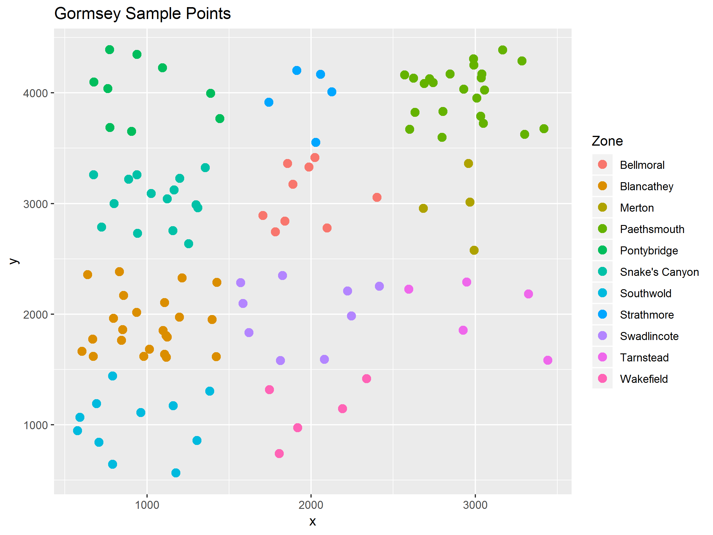

# Case Study 2: Understanding Customer Perception {#casestudy2}
This second case study uses data from a dissertation on [water utility marketing](http://hdl.handle.net/1959.9/561679). This research includes a survey of American tap water consumers to measure their perception of tap water services. The survey included questions to measure consumers' involvement with tap water services and their perception of service quality.

The data from the previous studies was an example of a perfect world without missing data and other issues. Many practitioners will tell you that cleaning data can be 80% of the work. Cleaning data is extremely important because even the most advanced algorithm can't create value from rubbish. As the old adagio goes: "Rubbish-in is rubbish-out". 

This first case study revolves around cleaning the customer survey data set to a format that we can easily visualise and analyse.

## Consumer Involvement
Consumer involvement is an essential marketing metric that describes the relevance a product or service has in somebody's life. People who own a car will most likely be highly involved with purchasing and owning the car due to a large amount of money involved and the social role it plays in developing their public self. Consumers will most likely have a much lower level of involvement with the instant coffee they drink than with the clothes they wear. More formally, consumer involvement can be defined as a person's perceived relevance of the object based on inherent needs, values, and interests.

Consumer involvement is vital because it is causally related to willingness to pay and perceptions of quality. Consumers with a higher level of involvement are willing to pay more for a service and have a more favourable perception of quality.

Understanding involvement in the context of urban water supply is also important because sustainably managing water as a common pool resource requires the active involvement of all users. The level of consumer involvement depends on a complex array of factors, which are related to psychology, situational factors and the marketing mix of the service provider. The lowest level of involvement is considered a state of inertia, which occurs when people habitually purchase a product without comparing alternatives.

Cult products have the highest possible level of involvement because customers are devoted to the product or brand. Commercial organisations use this knowledge to their advantage by maximising the level of consumer involvement through branding and advertising. This strategy is used effectively by the bottled water industry. Manufacturers focus on enhancing the emotional aspects of their product rather than on enhancing the cognitive aspects. Water utilities tend to use a reversed strategy and emphasise the cognitive aspects of tap water, the pipes, plants and pumps, rather than trying to create an emotional relationship with their consumers.

## Problem Statement
The fact that water is essential to life suggests that consumers of tap water have a high level of involvement with the service. Contrary to this common-sense intuition, practitioner experience and literature state that tap water is a low-involvement service. However, the level of consumer involvement with [tap water services](https://www.researchgate.net/publication/326533830_We_Care_About_Water_Even_If_You_Don%27t_Water_As_a_Low_Involvement_Service) has not been empirically verified. 

Determine the level of consumer involvement, using the data from the American tap water consumers.

## Methodology
A commercial survey service provider recruited the respondents, who were paid for their participation. The questionnaire consisted of [four pages](https://github.com/pprevos/R4H2O/blob/master/manuscript/resources/session5/customer_survey.pdf), which respondents accessed through a website. 

The first page introduced the research and asked respondents to provide their consent to participate. Respondents who did not provide consent were exited from the survey. Due to the broad geographical spread of potential respondents on the American survey panel, respondents were also required to complete two screening questions. The first question related to their place of residence and the second question asked whether they had tap water at home. Only customers located in Los Angeles, Denver or Boston and those with tap water connections continued to the next page of the questionnaire. Other respondents were excluded from the survey.

The second page consisted of questions about the level of involvement respondents have with tap water. These questions use the Personal Involvement Inventory developed by Judity Zaichkowsky ([1994](https://www.sfu.ca/~zaichkow/JA%252094.pdf)). The involvement items close with an open text item asking customers: "If you have any additional comments about your views on tap water, please enter them below". 

The Personal Involvement Inventory consists of two dimensions:  cognitive involvement (importance, relevance, meaning, value and need) and affective involvement 
(involvement, fascination, appeal, excitement and interest).

The involvement part of the survey uses a semantic differential scale. This method requires respondents to choose on a scale between two antonyms (figure 5.1). This type of survey measures the meaning that people attach to a concept, such as a product or service. The items were presented in a random order to each respondent. The words on the right indicate a high level of involvement. Fiver questions have a reversed polarity, which means that the left side indicates a high level of involvement.

{width: 80%}


The penultimate page started with two items related to the customer's relationship with their service provider. Customers were asked to indicate whether they struggle to pay their water bills when they fall due, using a seven-point Likert scale from "Strongly Disagree" to "Strongly Agree". 

The second question asked customers to indicate the frequency at which they contact their utility for support, also using a seven-point Likert scale: 
* Never
* Less than Once a Month
* Once a Month
* 2-3 Times a Month
* Once a Week
* 2-3 Times a Week
* Daily

One of the problems with using paid survey subjects is that they are motivated to complete many surveys, without having much regard for the content. American respondents were therefore also subjected to an attention filter: "If you live in the U.S. select Strongly Agree". The survey was only sent to people within the United States, so everybody should respond equally. Any respondent not answering "Strongly Agree" is excluded from the survey. This approach was used to remove inattentive respondents and assure the reliability of the results. 

The survey closed with eighteen service quality questions, which were measured using a seven-point Likert scale from "Strongly Disagree" to "Strongly Agree". The items were presented in random order. The final item of the questionnaire consisted of an open question which invited customers to provide additional comments about their tap water supplier.

If you are interested reading more about a scientific view of customer experience in water utilities, then you can read *Customer Experience Management for Water Utilities* by Peter Prevos, available from [IWA Publishing](https://www.iwapublishing.com/books/9781780408668/customer-experience-management-water-utilities-marketing-urban-water-supply).

## Analysing the Case Study
This session explains how to clean and visualise the data using the Tidyverse. The code in this section is available in the `casestudy2.R` script. You start the analyses by loading the Tidyverse packages using `library(tidyverse)`.

### Load the data
The `Customer_Perception_USA.csv` file provided in the `casestudy2` folder is the raw data exported from the [Qualtrics](https://qualtrics.com/) survey platform. 

The *readr* package of the Tidyverse has an alternative function to read and write CSV files. This function looks almost the same as the base version, except for the underscore. One of the advantages of this function is that it is faster and better able to guess the correct data format than the base R function.

{format: r, line-numbers: false}
```
rawdata <- read_csv("casestudy2/Customer_Perception_USA.csv")
```

We use the `rawdata` variable name because we want to keep this data intact as we process it, in case we need to use it again.

In Tidyverse, rectangular data is not a data frame, as in base R code, but a 'tibble'. This odd term is a pun on how the word table sounds in the New Zealand accent of Hadley Wickham, the lead developer. Tibbles have the same properties as a data frame, but have some extended capabilities to make life easier. The words data-frame and tibble are used interchangeably.

X> View the raw data in the console.

The *dplyr* package also has the `glimpse()` function that shows the structure of the data and some of the observations. 

X> Use the `glimpse()` function to view the raw data.

When you ask to display it in the console, the text does not scroll away like in the standard version, but R shows only the first set of columns that fits horizontally and only displays the first ten rows. The text below the summary informs us about the data that is not displayed.

The first 19 columns contain metadata about the data collections, such as a unique response ID, IP addresses, start and end times, and so on. The next 35 columns contain the actual data. Columns 5 and 56 contain the latitude and longitude of the respondent, based on their IP address. The last field provides information on the accuracy of the location:

Q> How many rows and columns of data does this data have?

### Clean the data
Looking at the data, we see that the first two rows contain header information. A tidy data set should only have one header row. Because of the double headers, R thinks that all columns are text. We need to remove the first row and re-assess the data types to create a clean table.

{format: r, line-numbers: false}
```
customers <- rawdata[-1, ]
customers <- type_convert(customers)
str(customers)
```

The first line of code creates the new `customers` data frame by removing the first line of the raw data. The `type_convert()` function re-assesses the data to ensure it has the correct types. Using the `str()` function, we can see that most columns are now numerical values, which is what we want them to be.

The next step is to remove any respondents that either:
* Failed the attention filter
* Did not consent
* Does not have tap water
* Does not live in one of the three nominated cities
* Quit the survey before completion

#  Like, which row shows those who failed the attention filter test. Something like that.

The Qualtrics survey software stores this information in the `term` field. To summarise the content of this field, we can use the `table()` function. This function creates, as expected, a table with a count of the unique elements in a vector.

{format: r, line-numbers: false}
```
table(customers$term)
```

You might notice that the total number of items in the table does not match the number of rows (observations). When you view the content of this field (`customers$term`), you see many entries with `NA` in them. These are empty values (Not Available). R uses this code to better manage missing values.

After reviewing the data, we can conclude that we only want those rows of data that have an `NA` value in the `term` field.

In the *dplyr* package of Tidyverse, the `filter()` function conditionally chooses rows of a data frame. For example, using `filter(customers, term == "attention")` results in a data frame with only those entries that failed the attention filter. In the filter function, we don't have to repeat the data frame name and can specify the variable name, as we did in the `subset()` function ([case study 1](#casestudy1)).

You can use the `which()` function to find out which variable in a vector meets a critrion. For example: `which(customers$term == "attention")`. This code provides the index numbers of the data that meets this condition.

In our case we want all values with `NA` because these are the responses without termination. To find these observations we need to use a special function. The `is.na()` function results in a logical variable (TRUE or FALSE) that shows whether a field is not available. Try `is.na(customers$term)` to see the result.

{format: r, line-numbers: false}
```
customers <- filter(customers, is.na(term))
```

To see all respondents that did not complete the survey, you can negate the `ìs.na(term)` statement with an exclamation mark (the not function): `filter(customers, !is.na(term))`. The exclamation mark indicates a logical negation and thus reverses the value of the condition. For example: `!(3 == 3)` results in `FALSE`.

The Qualtrics data contains metadata that we don't need for further analysis. The first 19 columns contain information about when the survey was taken and so on and the last two columns are irrelevant. The next step is to filter the data, so we only use the first column as a unique ID and columns 20 to 56.

In the dplyr package, the `select()` function works just like the filter function, but for columns. You can use numbers or names to indicate the required columns. In this case we like to keep the first column, which is the unique id for each response, and the columns 20 to 56.

{format: r, line-numbers: false}
```
customers <- select(customers, c(1, 20:56))
```

Q> How would you remove the unnecessary rows and columns using base R code?

We are close to a clean data set. The first column has the `city` variable, which at the moment is just the integer 1, 2, or 3. These numbers correspond to the order in the drop-down box in the survey. The options were:

1. Los Angeles
2. Denver
3. Boston. 

First, we create a new tibble to link the numbers with towns, which is then joined to the main data. 

{format: r, line-numbers: false}
```
cities <- tibble(city = 1:3,
                 city_name = c("Los Angeles", "Denver", "Boston"))
customers <- left_join(customers, cities)
```

The `left_join` function finds the matching fields in the two sets and then merges the sets. You can specify the specific column names with the `by = "city"` option. 

This function keeps all the values in the left data set, while linking. The Tidyverse has several other [join functions](https://dplyr.tidyverse.org/reference/join.html) that match values differently (Figure 5.2). 

{width: 80%}
.

### Code structure
This sequence of commands creates a clean data set for further analysis. This code contains a lot of repetition because we change the `customers` variable several times in a sequence. In a spreadsheet, these steps are often joined into one formula:

{format: r, line-numbers: false}
```
left_join(select(filter(type_convert(rawdata[-1, ]), is.na(term)), c(1, 20:56)), cities)
```

While the nested approach uses less space, it is not as easy to understand because you have to read from the inside out instead of from left to right.

The Tidyverse uses a pipe symbol (`%>%`) to streamline this process. A pipe transports the output of one function to the input of the next one. The code used to clean the customer data is now written like this:

{format: r, line-numbers: false}
```
customers <- rawdata[-1, ] %>%
    type_convert() %>%
    filter(is.na(term)) %>%
    select(c(1, 20:56)) %>%
    left_join(cities) %>%
    rename(id = V1, City = city_name) %>%
    select(- city)
```
The name of the customers variable only appears once because it is transported through the pipe. The result of the first expression is moved to the `type_convert()` function, the result of which is filtered, and so on.

This pipe stack contains two additional functions to further clean the data. The `rename()` function changes the name of the first column to "id" and `city_name` to "City". The `select()` function removes the now redundant `city` variable.

We now have a script that can be reused every time we run this survey on Qualtrics. This approach promotes the reproducibility of the analysis. If anything should change, we can easily apply this to the script and re-analyse every set of data in our collection. This approach also allows for peer review of the analysis to assure its soundness.

Now that we have a clean set of data and some new knowledge, it is time for some exercises.

Q> Save the cleaned data as `customers.csv` in the case study folder.

Q> Use the three approaches to exclude the data from Los Angeles and only retain the first 11 columns.

Q> The folder for Case Study 1 contains the `sample_points.csv` file. Join it to the Gormsey data so that the (random) coordinates are added to the results data frame.

Q> Visualise the location of the sample points, coloured by Zone.

### Involvement data
This case study is about consumer involvement, which is only one of several parameter collected in the survey. We have cleaned the data for the whole survey, but we need to take one more step because we are only interested in the Personal Involvement Index (PII).

This code selects the `id` and `City` columns and all columns that start with a lowercase p. The `starts_with()` function is a useful shortcut to selecting multiple columns. The *dplyr* library also has other selectors, such as `ends_width()` and `contains()`.

Q> Create a new data frame that selects all variables that contain either a 2 or a 3.

The second line reverses the value of five of the items that were presented in reverse order, as explained in the introduction. Where a respondent answered 7, the new score becomes 1, and so on. The last line saves this data to disk for future reference.

{format: r, line-numbers: false}
```
pii <- select(customers, id, City = city_name, starts_with("p", ignore.case = FALSE))
pii[, c(2, 3, 8, 9, 10, 11)] <- 8 - pii[, c(2, 3, 8, 9, 10, 11)]
write_csv(pii, "casestudy2/involvement_tidy.csv")
```

## Tidy Data{#tidy}
The last step in cleaning the survey is to create a tidy data set. [Tidy data](https://www.jstatsoft.org/article/view/v059i10) is a standard way of mapping the meaning of a dataset to its structure. Before we start writing more code, some theory.

A dataset is a collection of values, mostly numbers or strings. Values are organised in two ways. Every value belongs to a variable and to an observation. A variable contains all values that measure the same underlying attribute (like height, temperature, duration) across units. An observation contains all values measured on the same unit (like a person, or a day, or a race) across attributes.

A dataset is messy or tidy depending on how rows, columns and tables are matched up with observations, variables and types. In tidy data:

* Each variable forms a column.
* Each observation forms a row.
* Each type of observational unit forms a table.

The laboratory results sets used in the first [case study](#casestudy1) are a tidy dataset because all measurement are in the same column (Figure 5.3 on the right). The involvement data is, however, not tidy because the results are spread across multiple columns (Figure 5.3 on the left).

{width: 80%}


To tidy the involvement data we need to, speaking in Excel terms, 'un-pivot' the data. The `gather()` function in the *tidyr* package helps to create tidy sets of data. This function takes multiple columns and collapses them in to key-value pairs.

The example below creates the wide data frame in figure 5.3 and transforms it to the tidy long version. The first option in the `gather()` function is the name of the data frame. The second and third options provide the names of the new columns. 

{format: r, line-numbers: false}
```
df <- tibble(A = c(1, 2),
             B = c(12, 34),
             C = c(43, 76),
             D = c(5, 12))

gather(df, "var", "val", -A)
```

X> Reverse-engineer this example. Run the `gather()` function without excluding the first column and inspect the difference in result.

This parameters in this function are the data frame name and then followed by the names of variables and values. We exclude the `id` and `City` variables because we want to keep them as the key.

{format: r, line-numbers: false}
```
pii <- gather(pii, "Item", "Score", -id, -City)
```

Q> Create a tidy data set of the service quality questions.

This ends the introduction to cleaning data. In the last [case study](#casestudy3) we will use the Tidyverse to analyse data. Before you move to the [next chapter](#dataproducts) about sharing the results of your analysis, one more question.

Q> Visualise the results of the involvement data using a boxplot for each item.

D> What pattern do you observe in these results?

## Answers
Below are the answers to the questions in this chapter.

### How many rows and columns of data does this data have?
The raw data has 691 rows and 57 columns. You can see this in the Environment tab or by running the `dim()` function. Alternatively, you can call the `nrow()` and `ncol()` function.

{format: r, line-numbers: false}
```
dim(rawdata)
```

### How do you remove the unnecessary rows and columns using base R code?
Use the square brackets to indicate the rows and columns you want to retain. The data is stored in another variable to prevent interfering with the main code. This data frame is the same as the one we created using Tidyverse, as indicated by comparing the variable names and the number of rows.

{format: r, line-numbers: false}
```
customers_base <- rawdata[-1, ]
customers_base <- customers_base[is.na(customers_base$term), c(1, 20:56])
names(customers) == names(customers_base)
nrow(customers) == nrow(customers_base)
```

### Save the cleaned data as `customers.csv` in the case study folder.
Use the `write_csv()` function from the *readr* package. 

{format: r, line-numbers: false}
```
write_csv(customers, "casestudy2/customers.csv")
```

### Use the three approaches to exclude the data from Los Angeles and only retain the first 11 columns.
In the sequential version you would write:

{format: r, line-numbers: false}
```
la <- filter(customers, City == "Los Angeles")
la <- select(la, 1:11)
```

The nested version looks like this:
{format: r, line-numbers: false}
```
la <- select(filter(customers, City == "Los Angeles"), 1:11)
```
Using the pipe, it looks something like this:

{format: r, line-numbers: false}
```
la <- filter(customers, City == "Los Angeles") %>%
    select(1:11)
```

### The folder for case study 1 contains a file names `sample_points.csv`. Join this file to the Gormsey data so that the (random) coordinates are added to the results data frame.
The sample points file contains the simulated coordinates of the various sample points in the data. The `left_join()` function merges this data with the results table.

{format: r, line-numbers: false}
```
sample_points <- read_csv("casestudy1/sample_points.csv")
gormsey <- read_csv("casestudy1/gormsey.csv")
gormsey <- left_join(gormsey, sample_points)
```

### Visualise the location of sample points, coloured by zone
We use the `geom_point()` geometry, coloured by zone to create this map.
{format: r, line-numbers: false}
```
ggplot(gormsey, aes(x, y, col = Zone)) + 
    geom_point(size = 3) + 
    labs(title = "Gormsey Sample Points")
```
{width: 80%}


### Create a new data frame that selects all variables that contain either a 2 or 3
The select formula lists all conditions with a comma. There is no need to use conditional operators such as `&` and `|`. 

{format: r, line-numbers: false}
```
select(customers, contains("2"), contains("3"))
```

### Create a tidy data set of the service quality questions
Looking at the survey form, we can see that all service quality questions start with "t0" or with the letter "f" (for technical and functional service quality). We need to add the 0 to the t-questions because other items also start with this letter. The next step is to gather the data to tidy it.

{format: r, line-numbers: false}
```
sq <- select(customers, id, City, starts_with("t0", ignore.case = FALSE), starts_with("f", ignore.case = FALSE))
sq <- gather(sq, "Item", "Score", -id, -City)
```

### Visualise the results of the involvement data using a boxplot for each item
This solution uses the boxplot geom to show the distribution of results. The `Item` variable is in this case used to group the data by item, so we see ten individual boxplots.

{format: r, line-numbers: false}
```
ggplot(pii, aes(Item, Score)) +
    geom_boxplot(fill = "dodgerblue", col = "dodgerblue4") +
    labs(title = "Personal Involvement Index for Tap Water",
         subtitle = "Item Scores") + 
    theme_minimal()
```

{width: 80%}


D> Do you notice anything unusual in this data? What conclusion might you draw from this pattern?

We have not yet determined the level of involvement, as requested in the problem statement. We hold this back until we look at analysing data with Tidyverse in the third case study.

The [next chapter](#dataproducts) looks at methods to publish results through data products s that we can share our beautiful visualisations and analysis.

