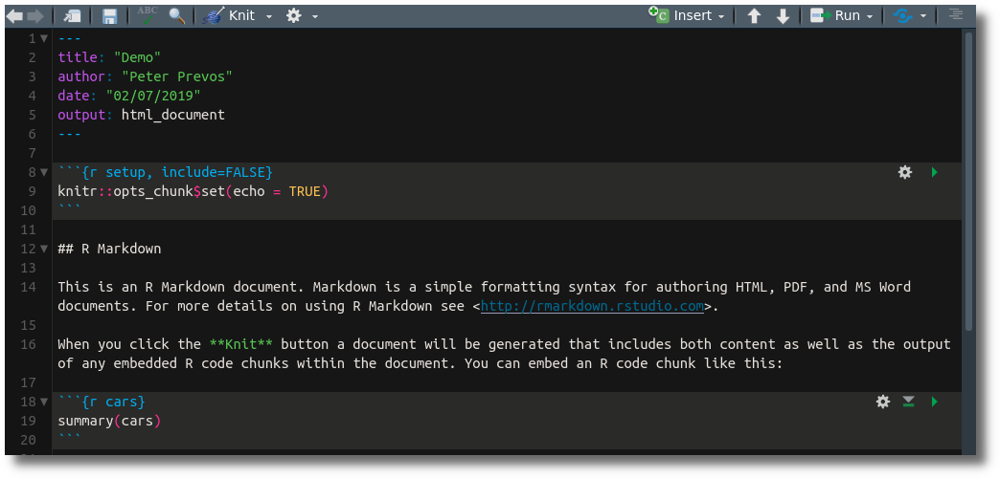

# Creating Data Products {#dataproducts}
The purpose of [data science](#datascience) is to create value from data by creating useful, sound and aesthetic data products. Analysing data is a rewarding activity, but creating value requires you to communicate the results. 

The generic term for the result of a data science project is a 'data product', which can be a:
* Report
* Presentation, or an;
* Application
* Infographic, or;
* Anything else that communicates the results of analyses.

The purpose of data products is to change reality positively. This change can be either by changing the way we understand our profession or by enabling somebody to implement change.

This section explains how to share the fruits of your labour with colleagues and other interested parties by generating reports that combine text and analysis through [literate programming](https://en.wikipedia.org/wiki/Literate_programming). Before we explain how to create reproducible reports, we delve into the data science workflow, with an excerpt from the book [Strategic Data Science](http://leanpub.com/strategic_data_science/c/r4h2o).

## Data Science Workflow
The workflow for analytical projects starts with defining a problem that needs solving (Figure 6.1). The next step involves loading and transforming the data into a format that is suitable for the required analysis. The data science workflow contains a loop, the so-called data vortex. This vortex consists of three steps: exploration, modelling and reflection that are repeated until the problem is solved or is shown to be unsolvable.

{width: 80%, align: "middle"}


### Define
The first step of a data science project is to define the problem. This first step describes the problem under consideration and the desired future state. The problem definition should not make specific reference to available data or possible methods but be limited to the issue at hand. An organisation could seek to optimise production facilities, reduce energy consumption, monitor effectiveness, understand customers, and so on. A concise problem definition is necessary to ensure that a project does not deviate from its original purpose or is cancelled when it becomes apparent that the problem cannot be solved.

The problem definition opens with a description of the current situation and clearly identifies which aspect needs improvement or more profound understanding. The problem statement concludes with a summary of the data product. For example:

> The regulator for water quality has released a new guideline that lowers the maximum value for trihalomethanes (THMs) at the customer tap to 0.20 mg/l. This report assesses the historical performance of the Gormsey water system to evaluate the risk of non-compliance, assuming no operational changes are implemented.

### Prepare
The available data needs to be loaded and wrangled into the required format before any analysis can take place. Influential data scientist Hadley Wickham refers to this process as tidying data, as discussed in the [previous chapter](#casestudy2). Anecdotally, this phase project could consume up to eighty per cent of the work effort, depending on the difference between the available data and the required data.

Best practice in data science is to record every data set that is considered for the project in the final result. Describe every field used in the analysis to ensure the context in which the data was created is understood.

For the problem statement above, we have the Gormsey data that was discussed previously, which is already a tidy data set. Our report would open with a description of this data and how it was collected.

### Understand
Once the data is available in a tidy format, the process of understanding the data can commence. The analytical phase consists of a three-stage loop, the data vortex, that is repeated until the required results are achieved or evidence becomes available that the objectives cannot be met. These three stages are: explore, model and reflect.

The techniques used in this phase depend on the type of problem that is being analysed. Also, each field of endeavour uses different methodological suppositions. Analysing subjective customer data requires a very different approach than the objective reality of a turbidity probe in a treatment plant.

For our example case study, the analysis is a straightforward description of the distribution of the results. We don't have chlorine residuals for the Gormsey data, but if we did, we could, for example, investigate the relationship between chlorine and THM.

#### Explore
The best method to analyse data is through exploration and understand the relationship between the data and the reality it describes. Generating descriptive statistics such as averages, ranges, correlations, and so on, provides a quick insight into the data. Relying on numerical analysis alone can, however, deceive because very different sets of data can result in the same values. 

Justin Matejka and George Fitzmaurice from *AutoDesk* demonstrated how very different sets of data can have almost the same [summary statistics](https://doi.org/10.1145/3025453.3025912) (Figure 6.2). Each of these six visualisations shows that these sets of data have very different patterns. When, however, analysing this data without visualising it, the mean values of `x` and `y`, and their correlations are almost precisely the same for all six subsets. In their paper, they presented an algorithm that generates every possible pattern with the same summary values, six of which are shown in the illustration.

{width: 80%}


Another reason visualisations are essential to explore data is to reveal anomalies, such as spikes in time series or outliers. A sudden increase and decrease in physical measurements are often caused by issues with measurement or data transmission instead of actual changes in reality. These spikes need to be removed to ensure the analysis is reliable. Anomalies in social data such as surveys could be subjects that provide the same question to all answers, discussed in the previous chapter.

Detecting and removing outliers and anomalies from the data increases the reliability of the analysis. Not all anomalies in a collection of data are necessarily suspicious, and care should be taken before removing data. The reasons for excluding any anomalous data should be documented so that the analysis remains reproducible. For this reason, the raw data should never be modified. Reproducible code shows the process from raw data to clean data to ensure that we clearly understand the relation between reality and the data product.

#### Model
After the analyst has a good grasp of the variables under consideration, the actual analysis can commence. Modelling involves transforming the problem statement into mathematics and code. Every model is bounded by the assumptions contained within it. Statistician George Box is famous for stating:

> "All models of reality are wrong, but some are useful". 

Since data science is not a science in the sense that we are seeking some universal truth, a useful model that can positively influence reality is all we need.

When modelling the data, the original research question always needs to be kept in mind. Exploring and analysing data without a specific purpose can quickly lead to wrong conclusions. Just because two variables correlate does not imply that there is a logical relationship. A clearly defined problem statement and methodology prevent data dredging. 

The wide availability of data and the ease of extracting this information makes it easy for anyone to find relationships between different sources of information. This is what Drew Conway coined the danger zone in his data science Venn diagram. While it is easy to combine data, we should never do this without understanding the mathematical foundations.

A good general rule when analysing data is to distrust your method when you can confirm your hypothesis easily. If this is the case, triangulate the results with another method.

#### Reflect
Before you can communicate the results of an analysis, domain experts need to review the outcomes to ensure they make sense and indeed solve the problem stated in the definition. The reflection phase should, where relevant, also include customers to ensure that the problem statement is being solved to their satisfaction.

Visualisation is a quick method to establish whether the outcomes make sense by revealing apparent patterns. Another powerful technique to reflect on the results is sensitivity analysis. This technique involves changing some of the assumptions to test the model responds as expected. Mathematical models are often complicated, and the relationship between variables is not clearly understood. Sensitivity analysis helps to understand these relationships by using extreme for specific variables and then observe the effect on the model.

### Communicate
The last, and arguably, the hardest phase of a data science project is to communicate the results to the users. In most cases, the users of a data product are not specialists with a deep understanding of data and mathematics. The difference in skills between the data scientist and the user of their products requires careful communication of the results.

Detailed reports and visualisations need to provide an accurate description of the outcomes, and they need to convince the reader. The most critical aspect of successfully communicating the solution to a problem is to ensure that the consumers of the results understand them and are willing to use the data product to solve their problem. As much as data science is a systematic process, it is also a cultural process that involves managing the internal change in the organisation.

Advertising executive Fred Barnard coined the well-worn cliche that "a picture is worth (ten) thousand words" in 1927. While this might be the case, the complexity of data science in most cases requires text to explain the analysis.

To claim that a report needs to be written with clarity and precision in proper spelling and grammar almost seems redundant. The importance of readable reports implies that the essential language a data scientist needs to master is not Python or R but English, or another human language.

Writing a good data report enhances the reproducibility of the process by describing all the steps in the process. A  report should also help to explain any complex analysis to the user to engender trust in the results.

The topic of writing useful business reports is too broad to do justice within the narrow scope of this book. For those people that need help with their writing, data science can also assist. There are many great online writing tools to support authors not only with spelling but also grammar and idiom. These advanced spelling and grammar checkers use advanced text analysis tools to detect more than spelling mistakes and can help fine-tune a text utilizing data science. As English is my second language, I rely heavily on the Grammarly software to ensure it is free of apparent issues. However, even grammar checking with machine learning is not a perfect replacement for a human being who understands the meaning of the text.


## Reproducible Research
RStudio has several options to create shareable outputs with people who don't necessarily understand R code. This section explains how to create reproducible research with the IDE through the use of the R Markdown approach.

[Chapter four]{#tidyverse} showed how to use the *ggplot2* package to create aesthetic visualisations and save them to disk in a high resolution with the `ggave()` function. You can then load these images in your report to communicate the results. This approach works fine until you need to change some assumptions in your graphs, a new colour scheme or any other change. Every time you change the analysis, you will have to edit the report. This is not only an inefficient way to work, but it can also lead to error as you might forget to transpose one of the new results into the report.

The problem with this standard approach is that the data, the code are separate from the final data product. Reproducible research solves this problem by combining the data and the analysis with the final result.

The most effective method to achieve full reproducibility is to use literate programming. Although many systems exist that at first instance might seem more user-friendly than writing code, point-and-click systems have severe limitations, and the results are often impossible to verify. The central concept of literate programming is that the data, the code and the output are logically linked so that when either the data or the code changes, the output will change as well. 

Several methods are available in the R language to ensure analysis is reproducible. The most basic one is adding comments to the code. A comment is a statement that is not evaluated when running the code. In the R language, comments are indicated with one or more pound signs, also known as a number sign, hash or hashtag, at the start. For example:

{format: r, line-numbers: false}
```
# Raw data from Qualtrics
rawdata <- read_csv("casestudy2/Customer_Perception_USA.csv")
customers <- rawdata[-1, ] # First row is redundant
```

Within any language, there are many ways to communicate the same message. Just like in natural language, data scientists use coding conventions to make a text readable. The developers of the Tidyverse have published a [style guide](https://style.tidyverse.org/) to assist data scientists with writing code that is easy to read and follow. In the developer's parlance, this is called elegant code.

Comments in code help a human reader understand the flow of logic. There is a point, however, where your analysis is so complex that you need more comments than code. This is the point to start using more advanced methods. Furthermore, most consumers of data products are not interested in the code and only want to see the results. The next section explains how to use RStudio to create data products in various formats, such as Word, Powerpoint, PDF and HTML.

## R Markdown
R-Markdown is a method to combine a narrative with the results of the analysis. An R-Markdown file consists, as the name suggests, of R code and Markdown code. You know what R is, so now we need to explore Markdown.

Word processors use the WYSIWYG approach. This means that what you see on the screen is what you get when you print the document (What You See is What You Get). While this is a seductive way to produce documents, it is not the most productive method because you get distracted by formatting and other fancy options. Writing should be about composing text, not about designing typography and layout.

Underneath the glitz and glamour of the word processors, the software stores the in a markup language, such as XML. This language indicates whether a text is bold, a heading, stores links to images, and so on. Many writers don't use WYSIWYG software but produce text directly in a markup language such as LaTeX, HTML or Markdown. The advantage of this approach is that you focus on content instead of design. Anything written in a markup language can be easily exported to almost any format imaginable using templates. 

Markdown is, paradoxically, a markup language, known for its simplicity, which is the reason for the play of words. This course is written in Markdown, using the [Emacs](https://www.gnu.org/software/emacs/) editor. All the text, images and other resources are available in the `manuscript` folder.

Let's put this theory into practice. Go to the *File* menu and create a new R Markdown file. You will see a popup menu where you can enter the document title, author name and select the output type. Select *Word* as the output and enter a title related to the problem statement at the start of this chapter. When you click OK, RStudio will create a template document that explains the basic principles.

When you click the *Knit* button, RStudio asks you to save the file and generates a Word document that includes content, some of the code and the output of any R code embedded in the document. When you do this for the first time, you might receive a message that specific packages need to be installed. Follow the prompts to let that happen.

An R-Markdown document consists of three elements. The content between the three-dash lines is the header that specifies necessary information about the title, author, date and the output format (Figure 6.3).

{width: 100%}


All R code is written in 'chunks'. The three grave accents (backticks) indicate the start and end of a code chunk. The text between curly braces indicates the language and any options. By default, the code is included in the output. When you, for example, add the `echo = FALSE` option, the code is excluded. If you like not to show any code in the final document, then change the option in the first chunk, which sets the defaults. Many other options are available.

You can add additional chunks with the insert button. When you click it, you will notice that RStudio can also process other data science languages such as SQL or Python.

The third part of the document is the Markdown text. In Markdown, headers start with one or more has symbols, lists start with asterisks, and so on. Markdown uses these non-alphanumeric symbols to instruct the computer what the output should look like. 

Lastly, you can embed the output of an R expression inside a line of text. For example, to write: "A total of 491 respondents completed the survey.", with data from the second [case study](#casestudy2) you can add the following line to your text:

```
A total of `r nrow(customers)` respondents completed the survey.
```

The expression is evaluated when you knit the document. This way, your numbers are always up to date with the latest data. Make sure you don't forget the lower case letter `r` to indicate that it needs to be evaluated. The line shown above will result in:

> A total of 691 respondents completed the survey.

When working on a project, it is best first to write the code in a well-commented R script and copy this into a Markdown document after you complete the analysis. You can then add any explanatory text and so on to create reproducible research.

The basic principles of R Markdown are explained in detail on R Markdown [cheat sheet](https://www.rstudio.com/wp-content/uploads/2016/03/rmarkdown-cheatsheet-2.0.pdf).

X> Familiarise yourself with R Markdown using the template. For advanced use, review the cheat sheet.

The output of data analysis is often expressed in tables. To create neat tables in a report, you should use the `kable()` function of the *knitr*  package. This example below shows how to export a table in an R-Markdown file.

The first two read the customer survey data and create a data frame with a count of each of the three cities. In this case, we convert the output of the `table()` function to a data frame with `as.data.frame()`.

The third line changes the generic variable names assigned by R to something more meaningful. The last line calls the `kable()` function in the  *knitr* library.

{format: r, line-numbers: false}
```
customers <- read.csv("casestudy2/customers.csv")
cities <- as.data.frame(table(customers$City))
names(cities) <- c("City", "Respondents")
knitr::kable(cities, caption = "Repspondent cites.")
```

Using a double colon is a quick way to use a function from a library that you have not explicitly loaded. Another option would be to first call `library(knitr)` and then the `kable()` function.

### Presenting numbers
The numerical output of R functions often contains far to many decimals. Several functions are available to control the way R presents numbers. Firstly, you can set the default number of digits with the `options(digits = n)` function. Standard R is accurate up to about 15 decimals. If you need more precision, you need to use specialised packages, such as the [Rmpfr](https://cran.r-project.org/web/packages/Rmpfr) package. Run the following code to see the difference:

{format: r, line-numbers: false}
```
a <- sqrt(7)
print(a)

options(digits = 15)
print(a)
```

This method will change the output of all calculations. To only change the current variable, use either of these three functions.

{format: r, line-numbers: false}
```
print(a)

round(a)

round(a, digits = 2) 

round(-123.456, digits = -1)

floor(a)

ceiling(a)

signif(a, digits = 4)
```

The `round()` function defaults to rounding to an integer. When using a negative number in the `digits` option, the number is rounded to the nearest power of ten. The `floor()` and `ceiling()` functions result in an integer. If you like to constrain the number of total digits, including the integer part, use the `signf()` function.

The `kable()` function discussed in the previous section has a built-in rounding function. The `digits` option sets the number of digits for numerical output. If you apply a vector to this option then you can set separate digit numbers for each column.

### Export formats
Rstudio can export R-Markdown to many standard formats. A standard file can be 'knitted' to an HTML file for websites, Word or PDF. To create a PDF, you need to have the LaTeX software installed on your computer. LaTeX is a powerful markup language, often used for publications in the formal and physical sciences.

### Sharing results online
If you like to share the results of your analysis with the world, then you can upload your HTML report to [RPubs](https://rpubs.com/). Please note the that documents on RPubs are publicly visible, so don't add any sensitive data.

You will need to install various packages to enable to publishing functionality in RStudio. The software will automatically prompt you to install these when you first try to publish to the internet.

1. In RStudio, create a new R Markdown document.
2. Click the Knit HTML button in the doc toolbar to preview your document. 
3. In the preview window, click the Publish button.

You will need to create a free account with RPubs before you can publish any documents.

### Other Output formats
RStudio can also be used to create other types of data products, which are not discussed in detail in this report.

Using the same principles, you can also create presentations with RStudio that combine text, images, code and the results of R analysis. These presentations are not in PowerPoint but use HTML and Javascript.

Lastly, using the *Shiny* extension, R can b used to build online applications where users can interactively explore the analysis.

## Reproducible Research Assignment
This chapter closes with an assignment using the data from the first or second case study.

X> Create a short report in Word that assesses the Gormsey data to solve the problem statement at the start of this chapter, repeated below.

### Problem Statement
> The regulator for water quality has released a new guideline that lowers the maximum guideline value for trihalomethanes at the customer tap to 0.15 mg/l. This report assesses the historical performance of the Gormsey water system to evaluate the risk of non-compliance, assuming no operational changes are implemented.

To undertake this task, you can follow this workflow:
* Load the Gormsey water quality data (in the `casestudy1` folder).
* Subset the data to only keep the THM results.
* Count the number of samples per zone.
* Visualise the data for each water quality zone and indicate the current and new limit.
* Show a table of the exceedsances.

X> If you like to boast or seek feedback, upload your solution to the [course community](https://community.leanpub.com/c/r4h2o).

A possible solution is provided in the `casestudy1` folder in the course materials.

In the last [case study](#casestudy3), we go back to the Tidyverse to analyse data from smart meters.
