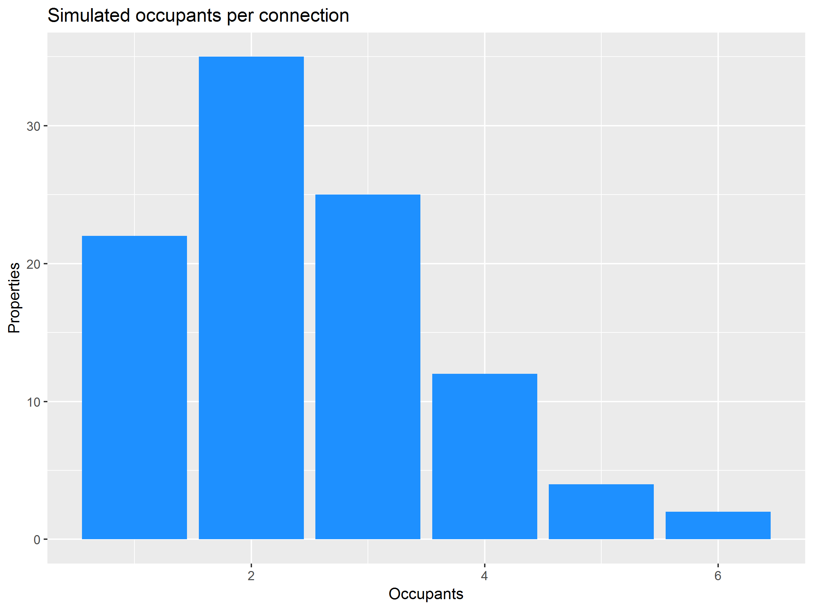

# Case Study 3: Measuring Water Consumption {#casestudy3}
The case study for this session is a data simulated data set for digital metering. This data set provides a realistic example of 

The data for this case study is simulated for two reasons. Firstly, detailed information about the water consumption of consumers can reveal a lot of information about the lifestyle of the people in the house. The data reveals when people are home or not, it can indicate how many people lie in the house, their nightly toilet habits and so on. Secondly, simulating data is an effective way to test computational methods because we know the expected outcomes. 

### Smart Water Meters
The term smart meters is quite common but contains a lot of marketing spin. Most customer water meters that fall into this category are standard devices fitted with an electronic data logger and transmitter. These devices are not intrinsically smart but they provide the utility with very detailed data that allows water professionals to make smarter decisions.

Smart meters provide data at varying frequencies, from every few seconds to daily. Deciding how much data to collect depends on many variables. A case study illustrates how to decide the ideal amount of data to collect. 

A water utility discussed how much data they wanted to

Good Data Science gather to measure how much water customers use. The existing method only provided one data point for each water meter every three months. The water engineers would ideally like a reading every five minutes, while the billing department was more than happy with one daily reading. New technology became available that collects data at a higher frequency. However, the higher the rate, the higher the cost of collection due to transmission bandwidth and battery life. Collecting data every five minutes was considered to be unfeasible and potentially unethical because it reveals too much about the lifestyles of customers. Daily data was insufficient to provide benefits in network design and operation. The utility decided to collect hourly data because it allows for most of the sought benefits, doesn't significantly impact the privacy of customers and is within reasonable reach for the current level of technology.

The benefits of digital metering is that the water utility 

## Simulating water consumption
Using real hourly water consumption data for this case study was not an option because of the privacy-sensitivity of the data. The diurnal curve for an individual property tells a story about the lifestyle of the people living there. 

Simulating human behaviour is complex that would require an intrinsic mathematical model. This simulation is simple but produces realistic data by using a stochastic method and a model diurnal curve for indoor water use.

The basic method used to simulate water consumption uses a model diurnal curve sourced from a journal article by [Gurung et al](https://www.researchgate.net/publication/263930947_Smart_meters_for_enhanced_water_supply_network_modelling_and_infrastructure_planning) (2014).

The number of occupants per service (each dwelling has one service) is determined by generating random numbers following a Poisson distribution. Figure 7.x visualises the number of people per household.

Next step was to determine which services have a leak. The leaking services were modelled with a binomial distribution and the intensity of the leak with a uniform distribution

All number generation is seeded to promote reproducibility. When seeding a random number with the `seed()` function, the 'random' numbers are always the same. This way we always have the same results, while still using a stochastic approach.

The `smart_meter_simulation.R` file in the `casestuy3` folder contains the code that was used to simulate the data.

## Analysing water consumption

## Assignment
