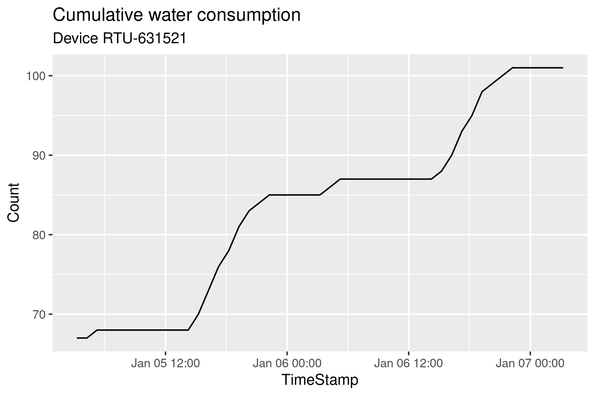
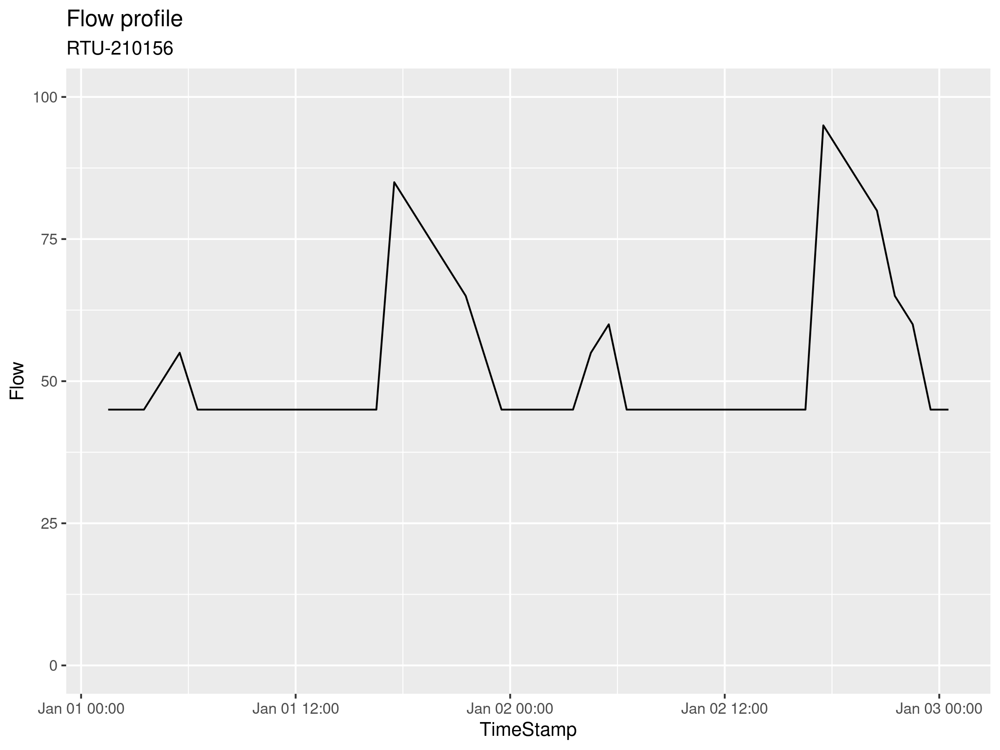
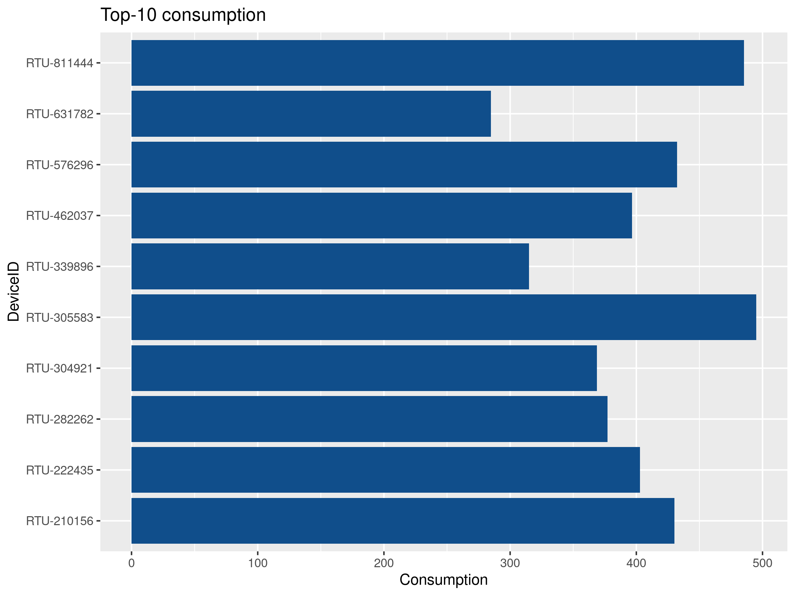
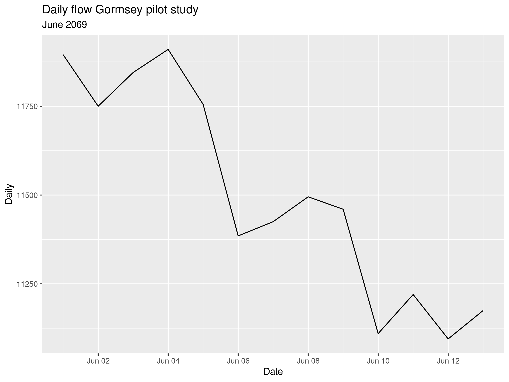

# Case Study 3: Measuring Water Consumption {#casestudy3}
The last case study looks at water consumption. Smart meters, or digital water meters, measure consumption at a much higher frequency for the water utility to better understand where the water flows in the network. 

This data unlocks many benefits, from providing customers with detailed knowledge of their consumption, to leak detection and network optimisation. This case study uses the functionality of the Tidyverse to analyse smart meter data.

## Problem Statement
Most water utilities measure the consumption of their customers once per month or even less, and some don't measure consumption at all. While this practice might be sufficient for billing, the limited amount of consumption data constrains the knowledge utilities can have about how water moves through the system. This approach is like looking at your bank balance once every month and then try to figure out where your money went.

Your water utility has just completed a pilot study of 100 services in the Gormsey system fitted with data loggers on existing services. One year of data is available, and your task is to explore this data and develop some algorithms to visualise consumption and to find services with leaks.

## Analysing data with the Tidyverse
Before we get started with analysing water consumption, we return to case study 2 to explain some principles of analysing data with the *dplyr* library of the Tidyverse. We still have not answered the main question for this case study: What is the level of consumer involvement for tap water?

X> Activate the Tidyverse library and read the Personal Involvement Index data (you created this in [Case Study 2](#involvement)) to the `involvement` data frame.

In case you forgot, this data frame consists of four variables: the respondent id, their city of origin, the item on the scale and the score. The `glimpse()` function gives this result:

{line-numbers: false}
```
Observations: 4,910
Variables: 4
$ id    <chr> "R_eqvaSnwkUPEwKz3", "R_50zNvLsNRxFctxj", "R_3env6Rl1UGW2m4R"…
$ City  <chr> "Los Angeles", "Boston", "Denver", "Boston", "Denver", "Denve…
$ Item  <chr> "p01", "p01", "p01", "p01", "p01", "p01", "p01", "p01", "p01"…
$ Score <dbl> 7, 7, 6, 7, 7, 7, 7, 7, 5, 7, 7, 7, 7, 2, 6, 6, 7, 1, 6, 7, 7…
```

The Personal Involvement Index is the sum of all the scores within the scale. Technically we need to confirm this through factor analysis, but that is outside the scope of this course. You can read about the detailed analysis of this data in [The Invisible Water Utility](http://hdl.handle.net/1959.9/561679).

The first step to answer the case study question is to add all the scores for each respondent. The score variable contains several `NA` values, which means that customers did not answer 520 items. Use `table(pii$Score, useNA = "always")` to verify this claim.

When we add a vector of numbers with an `NA` value, the result is also `NA`, unless you specifically tell R otherwise with the `na.rm = TRUE` option. We need this option because we can only use completed surveys.

{format: r, line-numbers: false}
```
a <- c(1, 3, NA, 5, 6)
sum(a)
sum(a, na.rm = TRUE)
```

To calculate the level of involvement with tap water for each respondent, we need to group the data by respondent id and add all the scores. We should not remove the NA values because that leads to invalid scores. We can only calculate the level of involvement if we have an answer to all questions. Those respondents that did not answer all items have `NA` as their involvement score.

An alternative option would be to remove all respondents that did not answer all questions in the data cleaning phase.

The *dplyr* library in the Tidyverse has very strong capabilities to slide-and-dice data. When analysing large sets of data, such as smart meters, you are only ever interested in groups or sections of the data. 

The `group_by()` function helps with this task. This function takes an existing data frame and converts it to a grouped table. The next step is to calculate the involvement of each customer. The `summarise()` function, as the name suggests, summarises the data in (groups of) data frames.

These two functions are the working horse of the Tidyverse, and we use them extensively to analyse the smart meter data.

{format: r, line-numbers: false}
```
libary(tidyverse)

pii <- read_csv("casestudy2/involvement_tidy.csv")

involvement <- pii %>%
    group_by(id) %>%
    summarise(pii = sum(Score))

ggplot(involvement, aes(pii)) + 
    geom_histogram(fill = "indianred4", col = "white", binwidth = 1) + 
    geom_vline(xintercept = mean(involvement$pii, na.rm = TRUE), col = "orange") + 
    labs(title = "Personal Involvement Index for tapwater",
         subtitle = paste("n = ", nrow(involvement))) + 
	theme_bw()
```


X> Reverse engineer the code to understand how it works.

Q> How many `NA` values are there in the involvement data frame? 

D> Review the results of the Personal Involvement Index. What story does this histogram tell you?

### Smart Water Meters
The term smart meters is quite common, but it contains a lot of marketing spin. Most customer water meters in this category are standard devices fitted with an electronic data logger and transmitter. These data loggers are an integral part of the meter, or they are retrofitted to the device. These meters are not intrinsically smart but provide the utility with detailed data that allows water professionals to make smarter decisions.


Smart meters provide data at varying frequencies, from every few seconds to daily reads. Deciding how much data to collect depends on several considerations.

Water engineers ideally like a reading every five minutes to match their modelling frequency, while the billing department was more than happy with one daily reading. The customer service team likes to know whether a property leaks. 

The higher the data rate, the higher the cost of collection due to increased transmission bandwidth and reduced battery life. Collecting data every few minutes is most likely unfeasible and potentially unethical because it reveals too much about the lifestyles of customers. Daily data is insufficient to provide benefits in network design and operation. Hourly reads seems a good compromise because it allows for most of the sought benefits, doesn't significantly impact the privacy of customers, and is within reasonable reach for the current level of technology.

### Simulating water consumption
The data for this case study is simulated, based on assumptions and stochastic variables. This data was created in a first step to develop a reporting system for smart meter data. Using simulated data enabled the development of the software before the actual data was available.

The data is simulated for two reasons. Firstly, detailed information about the water consumption of consumers reveals information about their lifestyle. The data reveals how many people live in the house, their nightly toilet habits, holidays, and so on. Secondly, simulating data is an effective way to test computational methods because we know the expected outcomes.

The R language includes many functions to generate patterns of random numbers to simulate stochastic processes. Simulating a process can provide information about the distribution of possible outcomes through a [Monte Carlo simulation](https://www.investopedia.com/terms/m/montecarlosimulation.asp). This type of simulation is often applied to probabilistic cost estimates.

The method used to simulate the data is explained in an R Markdown file in the `casestudy3` folder. This folder also contains a PDF version of this file, knitted with LaTeX.

## Analysing water consumption
The smart metering data does not need any cleaning because it is already tidy. There is only one observation for each device at a point in time. The first step is to load the data into a variable.

X> Load digital metering data into the `reads` variable.

{format: r, line-numbers: false}
```
reads <- read_csv("casestudy3/meter_reads.csv")
glimpse(reads)
```

Using the `glimpse(reads)` expression, we find out that the data has three variables with 876,000 observations (reads).

{line-numbers: false}
```
Observations: 876,000
Variables: 3
$ DeviceID   <chr> "RTU-2378716", "RTU-2378716", "RTU-2378716", "RTU-2378716"…
$ TimeStamp <dttm> 2069-06-30 14:09:08, 2069-06-30 15:09:08, 2069-06-30 16:0…
$ Count      <dbl> 2, 4, 5, 7, 10, 12, 17, 24, 30, 35, 39, 43, 47, 51, 54, 58…
```

The consumption data is provided as the number of cumulative counts in five-litre increments (Figure 7.2). A flat line indicates that there was no consumption, and a sloped line implies that the occupants consumed water.



D> What conclusions can you draw about the lifestyle of the hypothetical people that live at this imaginary property?

To determine the level of consumption between two reads in litres per hour, we need to subtract two consecutive reads from each other. Since there is no missing data in this case study, the period between all reads is precisely one hour. In real life, there are missing data points, which means you also need to determine the time difference between subsequent reads.

A fast way to determine the difference between consecutive numbers in a vector is the `diff()` function. An example illustrates the principle. The code below results in a vector with four times the number 1: (`2 - 1, 3 - 2, 4 - 3, 5 - 4`$). Note that this new vector is one element shorter than the original.

{format: r, line-numbers: false}
```
v <- c(1, 2, 3, 4, 5)
diff(v)
```

However, if we apply this function to the whole data frame, we get in trouble when we move from one device to the next. Taking the difference between rows 2 and 3 leads to negative consumption. You can use `summary(diff(reads$Count))` to see the negative values.

{format: r, line-numbers: false}
```
reads[(24 * 365 - 1):(24 * 365 + 2), ]

  DeviceID    TimeStamp           Count
  <chr>       <dttm>              <dbl>
1 RTU-6408930 2070-06-30 12:15:35 12410
2 RTU-6408930 2070-06-30 13:15:35 12410
3 RTU-1300375 2069-06-30 14:57:49     5
4 RTU-1300375 2069-06-30 15:57:49    10
```

We can solve this problem by applying the `diff()` function to the grouped data. However, because the result is one shorter than the original vector, we need to add an `NA` value to the result. Without this addition, we cannot fill every value in the data frame, which is a requirement. The difference between consecutive values is multiplied by five to get litres per hour. The `mutate()` function assigns the new variable to the data frame.

After we have the flow, the `Count` variable can be ditched, and we remove all `NA` values in `Flow` (the very first read). This data frame is the basis of all further analysis, so we save it to disk.

{format: r, line-numbers: false}
```
flow <- reads %>%
    group_by(DeviceID) %>%
    arrange(TimeStamp) %>%
    mutate(Flow = c(NA, diff(Count) * 5)) %>%
    select(-Count) %>%
    filter(!is.na(Flow))    

write_csv(flow, "casestudy3/flow.csv")
```

### Visualising Consumption
Now that we have the flow in litres per hour for each service it is pretty easy to visualise consumption for individual properties.

Q> Recreate the graph in figure 7.3. Tip: First use the `slice()` function to select the first 48 rows and filter the data to only show the device with serial number RTU-210156. Make sure the y-axis scales between 0 by including `ylim(0, 100)` in your call of the ggplot function.



D> What story does the graph in figure 7.3 tell?

### Top Ten Users
The previous section visualises flow for one specific service. While this is interesting, in any real-life situation, you need to review the flow of thousands or even millions of services. Also, viewing data in detail from individual services should only be done for operational reasons because this information is privacy-sensitive.

Instead then reviewing the individual performance of each service, we need to look at anomalies. The `group_by()` function summarises data for groups of services over time.

This following example shows how to find the top ten users in the available data. The code groups the flow data by device ID and summarises the consumption for each service by summing the flows and converting this to cubic meters (or kilolitres for Australians).

To find the top ten users, we first arrange the data by consumption. By default, the `arrange()` function sorts data in ascending order (low to high). Adding the `desc()` function sorts the data in descending order.

The last step uses the `top_n()` function to select the top ten users.

{format: r, line-numbers: false}
```
top10 <- flow %>%
    group_by(DeviceID) %>%
    summarise(Consumption = sum(Flow) / 1000) %>%
    arrange(desc(Consumption)) %>%
    top_n(10)
```

Q> Reverse-engineer this code to understand how it works. Use the `slice()` function to achieve the same result. Visualise the results to replicate Figure 7.4.



## Analysing Time Series
Digital Metering data is a time series as each data point is indexed by the time of the measurement. The data in this case study is an equally-spaced time series, which means that all time intervals are the same. In reality, most time-series data is irregular, which complicates the analysis.

Analysing a time series is a specialised task for which many packages exist in R. One of the necessary skills you need to analyse a time series is to work with time and data variables. The R language has extensive functionality to work with dates and times, and the Tidyverse contains the *lubridate* package to 'lubricate' working with these complex data types.

### Times and Dates
Computers store times and dates as a number of seconds from an origin, usually 1 January 1970. The underlying data for all time and date variables is thus a large integer from the starting point.

There are two fundamental units of time-based variables: dates and POSIX. POSIX is a standard for computer data that includes dates and times. A POSIX variable includes both a date and a time, e.g. "15 Jul 2019 13:41:36 AEST".

When you glimpse the flow data frame you see that the `TimeStamp` variable is a dttm (date and time) variable. If we, for example want to filter the data for only the month of May we can use:

{format: r, line-numbers: false}
```
filter(flow, TimeStamp >= as.Date("2069-05-01"), TimeStamp <= as.Date("2069-05-31"))
```

The `as.Date()` function converts the character string to a date. By defaults, dates are written in [ISO 8601](https://en.wikipedia.org/wiki/ISO_8601) format (YYY-MM-DD).

When a variable is registered as a date, you can also use arithmetic functions to calculate time differences.

Q> How many days has somebody who was born on 13 March 1977 lived? Use the `as.Date()` function to create two variables.

Please note that the results of a calculation with dates and times is of a special variable class. To use this result in further calculations you need to convert it to a numerical value by using the `as.numeric()` function.

T> Try to take the square root of the time difference and review the result. Then convert it with `as.numeric()` and try again.

{format: r, line-numbers: false}
```
sqrt(d)

sqrt(as.numeric(d))
```

Q> Filter the data for the first 14 days of June and group the consumption by date. Visualise the total consumption for all services. Note that you need to convert the date-time variable to a date to be able to group all flows by the date.

The R language has extensive functionality to create and manipulate time data, which are outside the scope of this course. In the following section we look at some functions in the Tidyverse to manage dates and times.

### Monthly consumption
The Tidyverse contains the *lubridate* package which makes working with dates and times a little easier. This next example groups the data in the data frame by month and adds the total flows.

The month function converts a date to the number of the month. For example,  `month(as.Date("2019-07-17"))` results in the number 7. The *lubridate* package has many functions to convert dates. In a similar way, you can extract the year and day from a date.

T> Use the `year()` and `day()` functions with a random date.

{format: r, line-numbers: false}
```
year(as.Date("2019-07-17"))
day(as.Date("2019-07-17"))
```

You can find out much more about this package on the [lubridate website](https://lubridate.tidyverse.org/), including a cheat sheet to help you navigate the myriad of functions.

{format: r, line-numbers: false}
```
library(lubridate)

flow %>%
    group_by(Month = month(TimeStamp, label = TRUE, abbr = TRUE)) %>%
    summarise(Consumption = sum(Flow) / 1000) %>%
    ggplot(aes(factor(Month), Consumption)) + 
    geom_col(fill = "dodgerblue4") + 
    labs(title = "Monthly consumption",
         x = "Month", y = "Consumption [kL]")
```


X> Reverse-engineer this code to understand how it functions.

## Leak Detection
One of the advantages of monitoring water consumption hourly is that we can quite easily find properties with suspected leaks. Water consumption is a direct reflection of consumer behaviour an with some simple assumptions we can identify anomalous consumption patterns, such as leaks.

The model diurnal curve for a residential property (Figure 7.1) has one or more periods without any water consumption. People sleep for at least one period per day and many houses are unoccupied during the day.

This assumption implies that for any property where the minimum flow rate in a day was not zero, the inhabitants either were using water over a very long period, or there was another reason for this flow unrelated to human behaviour, i.e. a leak.

Leak detection always occurs over a certain period. In this case study we use data from the whole year. In reality you would hope that leaks last a lot shorter than a whole year. 

The resolution of the data is five litres per hour. This means that we can only find substantial leaks. A dripping tap account for only about fiver litres per day, which is invisible at this resolution.

Q> Write a Tidyverse pipe that finds properties with a suspected leak and the extent of the leakage. Hint: group the data by service

D> If you analyse the data over a short period of time, what could be other reasons for continuous water flow?

## Answers
The following section contains the answer to the questions in this chapter.

### How many NA values are there in the involvement data frame?
We can answer this questions in two ways. The basic way is by using the `table()` function we have seen before, but setting the `useNA` option to "always".
 
The second method uses the Tidyverse method by first filtering all `NA` values and piping the result to the `count()` function.

{format: r, line-numbers: false}
```
table(involvement$pii, useNA = "always")

filter(involvement, is.na(pii)) %>%
    count()
```

### Recreate the graph in figure 7.3
The first two lines filter the data for the requested device and slice the first 48 rows, as suggested. 

The result of this filter is piped to the ggplot function with a line geometry. The `scale_y_continuous()` function has many options to define how to display the axis. In this case we instruct ggplot to scale the y-axis from 0 to 100 litres per hour. Lastly, we add some titles to the plot to provide context and ensure the saved file is always identifiable.

{format: r, line-numbers: false}
```
filter(flow, DeviceID == "RTU-210156") %>%
    slice(1:48) %>%
    ggplot(aes(TimeStamp, Flow)) + 
    geom_line() + 
    scale_y_continuous(limits = c(0, 100)) + 
    labs(title = "Flow profile",
         subtitle = "RTU-210156")
```

This plot shows the first two days for this random service. You see a typical diurnal curve, but night time use is higher than morning use. This could imply watering the garden after work. Most interesting is that the minimum flow is just below fifty litres per hour. We would expect that there are at least some periods with zero flow. This data is thus indicative of a leak.

### Replicate figure 7.4
The code below uses the `slice()` function to pick the top ten. The ggplot package automatically shows the services in alpha-numerical order. When we want to show a top x of a data set it is better to sort the bars by size so that we immediately see the relative differences.

We can force the order of the bars by changing the level of the factor variable. The *ggplot* package converts the `DeviceID` to a factor to visualise the data in categories. 

By default, R sets the levels of a factor in alpha-numerical order. Run `factor(top10$DeviceID)` to see the levels. We can use the `levels` option to force the order to something else. 

The `order()` function gives the order of a vector. The result is a new vector with index numbers. Execute `order(top10$Consumption)` to see the result.

Reverse engineer the code below to see how to change the levels of a factor.

{format: r, line-numbers: false}
```
top10 <- flow %>%
    group_by(DeviceID) %>%
    summarise(Consumption = sum(Flow) / 1000) %>%
    arrange(desc(Consumption)) %>%
    slice(1:10)

top10$DeviceID <- factor(top10$DeviceID, levels = top10$DeviceID[order(top10$Consumption)])

ggplot(top10, aes(DeviceID, Consumption)) + 
    geom_col(fill = "dodgerblue4") + 
    coord_flip() + 
    labs(title = "Top-10 consumption")
```

### Days alive
As usual, there is more than one way to solve this problem. We first need to create a date variable for the birthday and one for the current day. To find the number of days you subtract these from each other. R also has a function to determine the current date, which makes this a bit shorter and generic because it can be repeated at any time.

{format: r, line-numbers: false}
```
birth <- as.Date("1977-03-03")
now <- as.Date("2019-07-17")

now - birth

Sys.Date() - birth
```

### Visualise daily consumption
To group the data by day, we first need to create a grouping variable with just the date and without the time. We could create a new variable with `mutate(Date = as.Date(TimeStamp)`, but the `group_by()` function can also create new variables, as show below.

{format: r, line-numbers: false}
```
filter(flow, TimeStamp >= as.Date("2069-06-01"), TimeStamp <= as.Date("2069-06-14")) %>%
    group_by(Date = as.Date(TimeStamp)) %>%
    summarise(Daily = sum(Flow)) %>%
    ggplot(aes(Date, Daily)) + 
    geom_line() + 
    labs(title = "Daily flow Gormsey pilot study",
         subtitle = "June 2069")
```



### Leak detection
This crude leak detection code looks for all properties where the minimum flow is more than zero litres per hour.

{format: r, line-numbers: false}
```
flow %>%
    group_by(DeviceID) %>%
    summarise(MinFlow = min(Flow)) %>%
    filter(MinFlow != 0)
```

This is the last session in this course. The [last chapter](#close) reflects on what you have learned and provides suggestions for further study.
