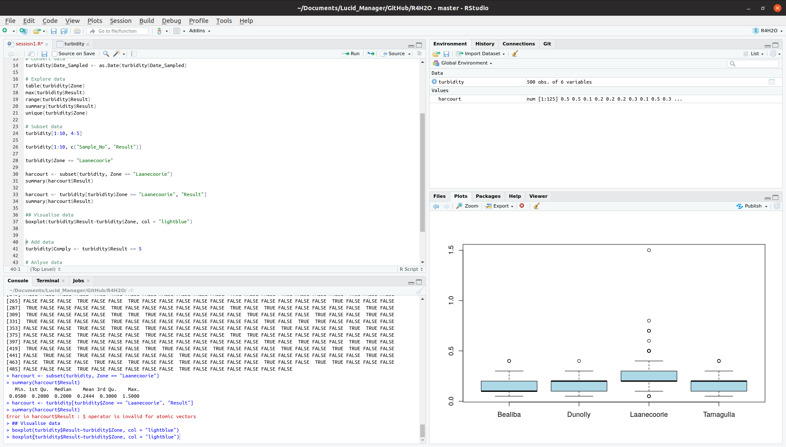

# Introduction to the R Language: Water Quality Regulations
This first session introduces the principles of working with the R language using a case study about water quality monitoring. 

This session starts with a 
In this session, participants learn to load data

## The R Language
R is a programming language for statistical computing and visualisation. This language is developed and maintained through the [R Foundation for Statistical Computing](https://www.r-project.org/foundation/ "The R website"). The R software is open source, which means that anyone can freely download, use, modify ad share the software. The open source model enables an activity community of developers that continuously improve the software.

Open source software is free. The word free in open source does not necessarily mean free as in free beer, but means freedom. The people developing open source software also need to be paid and most projects rely on donations from organisations that use the software commercially. If your organisation uses R, then I highly recommend considering financially supporting the R Foundation.

The R language is one of the most common tools for data science that can be integrated with many other data science software systems, such as Power BI, Tableau, Mathematica, MATLAB and do so on.

The easiest and fastest way to learn how to use R is by following one or more of the many courses available on the internet. This course is only a teaser to motivate water professionals to ditch their spreadsheets and start to write code. Some recommended resources are:

* DataCamp: Provides free introduction courses
* 

The basic R software only provides a console where the analyst can issue commands to the computer or run scripts. The best way is to use R in combination with an Integrated Development Environment (IDE). The most popular IDE for the R language is RStudio. This software is also an open source project with free and paid options. This workshop introduces some of the functionality of RStudio.

When you open RStudio for the firs time, the window is divided in three panes, each with various tabs. The left pane is the console. The top right pane shows the environment

X> Move your cursor to the console and type some simple mathematical expressions, such as 1 + 1 and hit enter. Now do the same in the 

## Basic principles

## Packages
One of the most exciting aspects of this language is that developers can write their own extensions of the R language, the so-called packages or libraries. Thousands of specialised packages are available that undertake a vast range of tasks. You can use R as a GIS and analyse spatial data, other packages help you to access data from various sources, such as SQL databases. Many R extensions undertake specialised tasks such as machine learning.

The majority of R packages are stored on [CRAN](https://cran.r-project.org/ "The Comprehensive R Archive Network"), which is the Comprehensive R Archive Network. You can install packages in R with the `install.packages` function. Within RStudio you can install packages in the *Tools* menu.

### Water R packages

    The CRAN library contains many packages with specialised functions to analyse water. This workshop does not cover any of these packages. This list is for information only.

* [agriwater](https://cran.r-project.org/web/packages/agriwater/index.html): Evapotranspiration and Energy Fluxes Spatial Analysis
* [ambhasGW](https://cran.r-project.org/web/packages/ambhasGW/index.html): Ground Water Modelling
* [baytrends](https://cran.r-project.org/web/packages/baytrends/index.html): Long Term Water Quality Trend Analysis
    -   [biotic](https://cran.r-project.org/web/packages/biotic/index.html): Calculation of Freshwater Biotic Indices
    -   [boussinesq](https://cran.r-project.org/web/packages/boussinesq/index.html): Analytic Solutions for (ground-water) Boussinesq Equation
    -   [CityWaterBalance](https://cran.r-project.org/web/packages/CityWaterBalance/index.html): Track Flows of Water Through an Urban System
    -   [dataRetrieval](https://cran.r-project.org/web/packages/dataRetrieval/index.html): Retrieval Functions for USGS and EPA Hydrologic and Water Quality Data
    -   [dbhydroR](https://cran.r-project.org/web/packages/dbhydroR/index.html): 'DBHYDRO' Hydrologic and Water Quality Data
    -   [driftR](https://cran.r-project.org/web/packages/driftR/index.html): Drift Correcting Water Quality Data
    -   [ecoval](https://cran.r-project.org/web/packages/ecoval/index.html): Procedures for Ecological Assessment of Surface Waters
    -   [EmiStatR](https://cran.r-project.org/web/packages/EmiStatR/index.html): Emissions and Statistics in R for Wastewater and Pollutants in Combined Sewer Systems
    -   [gsw](https://cran.r-project.org/web/packages/gsw/index.html): Gibbs Sea Water Functions
    -   [GWSDAT](https://cran.r-project.org/web/packages/GWSDAT/index.html): GroundWater Spatiotemporal Data Analysis Tool (GWSDAT)
    -   [humidity](https://cran.r-project.org/web/packages/humidity/index.html): Calculate Water Vapor Measures from Temperature and Dew Point
    -   EXPAND

# Case Study
The case study for this first session is a set of water turbidity measurement for  number of suburbs in the same water network. The Laanecoorie water network is situated approximately 100 km North of Melbourne in Victoria, Australia. The plant extracts water from the  reservoir, which  and treated with sand filtration.

The water network is divided in * water quality zones, each of which has a set of sample points installed at customer taps in the front of the house. The laboratory contractor regularly samples these taps and tests the water for a range of parameters, including turbidity.

All turbidity measurements in NTU are recorded at a specific sample point at a certain point in time. The data set is already cleaned and is ready for analysis.

## Turbidity

-   What is 

The individual states of Australia each have their own water quality regulations. These regulations all rely on the federal Australian Drinking Water Quality Guidelines. 

The Victorian regulations for water quality specify that the 95th percentile of turbidity 

# Examples
This section explains how to analyse an example data set with turbidity data for compliance with the Victorian Safe Drinking Water Regulations. All the code is available in the [session1.R](../session1/session1.R "Session 1 code file") file. 

The first step is to open the RStudio project file in the workshop folder. This file contains the basic settings for this project and sets the working folder.

## Load data
The data is stored in a csv file, which the `read.csv` file can read. The text between quotation marks is the path to the file. The path is relative to the working folder, so in this case we need to add the folder and the file name. Note that R uses the forward slash, common in Unix systems, and not the Windows backslash to form a path.

	turbidity <- read.csv("CaseStudies/turbidity_laanecoorie.csv")

If there is no error, the turbidity data is no loaded and visible in the Environment tab. The turbidity data is a 'data frame', which is a tabular set of data with rows and columns, very much like a spreadsheet.
## Inspect data
The next step is to see what is in the data. When you type the name of the variable, R will display all data in the console. This is not a practical way to inspect large sets. The `head` function only shows the first half dozen rows of the data, which prevents the screen from scrolling away. By the way, R also has the `tail` function, that shows the last rows of a data frame.

The `View` function (note the capital V) opens the data in a separate read-only window. This is the most convenient way to inspect the data. You can also view the data this way by clicking on the variable name in the Environment tab.

The `names` function only shows the names of the columns. You can also use this function to rename variables in a data frame. 

The `dim` function shows the number of rows and columns.

Lastly, the `str` function provides a succinct overview of the fields in the data set, including the data types. 

You can also obtain this information by clicking on the triangle next to the variable name in the Environment tab. The functions are useful when you need to use them in calculations or change the properties of the data.
## Convert data
When using the `str` function, you will note that the `Date_Sampled` field is a factor instead of a date field. A factor is a type of character variable that can be used in calculations, which falls outside the scope of this introduction to R. Using factors as a date is problematic because data cannot be ordered chronologically.

The `as.Date` function changes the factor into a proper date field that can be sorted chronologically and create a time series. R has many other functions to change the type of a variable, all of which start with `as.`.
## Explore data
Now we are ready to explore the data.

## Descriptive statistics

## Analysing the data

# Assignment
Using the functions described above, answer the following questions:

* How many samples were taken at each sample point?
* How many sample points are in the database?
* 

If you are stuck, you can view a possible solution in the [assignment1.R](../session1/assignment1.R "First assignment")file. Best to leave the cheating until you have tried everything to get the answer.

# Further study
After you have followed Session 2, apply the Tidyverse approach to this data and produce the visualisation shown below.

