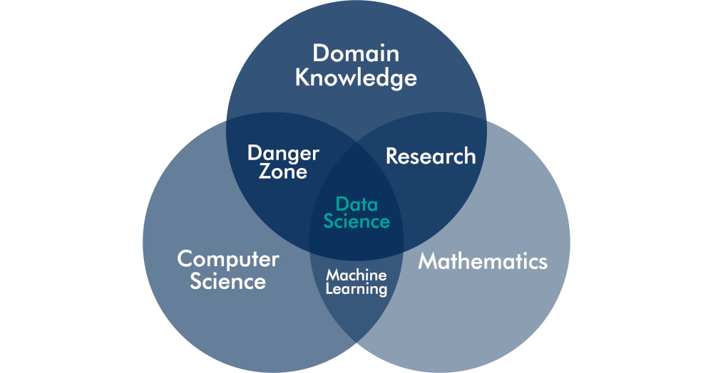

# Data Science for Water Utilities
This first session provides a framework for good data science. The first section defines data science within the context of managing water and sewerage supplies. The seconds section presents a framework for good data science.
## What is data science?
The earliest known form of writing is not an epic poem or religious text, but data. The [Ishango bone](https://arxiv.org/abs/1204.1019) is an engraved fibula of a baboon which was carved in central Africa 20,000 years ago. Some scholars hypothesised that the carvings represent an early number system as it lists several prime numbers, while others believe it to be a calendar. Some researchers dismiss these ideas and believe the markings merely improve grip when using the bone as a club. Whatever their purpose, the groupings of the markings are distinctly mathematical (Figure 1).

{width: "100%", alt: "Markings onthe Ishango bone."}

The idea that data can be used to understand the world is thus almost as old as humanity itself and has gradually evolved into what we now call data science. Using data in organisations is also called business analytics or evidence-based management. There are also specific approaches, such as Six-Sigma, that use statistical analysis to improve business processes.

Although data science is merely a new term for something that has existed for decades, some recent developments have created a watershed between the old and new ways of analysing business. The difference between traditional business analysis and the new world of data science is threefold.

Firstly, businesses have much more data available than ever before. The move to electronic transactions means that almost every process leaves a digital footprint. Collecting and storing this data has become exponentially cheaper than in the days of pencil and paper. Many organisations collect this data without maximising the value they extract from it. After the data is used for its intended purpose, it becomes 'dark data', stored on servers but languishing in obscurity. This data provides opportunities to optimise how an organisation operates by recycling and analysing it to learn about the past to create a better future.

Secondly, the computing power that is now available in a tablet was not long ago the domain of supercomputers. [Piotr Luszczek](https://www.phoronix.com/scan.php?page=news_item&px=MTE4NjU) showed that an iPad-2 produced in 2012 matched the performance of the world's fastest computer in 1985. The affordability of vast computing power enables even small organisations to reap the benefits of advanced analytics. The availability of computing power is illustrated by the fact that the majority of this course is written on a $99 [Pinebook](https://www.pine64.org/pinebook/) laptop.

Lastly, complex machine learning algorithms are freely available as Open Source software, and a laptop is all that is needed to implement sophisticated mathematical analyses. The R language for statistical computing and Python are potent tools that can undertake a vast array of data science tasks such as complex visualisations and machine learning. These languages are 'Swiss army chainsaws' that can tackle any business analysis problem. Part of their power lies in the healthy communities that support each other in their journey to mastering these languages. 

These three changes have caused a revolution in how we create value from data. The barriers to entry for even small organisations to leverage information technology are very low. The only hurdle to take is to make sense out of the fast-moving developments and follow a strategic approach instead of chasing the hype.

D> To what extent has your organisation digitised the collection of data? Are all sources of data available for analysis?

This revolution is not necessarily only about powerful machine learning algorithms, but about a more scientific way of solving business problems. The definition of data science in this book is not restricted to machine learning, big data and artificial intelligence. These developments are essential aspects of data science, but they do not define the field.

The expectations of data science are very high. Business authors position data science, and its natural partner 'big data', as a panacea for all societal problems and a means to increase business profits. In a 2012 article in _Harvard Business Review_, [Davenport and Patil](https://hbr.org/2012/10/data-scientist-the-sexiest-job-of-the-21st-century) even proclaimed data scientist the "sexiest job of the 21st century". Who would not want to be part of a new profession with such enticing career prospects?

For organisations that deliver physical products, data science is about improving how they collect, store and analyse data to extract more value from this resource. The objective of data science is not the data or the analysis itself but is closely intertwined with the strategic goals of the organisation. For a water utility, these objectives are generically maintaining or improving the experience that customers have with their service and minimising impact to the natural environment. Whatever kind of organisation you are in, the purpose of data science is to assist managers with changing reality to a more desirable state. A data scientist achieves this objective by measuring the current and past states of reality and using mathematical tools to predict a future state.

Data science is a systematic and strategic approach to using data, mathematics and computers to solve practical problems. The problems of data scientists are practical because the objectives of science are different objectives to business. A data scientist in an organisation is less interested in a generalised solution to a problem but focuses on improving how the organisation achieves its goals. In this sense a data scientist is not strictly speaking a scientist.

## The Elements of Data Science
Now that we have defined data science within the context of managing a water utility, we can start describing the elements of data science. The best way to unpack the art and craft of data science is Drew Conway's often-cited Venn diagram cite (Figure 2). [Conway](http://drewconway.com/zia/2013/3/26/the-data-science-venn-diagram) defines three competencies that a data scientist, or a data science team as a collective, need to possess. The diagram positions data science as an interdisciplinary activity with three dimensions: domain knowledge, mathematics and computer science. A data scientist is somebody who understands the subject matter under consideration in mathematical terms and writes computer code to solve problems.

### Domain Knowledge
The most significant skill within a data science function is _domain knowledge_. While the results of advanced applied mathematics such as machine learning are impressive, without understanding the reality that these models describe, they are devoid of meaning and can cause more harm than good. Anyone analysing a problem needs to understand the context of the issues and the potential solutions. The subject of data science is not the data itself but the reality this data describes. Data science is about things and people in the real world, not about numbers and algorithms.

A domain expert understands the impact of any confounding variables on the outcomes. An experienced subject-matter expert can quickly perform a sanity check of the process and results of the analysis. Domain knowledge is essential because each area of expertise uses a different paradigm to understand the world. 

Each domain of human enquiry or activity has different methodologies to collect and analyse data. Analysing objective engineering data follows a different approach to subjective data about people or unstructured data in a corpus of text. The analyst needs to be familiar with the tools of the trade within the problem domain. The earlier-mentioned example of a graduate professional beating a team of machine learning experts with a linear regression shows the importance of domain knowledge.

Domain expertise can also become a source of bias and prevent innovative ways of looking at information. Solutions developed through systematic research can contradict long-held beliefs about a specific topic that are sometimes hard to shift. Implementing data science is thus as much a cultural process as it is a scientific one.

### Mathematical Knowledge
The analyst uses mathematical skills to convert data into actionable insights. Mathematics consists of pure mathematics as a science in itself and applied mathematics that helps us to solve problems. The scope of applied mathematics is broad, and data science is opportunistic in choosing the most suitable method. Various types of regression models, graph theory, k-means clustering, decision trees and so on, are some of the favourite tools of a data scientist.

Combining subject-matter expertise with mathematical skills is the domain of traditional _research_ and analysis. Also academics are moving towards integrating skills in computer science with their work towards a data science approach of research.

Numbers are the foundations of mathematics, and the craft of quantitative science is to describe our analogue reality into a model that we can manipulate to predict the future. Not all mathematical skills are necessarily about numbers but can also revolve around logical relationships between words and concepts. Contemporary numerical methods help us to understand relationships between people, the logical structure of a text and many other aspects beyond the realm of traditional quantitative analysis. These types of analysis are outside the scope of this course.

### Computer Science
Not that long ago, most of the information collected by an organisation was stored on paper and archived in copious volumes of arch lever files. Analysing this information was an arduous task that involved many hours of transcribing information to a format that is useful for analysis.

In the twenty-first century, almost all data is an electronic resource. To create value from this resource, data engineers extract it from a database, combine it with other sources and clean the data before analysts can make sense of it. This requirement implies that a data scientist needs to have computing skills. Conway uses the term hacking skills, which many people interpret as negative. Conway is, however, not referring to a hacker in the sense of somebody who nefariously uses computers, but in the original meaning of the word of a developer with creative computing skills. The core competency of a hacker, developer, coder or whatever other term might be preferable, is algorithmic thinking and understanding the logic of data structures. These competencies are vital in extracting and cleaning data to prepare it for the next step of the data science process.

The importance of hacking skills for a data scientist implies that we should move away from point-and-click systems and spreadsheets and instead write code in a suitable programming language. The flexibility and power of a programming language far exceed the capabilities of graphical user interfaces and leads to reproducible analysis.

The mathematical interpretation of reality needs to be translated to computer code. One of the factors that spearheaded data science into popularity is that the available toolkit has grown substantially in the past ten years. Open source computing languages such as R and Python are capable of implementing complex algorithms that were previously the domain of specialised software and supercomputers. Open Source software has accelerated innovation in how we analyse data and has placed complex machine learning within reach of anyone who is willing to make an effort to learn the skills.

Conway defines the _danger zone_ as the area where domain knowledge and computing skills combine, without a good grounding in mathematics. Somebody might have sufficient computing skills to be pushing buttons on a business intelligence platform or spreadsheet. The user-friendliness of some analysis platforms can be detrimental to the outcomes of the analysis because they create the illusion of accuracy. Point-and-click analysis hides the inner workings from the user, creating a black-box result. Although the data might be perfectly structured, valid and reliable, a wrongly-applied analytical method leads to useless outcomes.

### The Unicorn Data Scientist?
Conway's diagram is often cited in the literature on data science. His simple model helped to define the craft of data science. Other data scientists have proposed more complex models but they all originate with Conway's basic idea. A quick internet search will reveal several variants. 

The diagram illustrates that the difference between traditional research skills or business analytics exists in the ability to understand and write code. A data scientist understands the problem they seek to resolve, they have the mathematical expertise to analyse the problem, and they possess the computing skills to convert this knowledge into outcomes.

It could be argued that the so-called soft skills are missing from this picture. However, communication, managing people, facilitating change and so on, are competencies that belong to every professional who works in a complex environment, not just the data scientist.

Some critics of this idea point out that these people are unicorns. Data scientists that possess all these skills are mythical employees that don't exist in the real world. Most data scientists start from either mathematics or computer science, after which it is hard to become a domain expert. 

This course is written from the point of view that we can breed unicorns by teaching domain experts how to write code and, where required, enhance their mathematical skills. Teach water professionals to understand the principles of data science and write code will help an organisation's ability to embrace the benefits of the data revolution.

D> Many data scientists have published modifications of this model. Can you think of some other competencies that could be added?

## The water-data value chain: The Digital Water Utility
The flow of data in a utility follows the flow of the water through the value chain. The water value chain starts and ends in the natural environment. Water utilities extract water from nature, process it in their value chain, and eventually return it to the environment.

Water utilities collect data along the flow path of the water. This data describes the quantity and quality of the water, including wastewater, as it makes its way from the environment to the consumer and back. The data derived from instrumentation provides an objective view of the status of the water supply chain. Customer-centric water utilities also collect data from the perspective of the consumers of the services they supply. This data is, by definition, subjective. Data science for water utilities merges the objective measurements from the field with the subjective perspectives of customers to maximise value to the community overall.

The term ‘digital water utility’ is often used to describe the situation where the flow of water and customer experience is fully captured with data. Some experts even suggest that digitisation represents a disruption of water utilities. The term digital water utility is a distraction because data is not a replacement for effective water management. No matter how much water utilities digitise, electronics will not meaningfully change the service utilities provide: a reliable supply of drinking water and sewerage services.

Digitisation also has limitations. Firstly, data cannot describe everything. Measuring physical processes is only ever a sample of the reality we seek to control. Secondly, the experience of customers is subjective, which requires human insight to understand. These limitations highlight the need for domain expertise to complement skills in mathematics and computing. Relying on data alone, without recognising the physical and social reality of water management does not add value to a community.

## Engineering Data
Providing reliable water services is mostly an engineering challenge. Engineers build pumps and reservoirs to hold water. They then purify it in treatment plants and distribute it through a pressurised network of pipes. Consumers use this water to create value in their lives. After they consumer the water, it flows back to the environment through evaporation or as sewage. An ideal water utility balances the technical requirements with the expectations and experiences of its customers, the impact on the natural environment and many other aspects.

Water volume and flow and pressure

The volume, flow and pressure of water are the two defining variables of how a water network
performs. The core problem of water utilities is therefore to ensure that sufficient water is available to
serve its customers. The two core data science tasks in managing water supplies are:

* Predicting future water consumption.
* Detecting leaks and anomalies in the network.

Water consumption of individual customers is traditionally measured sporadically. Most Australian
water utilities read their meters every three months. This means that the system can only be
balanced four times per year. New technology enables water meters to be read much more frequently
so that water utilities better understand the flow in their systems. Digital water meters, or smart
meters, are a valuable source of data for water utilities to reduce consumption and make better
investment decisions. Data science helps to create value from this data.

Hydroinformatics: diurnal curve for smart water meters 
Diurnal curve from smart water meters.

Water quality

Having enough water is a problem in many parts of the world. An equally important aspect of
managing a water supply is to prevent people from becoming ill. The Flint Michigan Water Crisis is a
recent event that shows the importance of managing water quality. 

Water quality data can be high-frequency samples from SCADA systems or less frequent laboratory
samples. Hydroinformatics, or data science for water quality, often involves finding anomalies, such
as spikes, and analysing these to prevent a recurrence. Water quality data is also regularly subjected
to regulations, which usually relates to descriptive statistics.

Analysing turbidity data in various systems. 
Analysing turbidity data in various systems.

Customers

The engineering data gives an objective image of the status of the flow path. Engineers measure flow, pressure and quality with almost arbitrary precision. These measurements are repeatable, and most
importantly, we can model them using the laws of physics. Customer d m ata is quite different because it
is often qualitative and always subjective.

This subjectivity is inherent to social data, which means we need different methods to analyse this
information compare to engineering data. We can never actually measure what customers feel, we
can only try to understand it by analysing. Tweets can reveal how customer feel about tap water.
Surveys are a more formal method to measure many dimensions, such as how involved customers
are with a service. The most important part of analysing customer data is to seek beyond the
numbers to understand what customers experience.

## Data Science Tools
The last ten years have seen an explosion of available data science tools. There is no one single tool that can do everything. Just like a trades-person uses each tool for a specific job, so does a data scientist use tools for specific tasks within the workflow.
### Spreadsheets
The most common tool to solve data problems are spreadsheets. They are a great product that combines storing data, writing and executing code and displaying output. Their versatility is also their Achilles heel. Spreadsheets have limited capabilities and some intrinsic constraints. Spreadsheets are very easy to build, but they are extremely difficult to reverse-engineer. We all would have had the unpleasant experience of trying to understand how a spreadsheet made by somebody else, or one that you did ages ago, actually functions. The biggest issue with spreadsheets is reproducibility of the analysis process.
[insert 5.5 reasons]
### Business Intelligence Systems
The software market is saturated with point-and-click business intelligence systems, such as Click, Tableau or Power BI. These tools are very user-friendly portals for end-users to consume data. Business intelligence tools are, however, not very suitable to analyse data. Their main strength is to present the results of analysis in a dynamic way. Analysing data is not just about visualisations. Good analysis reviews a lot of intermediate steps that are hidden from the end-user.

Another limitation of these systems is that they are limited to visualisations, without any meaningful capacity to include a narrative. Business intelligence are almost like a 'create your own adventure'. The user can choose how the system presents the data and thus create their owns stories. While a well-designed visualisations is, as they say, worth a thousand words, the complexity of the analytical process often needs a narrative to help the reader understand the purpose, method and conclusions. Limiting a data product to visualiations can quickly become data porn; easy to swallow but a bit naughty.
## Data science code
Writing computer code has long been the domain of information technology professionals. This view is not helped by stereotypes of coders as slightly eccentric geeks that prefer to communicate with their terminal instead of with people. The main objective of this course is to dispel this false idea and promote that water professionals should ditch their spreadsheets and learn how to write code.

For those that are used to developing spreadsheets, the jump to writing code is not as large as it might seem. Every formula in a spreadsheet is in essence a part of a computer program. Writing code is an essential component of 

There are almost as many computer languages as their are human ones. Many of these languages are suitable to analyse data and the list in this section only includes the most common ones. Some languages, such as Python, C or Java are general programming languages that can be used for any type of software. Other languages are developed specifically to manipulate and analyse data. 

The Structured Query Language (SQL, pronounced seequel) is a language to access and manipulate databases. Many varieties of SQL exist, but they all have great similarities. The main strength of SQL is its ability extract, transform and load data. The first version of this language was released in 1986 and it is a robust data interface. This language is not very good at actually analysing data because it does not include any higher-order mathematics.

Python is a general-purpose programming language that developers use to develop many types of applications. Python has many extensions with specialised data science functions. 

There are many other less common languages specialised such as Julia, Haskell, Fortran, Mathematica and so on.

This workshop uses the R language because it is designed to analyse data. The basic functionality of R includes many higher-order functions to undertake statistical analysis. R is not as fast as some other languages. This book is about the R langauge because the way it is structured is close to the way subject-matter-experts think about analysis, instead of the way computer scientists structure software. 

## Good Data Science
Data is sometimes called the "new oil", a source of new-found wealth that is mined from the depths of corporate and government archives. Some accountants are so excited about the potential value of data that they account for it in the same way as a physical asset. While it is indeed true that data can increase the value of an organisation, this resource has no intrinsic value. Just like oil, data needs to be mined and has to be refined to the right quality. Data needs to be transported through information networks before it can be used to create new value. The value of data is not in the information itself but occurs during the transformations it undergoes.

The analogy between data and oil is only partially correct in that data is a renewable resource. The same data can be used many times for a sometimes originally unintended purpose. The ability to use data for more than one goal is one of the reasons data science has gained popularity around board tables. Senior managers are seeking ways to extract value from so-called 'dark data'. Data scientists use these forgotten data sources to create new knowledge, make better decisions and spawn innovations.

The question that arises from this introduction is how to manage and analyse data so it can become a valuable resource. This chapter presents a normative model to create value from data using three basic principles derived from architecture. This model is useful for data scientists as an internal check to ensure that their activities maximise value. Managers can use this model to assess the outcomes of a data science project without having to understand the mathematical intricacies of the craft and science of analysis.

### Data Science Trivium
Although data science is a quintessential twenty-first-century activity, to define good data science, we can find inspiration in a Roman architect and engineer who lived two thousand years ago. Vitruvius is immortalised through his books _About Architecture_, which inspired Leonardo Da Vinci to draw his famous Vitruvian man. Vitruvius wrote that an ideal building must exhibit three qualities: _utilitas_, _firmitas_ and _venustas_, or usefulness, soundness and aesthetics. 

Buildings must have utility so they can be used for their intended purpose. A house needs to be functional and comfortable; a theatre needs to be designed so that everybody can see the stage. Each type of building has its functional requirements. Secondly, buildings must be sound in that they are firm enough to withstand the forces that act upon them. Last but not least, buildings need to be aesthetic. In the words of Vitruvius, buildings need to look like Venus, the Roman goddess of beauty and seduction.

The Vitruvian rules for architecture can also be applied to the products of data science. Great data science needs to have utility; it needs to be useful to create value. The analysis should be sound so it can be trusted. The products of data science also need to be aesthetic to maximise the value they provide to an organisation (Figure 4).

### Useful Data Science
How do we know that something is useful? The simple, but not very illuminating answer is that when something is useful, it has utility. Some philosophers interpret utility as the ability to provide the greatest good for the highest number of people. This definition is quite compelling, but it requires contextualisation. What is right in one situation might not be so beneficial in another. 

The highest number of people is open to interpretation. Is something only useful when it benefits all of humanity or can it also be useful when it helps just one person? The requirement to include the highest number of people in our definition of usefulness might work well for government organisations. It is not so clear in corporations that seek to maximise the benefits to their shareholders.

Whether something is useful or useless depends on the context in which it is applied, but also on the set of values that it is judged by. Defining usefulness in generic terms will prove to be an impossible quest because of the dependence on the context and the relevant value system. For example, to Greenpeace, analysing data from fracking activities will have different usefulness as it does to a gas exploration company. The same data can satisfy different types of merit depending on context.

These philosophical deliberations aside, defining usefulness for organisations is more straightforward because we apply a pragmatic approach. Usefulness for organisations is the extent to which something contributes to their strategic or operational objectives. If the result of a data science project is unable to meet this criterion, then it is strictly speaking useless. As a civil engineer and social scientist, I could spend many hours analysing the vast amounts of data collected by my organisation. Dredging the data to find something of value might be an exciting way to waste time, there is also a significant risk of finding fool's gold instead of valuable nuggets of wisdom. The first step that anyone working with data should undertake before starting a project is to define the business problem that needs solving.

This book follows a pragmatic and perspectivist view of usefulness. For a data science strategy to be successful, it has to facilitate the objectives of the organisation. Data scientists are opportunistic in the approach they use to resolve problems. Perspectivism implies that the same data can be used for different issues, depending on the perspective you take on the available information and the problem at hand.

After digesting a research report or viewing a visualisation, managers ask themselves: "What do I do differently today?" Usefulness in data science depends on the ability of the results to empower professionals to influence reality positively. In other words, the result of data science should either comfort management that objectives have been met, or they provide actionable insights to resolve existing problems or prevent future ones.

Providing actionable intelligence is only a narrow scope of works for data scientists. The concept of usefulness in business needs to be extended beyond this short term and one-dimensional view. Business scholar Bernard Jaworski classified the results of research into two types to help us make sense of how theory relates to practice.[^fn2-02] Some knowledge is suitable for action, which is the much sought-after actionable intelligence. Other research doesn't lead to action but inspires deeper thinking about managerial practice. Data science can direct action, but it can also motivate innovation by providing a more profound understanding of the current reality. The results of data science should either stimulate action or inspire contemplation. While the relevance of taking action is self-evident, reflection is not often recognised as a beneficial managerial impact.

[^fn2-02]: Jaworski, B.J. (2011). On managerial relevance. _Journal of Marketing_, 75(4), 211–224. [doi 10.1509/jmkg.75.4.211](https://doi.org/10.1509/jmkg.75.4.211).

For data science to provide actionable intelligence, the raw data needs to be converted to knowledge following a standardised workflow. The well-known DIKW Pyramid (Data, Information, Knowledge and Wisdom) explains how data produces a useful analysis. The source of the original version of this model is lost in time as a multitude of authors has used it without citation. The basic principle of the hierarchy is that to obtain wisdom you need to have relevant knowledge, which derives from information, which in turn consists of the conclusions drawn from the data. Various versions of the model have been proposed, with slightly different terminology and interpretations. 

The version in this book is modified to understand better how to create useful data science (Figure 5). Firstly, wisdom no longer forms part of the model because this concept is too nebulous to be useful. Anyone seeking wisdom should study philosophy or practice religion as data science is unable to provide this need. Secondly, the bottom of the pyramid needs to be grounded in reality. The standard DIKW model ignores the reality from which the data is collected that creates the information and knowledge used to make business decisions. The second addition to the traditional model is a feedback loop from knowledge to the real world. The purpose of data science is to enhance the knowledge that professionals use to influence reality by converting data into information.

### Reality

Useful data science positively influences reality by collecting data, creating information and increasing our knowledge about and understanding of reality. This knowledge is useful when it changes the way we perceive reality to innovate the way we do things, and when it enables better operational or strategic decisions. If data science becomes abstracted from the world it seeks to understand or influence, it loses its power to be valuable.

This reality of data science can be either physical or social, each of which requires a different paradigm to describe the world. Our physical reality can be measured with almost arbitrary precision. We can measure size, weight, chemical composition, time and so on, with high validity and reliability.

The social world can also be summarised in numbers, but these measurements are almost always indirect. We cannot read people's minds. When we want to know how somebody feels about a level of service or another psychological parameter, we can only indirectly measure this variable. Data from the social world is often qualitative and requires different considerations than in the physical world.

The complex relationship between the data and the reality it seeks to improve emphasises the need for subject-matter expertise about the problem under consideration. Data should never be seen as merely an abstract series of numbers or a corpus of text and images, but should always be interpreted in its context to do justice to the reality it describes.

### Data
Data is the main ingredient of data science, but not all data sources provide the same opportunities to create useful data products. The quality and quantity of the data determine its value to the organisation. This mechanism is just another way of stating the classic _Garbage-In-Garbage-Out_ (GIGO) principle. This principle derives from the fact that computers blindly follow instructions, irrespective of truthfulness, usefulness or ethical consequences of the outcomes. An amazing algorithm with low quality or insufficient data will be unable to deliver value to an organisation. On the other hand, great data with an invalid algorithm will also result in garbage, instead of valuable information.

The quality of data relates to the measurement processes used to collect the information and the relationship of this process to the reality it describes. The quality of the data and the outcome of the analysis is expressed in their validity and reliability. [Section 2.3](#sound) discusses the soundness of data and information in more detail.

The next step is to decide how much data to collect. Determining the appropriate amount of data is a balancing act between the cost of collecting, storing and analysing the data versus the potential usefulness of the outcome. In some instances collecting the required data can be more costly than the benefits it provides.

The recent steep reduction in the cost of collecting and storing data seems to render the need to be selective in data gathering a moot point. Data scientists might claim that we should collect everything because a time machine is much more expensive than collecting and storing more data than strictly necessary. Not measuring parts of a process has an opportunity cost because future benefits might not be realised. This opportunity cost needs to be balanced with the estimated cost of collecting and storing data.

This revolution in data gathering is mainly related to physical measurements and the so-called Internet of Things, mobile phones and other wearable devices. Measurement devices and the transmission and storage of data are affordable, so carpet-bombing a region with sensors to collect data becomes more feasible. Some aspects of reality remain complicated and expensive to measure as the Internet of Things cannot be applied everywhere. Assessing how people feel about something, their intentions and so on will, until we have access to cost-effective mass mind reading, remain a complicated and expensive undertaking.

One guideline to determine what and how often to collect is to work backwards from the sought benefits. Following the knowledge pyramid, we should collect data that enables us to influence reality positively. The frequency of collection is an outcome of the statistical power that is required to achieve the desired objectives. In most cases, the more data is available, the higher the statistical power of the analysis.

The amount of data points required to achieve a specific outcome also depends on the type of data. The more reliable and valid the measurements, the fewer data points are needed to obtain a reliable sample. Lastly, the need to ensure that a sample represents the population it describes defines the minimal size of the sample in a social context. Determining sample sizes is a complex topic and the statistics literature provides detailed information about how much data to collect to achieve the required statistical power.

Gathering data about people because it might be useful in the future also has ethical consequences. Storing large amounts of personal data without a defined need can be considered unethical because the data might be used for a purpose for which the subjects did not consent. Medical records are a case in point. They are collected to manage our health and not for insurance companies to maximise their profits. The [last section](#ethics) of this book discusses the ethics of data science.

A case study illustrates how to decide the ideal amount of data to collect. A water utility discussed how much data they wanted to gather to measure how much water customers use. The existing method only provided one data point for each water meter every three months. The water engineers would ideally like a reading every five minutes, while the billing department was more than happy with one daily reading. 

New technology became available that collects data at a higher frequency. However, the higher the rate, the higher the cost of collection due to transmission bandwidth and battery life. Collecting data every five minutes was considered to be unfeasible and potentially unethical because it reveals too much about the lifestyles of customers. Daily data was insufficient to provide benefits in network design and operation. The utility decided to collect hourly data because it allows for most of the sought benefits, doesn't significantly impact the privacy of customers and is within reasonable reach for the current level of technology.

### Information
Within the context of this book, information is defined as processed data. Information is data placed with the context of the reality from which it was extracted. To ensure information is sound and useful, professionals need to use an appropriate methodology, logically present the information and preserve the results for future reuse or review.

Data scientists use an extensive range of methods to convert data into information. At the lowest level, summarising the averages of the various data points converts provides some value. More complex analysis transforms data about the past into a prediction of the future. These techniques require a solid understanding of mathematics and analytical methods to ensure they don't result in data pseudo data science.

Communicating information is where art meets data science. Writing good reports and designing meaningful visualisations ensures that a data product is useful.

Lastly, the information needs to be preserved so that it is accessible to those who need it in the future or for those who seek to review the methods.

The last two sections in this chapter discuss the criteria for the soundness of data products and how to best visualise information. [Chapter three](#ch3) delves into the various methods to convert data into information. The [last chapter](#ch4) covers some issues concerning communicating the results of data science to other professionals.

### Knowledge
Professionals with subject-matter expertise gain knowledge from the results of data science, which they use to decide on future courses of action. Knowledge can be either tacit or explicit. The results of a data science project, or a data product, are explicit knowledge. This knowledge can be transferred through writing or instruction.

Numbers and visualisations help professionals to understand the reality they need to manage. This process of understanding and using these results in practice leads to tacit knowledge, which is the essence of domain expertise. Tacit knowledge is difficult to transfer because it consists of a combination of learnt explicit knowledge mediated through practical experience.

Data science thus not only requires domain expertise to be useful, but it can also increase this expertise. This topic is outside the scope of data science as it ventures into knowledge management.

### Feedback Loop
The last and most important part of this data science model is the feedback loop from knowledge back to reality. The arrow signifies actionable intelligence which is how reality is improved through knowledge. The key message of this section is that the results of data science need to either lead to a different way of thinking about a problem or provide actionable intelligence to propose. 

Either option eventually leads to improved decisions using the best available data and analysis. Care needs to be taken, however, that the correct conclusions are drawn. The GIGO principle only covers the input of the process, but also the process itself needs to be sound. Although the data might be of good quality, a lousy analysis will still result in 'garbage'. The next two sections discuss how we can ascertain whether the outcomes of data science are sound and ensure the user draws the correct conclusion from the information.

### Sound Data Science {#sound}
Just like a building should be sound and not collapse, a data product needs to be sound to be able to create business value. Soundness is where the science and the data meet. The soundness of a data product is defined by the validity and reliability of the analysis, which are well-established scientific principles (Figure 6).[^fn-and]  Soundness of data science also requires that the results are reproducible. Lastly, the data and the process of creating data products need to be governed to assure beneficial outcomes.

[^fn-and]: Anderson, C. (2015). _Creating a Data-Driven Organization: Practical Advice from the Trenches_. Sebastopol, CA: O’Reilly Media Inc.

The distinguishing difference between traditional forms of business analysis and data science is the systematic approach to solving problems. The key word in the term data science is thus not data but _science_. Data science is only useful when the data answers a useful question, which is the science part of the process.[^fn-exec]

[^fn-exec]: Caffo, B., Peng, R., & Leek, J.T. (2018). _Executive Data Science. A Guide to Training and Managing the Best Data Scientists_. LeanPub.

This systematic approach ensures that the outcomes of data science can be relied upon to decide on alternative courses of action. Systematic data science uses the principles of scientific enquiry, but it is more pragmatic in its approach. While scientists search for general truths to explain the world, data scientists pragmatically seek to solve problems. The basic principles that underpin this methodical approach are the validity, reliability and reproducibility of the data, the methods and the results.

    
### Validity
The validity of a data set and the information derived from it relates to the extent to which the data matches the reality it describes. The validity of data and information depends on how this information was collected and how it was analysed.

For physical measurements, validity relates to the technology used to measure the world and is determined by physics or chemistry. If, for example, our variable of interest is temperature, we use the fact that materials expand, or their electrical resistance increases, when the temperature rises. Measuring length relies on comparing it with a calibrated unit or the time it takes light to travel in a vacuum. Each type of physical measurement uses a physical or chemical process, and the laws of nature define validity. When measuring pH, for example, we want to be sure that we actually measure the power of hydrogen ions and not some other chemical property.

Psychological processes, such as customer satisfaction or personality, are much harder to measure than physical properties. Although a state of mind is merely a pattern of electrical and chemical activity in the brain, no technology can directly measure it. Not much is known about the relationship between the physical events in the brain and our feelings, motivations and other psychological states.

Not all data about people has a validity problem. Observations that relate directly to our behaviours, such as technology that tracks our movements, or eye-tracking equipment to record our gaze, are physical measurements. Demographic data is a direct measurement of a social state. However, even seemingly simple aspects such as gender can lead to significant complexity when trying to measure it. What often seems a simple demographic variable can be quite complicated to define.

Scientists use complex machinery to scan brains to discover how our mind functions. Marketers regularly use this technology to understand customers. Neuromarketing produces insights from brain scans to fine-tune the design of products and marketing communication to maximise the likelihood that a customer purchases their offering.[^fn2-03] Brain scanning gives insight into the processes inside our brain, but it is quite expensive and intrusive. Scanning technologies are insightful, but not an efficient way to get to know your customers.

[^fn2-03]: Lindström, M. (2010). _Buy.Ology: Truth and Lies About Why We Buy_. New York: Broadway Books.

In practice, social scientists and psychologists use psychometrics to indirectly measure states of mind by using survey techniques. We might ask a customer whether they agree or disagree with a series of statements such as "The hotel room was comfortable". Most commonly these questions are measured using a Likert scale with five or seven descriptors.

The basic principle of surveys to measure a state of mind is that the mental processes we seek to understand causes the subject to answer a survey question in a certain way. People who think that the hotel room was very comfortable will fully agree with the statement in the survey. The statistical analysis of such questions seeks to reverse this causality to learn about the subject's thoughts and feelings.

The variables that we are interested in are latent variables because they are hidden within the mind of the subject and only reveal themselves indirectly through the survey answers. The validity of psychometric measurements is a complex topic with many types of validity, each with their specific purpose. A vast field of literature describes how to measure and analyse latent variables.[^fn2-04]

[^fn2-04]: DeVellis, R.F. (2011). _Scale Development: Theory and Applications_ (3rd ed.). SAGE Publications.

Another method to understand people is to use a Big Data approach. This technology does not rely on surveys or brain scans from a sample of the population but uses our behaviour on social media or measured through a wearable device as a proxy for our psychology. The big data approach is entirely different from any of the other techniques.

Brain scanning and psychometrics aim to understand future behaviour by indirectly measuring what we think, feel and believe. One of the main problems with surveys is that our answers are biased and perhaps not an accurate reflection of what we believe. Brain scans are impressive but are still only a proxy for our internal states of mind.

Big data methods measure our actual behaviour by recording what we purchase, where we travel, what we search for and so on. The second significant difference between big data and traditional approaches is that the first two methods rely on a small sample of the population, while big data approaches, by their very nature, include millions of subjects. The validity of this information is very high because it measures actual behaviour instead of indirect parameters.

### Reliability

The reliability or accuracy of physical measurements depends on the quality of the instrumentation used to obtain the data. Engineers spend a lot of effort to assure the reliability of instrumentation through maintenance and calibration programs. The instruments need to be installed and maintained to the manufacturer's specifications to ensure their ongoing accuracy. Quality assurance of instrumentation is possibly the most costly aspect of collecting and storing data about physical processes.

Several methods exist to test the reliability of psychological survey data. One simple test is to check for respondents that provide the same answer to all questions. The chances that somebody would genuinely answer "Neither agree or disagree" to all questions is negligible, and it is good practice to remove these people from the sample. Researchers also use questions to trap fake responses. The researcher can, for example, ask people whether they agree or disagree with certain factual statements, such as: "You live in Australia." Any subject not wholly agreeing with this question (assuming this is an Australian survey) should be removed from the sample.

Brain scanning technology relies on small samples of the population because of the cost of the technology. These methods are sensitive to error, illustrated by an infamous example. Craig Bennett and Abigail Baird placed a dead Atlantic salmon in an fMRI scanner and were surprised to find brain activity. They published their results to warn scientists of the risk of unreliable statistical methods. The spoof scientific journal _Annals of Improbable Research_ awarded Bennet and Baird with the igNobel prize. This annual prize awards unusual and trivial results in science.[^fn2-05]

[^fn2-05]: Bennett, C.M., Baird, A.A., Miller, M.B., & Wolford, G.L. (2009). Neural correlates of interspecies perspective taking in the post-mortem Atlantic Salmon: an argument for multiple comparisons correction. _NeuroImage_, 47, S125. [DOI 10.1016/S1053-8119(09)71202-9](https://doi.org/10.1016/S1053-8119(09)71202-9).

The reliability of big data approaches is arguably very high because people provide this information not to satisfy the need of a researcher but to guide their actions. Rather than asking somebody whether they will purchase something in the future, our actual purchase patterns are naturally a strong predictor for future purchases.

### Reproducibility
    
The third aspect of the soundness of a data product is its reproducibility, which is the ability for other people to reconstruct the workflow of the analyst from raw data collection to reporting. This requirement is a distinguishing factor between traditional business analysis and data science. The condition of reproducibility ensures that managers who base business decisions on a data product can review how the results were obtained or at least have trust in the results because they are potentially auditable. Reproducibility ensures that peers can evaluate all analysis and negates the problems of black boxes.

Replication is the gold standard for science to ensure the quality of previous results. Replication involves repeating the experiments, which is a costly and complex activity. The past few years, some areas of science have suffered from a replication crisis. Famous experiments in psychology and sociology are under a cloud of doubt because current researchers fail to replicate the findings. Some scientists were clearly fraudulent in their approach, changing data and manipulating the analytical process to obtain the desired results. Other scientists either used unrepresentative samples or misinterpreted the data and published wrong results. The peer review process did not identify these issues because the authors only provided the outcomes of their research, and the papers were published and accepted as truthful.

This crisis in some of the sciences has moved some journals to require authors to submit not only the written text but also the data and analytical code that was used to draw the conclusions. Releasing the data and the code strengthens peer review. These principles of reproducibility also apply to business analysis and ensure sound data science. Every study needs to be undertaken in such a way that a colleague or auditor can recreate the steps of the recipe that was followed to reach a conclusion.

The most effective method to achieve full reproducibility is to use literate programming. This method combines computer code with text so that the analysis becomes fully transparent. Although many systems exist that at first instance might seem more user-friendly than writing code, point-and-click systems have severe limitations, and the results are often difficult to verify. The [last chapter](#ch4) discusses the various tools to create data products in more detail.

A specific aspect of machine learning that relates to its reproducibility is whether the user can understand how the model drew a conclusion. Can the data scientist explain to the subject-matter expert how the model works? The great benefit of machine learning is that these algorithms can detect patterns in large volumes of data that are impossible for humans to comprehend within a lifetime. More often than not, however, machine learning results in a black box that converts data into output. Although the algorithms are reproducible in that they produce the same result with the same data, they are not necessarily _explainable_. The outcomes of, for example, a random forest model, can take tens of pages to print and the logic will be hard to verify for humans.

Machine learning algorithms are sometimes simplified so that the responsible managers can understand the logic of the decisions they make. In these cases, reliability is sacrificed for greater explainability. Whether a data science product is explainable depends not only on the code itself but also on the level of mathematical insight of the consumer of the outcomes. Explainability is thus a direct result of the level of data literacy of the organisation. This theme is further discussed in the [final chapter](#ch4).

### Governance
The fourth aspect of sound data science is governance. The process of creating data products needs to be documented in line with quality assurance principles. Practical considerations such as naming conventions for scripts, coding standards to ensure readability and so on are a necessary evil when managing complex data science projects.

The same principle also applies to managing data. Each data source in an organisation needs to have an owner and a custodian who understands the relationship between this data and the reality from which it is extracted. Large organisations have formal processes that ensure each data set is governed and that all employees use a single source of truth to safeguard the soundness of data products.

Governance is a double-edged sword as it can become the 'wet blanket' of an organisation. When governance becomes too strict, it will smother the very innovation that data science is expected to deliver. The art of managing a data science team is to find a middle way between strictly following the process and allowing for deviations of the norm to foster innovation. Good governance minimises risk, while at the same time enabling positive deviance that leads to better outcomes. 

### Aesthetic Data Science
Vitruvius insisted that buildings, or any other structure, should be beautiful. The aesthetics of a building causes more than just a pleasant feeling. Architecturally designed places stimulate our thinking, increase our well-being, improve our productivity and stimulate creativity.

While it is evident that buildings need to be pleasing to the eye, the aesthetics of data products might not be so obvious. The requirement for aesthetic data science is not a call for beautification and obfuscation of the ugly details of the results. The process of cleaning and analysing data is inherently complex. Presenting the results of this process is a form of storytelling that reduces this complexity to ensure that a data product is understandable.

The data science value chain starts with reality, described by data. This data is converted to knowledge, which managers use to influence reality to meet their objectives. This chain from reality to human knowledge contains four transformations, each with opportunities for a loss of validity and reliability. The last step in the value chain requires the user of the results of data science to interpret the information to draw the correct conclusion about their future course of action. Reproducibility is one of the tools to minimise the chance of misinterpretation of analyses. Another mechanism to ensure proper interpretation is to produce aesthetic data science.

Aesthetic data science is about creating a data product, which can be a visualisation or a report, that is designed so that the user draws correct conclusions. A messy graph or an incomprehensible report limits the value that can be extracted from the information. The remainder of this section provides some guidelines on designing good visualisations and writing reports.

### Visualisation
Data visualisations are everywhere. They are no longer the domain of scientific publications and business reports. Publications in every medium use graphs to tell stories. The internet is awash with infographics on a wide range of topics. These popular images are often data science porn because they are designed to entertain and titillate, with limited usability from a business perspective. They are a fantastic tool to supply information to customers but should not be used to report data science.

Aesthetics and usefulness go hand in hand. Some data visualisations in engineering remind me of a Jackson Pollock painting, with multitudes of lines and colours splashed over the screen. Adding too much information to a graph and using too many colours reduces its usability. When visualisation is not aesthetic, it becomes harder to interpret which leads to the wrong conclusions and can even deceive the user.[^fn-jones]

[^fn-jones]: Jones, G. E. (2007). _How to Lie with Charts_ (2nd ed). Santa Monica, Calif: LaPuerta.

The [previous chapter](#ch2) discussed how Taylor introduced the concept of scientific management to remove bias from business decisions. A data scientist needs to be aware of these biases in order to prevent them and create data products that don't deceive. Many of these biases relate to how information is presented.

Our perception is not always an accurate representation of reality, and we often misinterpret the images that our retina collects. Optical illusions are funny internet memes, but they also occur in real life. Besides optical illusions, messy visualisations are hard to interpret because our mind does not know what element to focus on. A messy graphic confuses the brain so that it starts to form its interpretations.

Perhaps a good data visualisation should look more like a painting by Piet Mondrian who is famous for his austere compositions with straight lines and primary colours. Using art to explain data visualisation is not an accidental metaphor because visual art represents how the artist perceives reality. This comparison between Pollock and Mondrian is not a judgement of their artistic abilities. For Pollock, reality was chaotic and messy, while Mondrian saw a geometric order behind the perceived world.

Although visualising data has some parallels with art, it is very different. All art is basically a form of deception. The artist paints a three-dimensional image on a flat canvas, and although we see people, we are just looking at blobs of paint. Data visualisation as an art form needs to be truthful and not deceive, either intentionally or accidentally. The purpose of any visualisation is to validly and reliably reflect reality.

Aesthetic data science is not so much an art as it is a craft. Following some basic rules will prevent confusing the consumers of data products. Firstly, a visualisation needs to have a straightforward narrative. Secondly, visualising data should be as simple as possible, minimising elements that don't add to the story.

#### Storytelling
First and foremost, a visualisation needs to tell a story. The story in data visualisation should not be a mystery novel or of the choose your own adventure genre. A visualisation should not have suspense but get straight to the point. Trying to squeeze too much information into one graph will confuse the reader. Ideally, each visualisation should contain only one or two narratives. If there is more to tell, then use more charts and create a dashboard. 

Numerical data can contain several types of narratives. A graph can compare data points to show a trend among items or communicate differences between them. Bar charts are the best option to compare data points with each other. A line graph is possibly your best option to compare data points over time. The distribution of data points is best visualised using a histogram. Scatter plots or bubble charts show relationships between two or three variables (Figure 7). 

The detailed considerations of choosing the most suitable visualisation are outside the scope of this book. The _Chart Chooser_ website ([chartchooser.com](https://chartchooser.com)) provides a dynamic interface to choose the best graph to tell a story. The main point is that every visualisation needs to tell a story and not just summarise a bunch of data.

Visualising qualitative information has its own language with many options to tell a story. Displaying qualitative information is more an art than a craft because there is less reliance on mathematics. Word clouds are a popular tool to summarise text. These visualisations display the relative frequency of the words in a text (Figure 8). Network diagrams are another common visualisation tool. Networks are a convenient method to analyse relationships between people or other qualitative entities such as journal articles.

#### Visualisation Design
Beauty is in the eye of the beholder, and there are no formulas or algorithms to ensure perfect visualisations. The social network Reddit has two groups dedicated to visualisations. Users members of the [Data is Ugly](https://reddit.com/r/dataisugly/) and [Data is Beautiful](https://reddit.com/r/dataisbeautiful/) groups share images of visualisations they consider ugly or beautiful. These two groups sometimes share the same visualisations because of different interpretations of aesthetics in data. What is a beautiful visualisation to one person, is an abomination to somebody else. The aesthetics of data visualisation is for a significant part in the eye of the beholder. However, when viewing aesthetics from a practical perspective, we can define what this means with a simple heuristic. 

Edward Tufte is an American statistician who is famous for his work on visualisation.[^tufte] Tufte introduced the concept of the data-ink ratio. In simple terms, this ratio expresses the relationship between the ink on the paper that tells a story and the total amount of ink on the paper. Tufte argues that this ratio should be as close to one as possible. In other words, we should not use any graphical elements that don't communicate any information, such as background images, superfluous lines and text.

[^tufte]: Tufte, E. R. (1997). _Visual Explanations: Images and Quantities, Evidence and Narrative_. Cheshire, Conn.: Graphics Press.

Now that we are in the paperless era, we can use the data-pixel ratio as a generic measure for the aesthetics of visualisations. The principle is the same as in the analogue days. Remove any redundant information in your visualisation. Unnecessary lines, multiple colours or multiple narratives risk confusing the user of the report.

The data-ink ratio is not a mathematical concept that needs to be expressed in exact numbers. This ratio is a guideline for designers of visualisations to help them decide what to include and, more importantly, what to exclude from an image.

Figure 9 shows an example of maximising the data-ink ratio. The bar chart on the left has a meagre data-pixel ratio. The background image of a cat might be cute and possibly even related to the topic of the visualisation, but it only distracts from the message. Using colours to identify the variables is unnecessary because the labels are at the bottom of the graph. The legend is not very functional because it also duplicates the labels. Lastly, the lines around the bars have no function.

To improve this version, all unnecessary graphical elements have been removed. Assuming that the story of this graph is to compare variables, the columns have been ranked from large to small. If the narrative of this graph was to compare one or more of the variables with other variables, then groups of bars can be coloured to indicate the categories.

The basic rule of visually communicating data is to not 'pimp' your visualisations with unnecessary graphical elements or text that does not add to the story. When visualising data, austerity is best practice.

#### A Splash of Colour
In the era before the petrochemical revolution, colours were mostly limited to nature because artificial colouring was very expensive. The purple togas of Roman emperors were dyed with the secretion of thousands of sea snails. Seventeenth-century Dutch painter Johannes Vermeer used precious lapis lazuli to obtain the perfect blue for his paintings. The expense of creating colours in the past limited the art of choosing the right ones to artists and rich people.

In our times, we have easy access to every imaginable colour. We can buy clothes in whatever colour or desire or paint our house like Pippi Longstocking's villa. We are spoilt for choice concerning colour. The increased possibilities are also a burden because we need to choose the right colour, not just any colour. This tyranny of choice also plays a role in designing beautiful visualisations.

When buying clothing or painting a house, our choice of colours is hopefully governed by a sense of style. When designing visualisations, colour plays a more instrumental role. The colours in a graph are not decoration, but they communicate a narrative. The basic principle for good visualisation design is to minimise the number of colours. 

Colours have intrinsic meaning that helps to tell the story. Red is generally recognised as a warning sign and green a calmer tone. In Western cultures, pink associates with femininity and the colour blue is often used in a corporate sense. Marketers use these associations with colour when designing brands. The psychological meaning of colour is, however, not culturally constant and can vary between countries. The Color Psychology website ([colorpsychology.org](https://www.colorpsychology.org/)) contains valuable information about how colours are interpreted.

Traffic lights are one of the most popular colour schemes in business reporting. The colour red stands for an adverse outcome, yellow for a neutral one and green is positive. This type of reporting helps managers to focus on problem areas so they can discuss actions to improve future performance. A note of caution is that this technique does not work for men with green/red colour blindness. This condition is not a problem with real traffic lights as the order of the lights is always the same. However, on a business report, the colours will all look the same to roughly eight per cent of men with this condition.

The minimum amount of colour depends on the narrative you want to convey and the type of visualisation. Cartography often uses colour to communicate its message. One of the problems that plagued mathematicians for centuries is how many colours we need as a minimum to colour every area on a map, without two bordering regions with the same colour. Cartographers know from practical experience that this number is four, but mathematical proof only came in a few decades ago.

Besides minimising the number of colours, we also need to know which colours to use. Cartographers Mark Harrower and Cynthia Brewer developed the Color Brewer system ([colorbrewer2.org](http://colorbrewer2.org/)) to help designers of visualisations select a good scheme. These colour schemes are designed for choropleth maps, but can also be used for non-spatial visualisations. [^fn_brewer] The Color Brewer system consists of three types of colour palates: sequential, diverging and qualitative (Figure 10). 

[^fn_brewer]: Harrower, M., & Brewer, C.A. (2003). ColorBrewer.org: An Online Tool for Selecting Colour Schemes for Maps. _The Cartographic Journal_, 40(1), 27–37. [DOI 10.1179/000870403235002042](https://doi.org/10.1179/000870403235002042).

Sequential schemes contain a series of colours with increasing strength. These colour schemes are most suitable to visualise magnitude from low to high, with light colours usually for low data values and dark colours for high values.

Diverging colours are used to visualise a deviation from a norm, such as droughts or floods or adherence to a budget. Green, yellow and red are the most common use of this type of palate as business reports are filled with traffic lights to report progress.

Qualitative colours are groups of colours that are aesthetically compatible but without a logical relationship between them based on the data. These palates can express qualitative values such as categories. The left graph in figure 9 is an example of a qualitative scheme to indicate categorical variables.

### Reports
Advertising executive Fred Barnard coined the now famous idiom that "a picture is worth (ten) thousand words" in 1927. While this might be the case, the complexity of data science in most cases requires text to explain the analysis. 

To claim that a report needs to be written with clarity and precision in proper spelling and grammar almost seems redundant. The importance of readable reports implies that the essential language a data scientist needs to master is not Python or R but English, or another relevant human language.

Writing a good data report enhances the reproducibility of the process by describing all the steps in the process. A  report should also help to explain any complex analysis to the user to engender trust in the results.

The topic of writing good business reports is too broad to do justice within the narrow scope of this book. For those people that need help with their writing, data science can also assist. There are many great online writing tools to support authors not only with spelling but also grammar and idiom. These advanced spelling and grammar checkers use advanced text analysis tools to detect more than spelling mistakes and can help fine-tune a text using data science. As English is my second language, I rely heavily on the Grammarly software to ensure it is free of apparent issues. However, even grammar checking with machine learning is not a perfect replacement for a human being who understands the meaning of the text.

### Best-Practice Data Science
This chapter discusses a normative framework for creating value with data. Inspired by the Roman architect Vitruvius, the products of data science need to be useful, sound and aesthetic.

Data science is useful when the data is converted to information. This information increases the knowledge of the professionals who use it. This knowledge improves the reality from which the data was extracted. The relationship between reality and data is critical.

Data science is sound when it delivers valid and reliable results and can be reviewed by other experts. 

Validity is the extent to which the data describes the aspect of reality it is presumed to represent. In physical measurements, this aspect is governed by physics and chemistry. In measures of the social world, validity is complicated because we can only record the external states of a human being and not their state of mind.

The reliability of data and the analysis relates to the accuracy of the information. In physical measurements, accuracy is a function of how well an instrument is installed and maintained. Within the social sciences, reliability relates closely to the biases of people providing data.

Sound data science also needs to be reproducible and well governed. Reproducibility is essential to enable other people to understand the steps taken to achieve a result. Governance is a crucial aspect of managing a business and helps with making data science efficient and effective.

Lastly, the results of data science need to be aesthetic to reduce the likelihood that users draw the wrong conclusions. This need for aesthetics does not imply beautification but a focus on telling a story with the data. The basic principle of good visualisations is to minimise text and graphics that does not communicate any information.

The next chapter delves into the strategic aspects of data science by presenting a five-phase framework that organisations can follow to enhance the value they extract from data.
