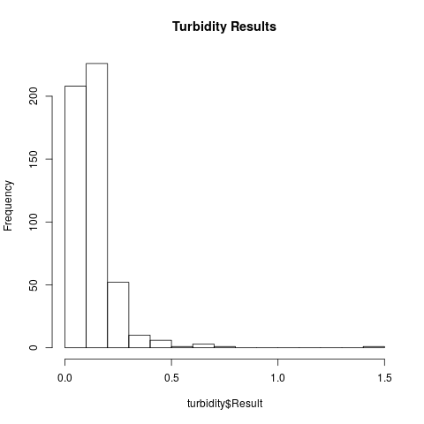
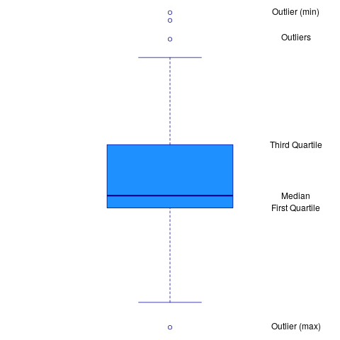
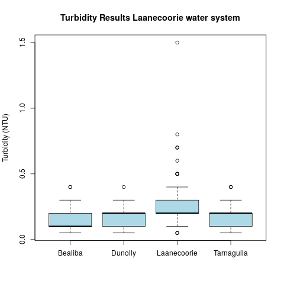

# Introduction to the R Language
R is a programming language for statistical computing and visualisation. This language is developed and maintained through the [R Foundation for Statistical Computing](https://www.r-project.org/foundation/). The R software is open source, which means that anyone can freely download, use, modify and share the software. The open source model relies on communities of developers that continuously improve the software.

Open source software is free. Not free as in free beer, but free as in [freedom](https://www.gnu.org/philosophy/free-sw.html). The people developing open source software also need to be paid, and most projects are not-for-profit organisations funded by organisations that use the software commercially. If your organisation uses R commercially, then I highly recommend considering supporting the R Foundation.

The R language is one of the most popular tools for analysing data. This language includes advanced mathematical capabilities, missing from general-purpose languages. This language also has extensive built-in visualisation capabilities. Furthermore, R can be integrated with many other data science software systems, such as *Power BI*, *Tableau*, *Mathematica*, *MATLAB* and do so on.

This session only gives a cursory overview of the R language with enough theory to solve the case study. This course is only a teaser to motivate water professionals to ditch their spreadsheets and start to write code. For a more systematic introduction to this language, I recommend following one of the many courses available on the internet or read a book. Two recommended sources to systematically learn the basics of the R language in detail are:

* [DataCamp](https://www.datacamp.com/): Free introduction courses and paid advanced courses.
* [R for Dummies](http://rfordummies.com/): Introduction from the well-known *For Dummies* series.

## Using R and RStudio
The best way is to use R in combination with an *Integrated Development Environment* (IDE). The most popular IDE for the R language is [RStudio](https://rstudio.com/). This software is also an open source project, with free and paid versions. 

An integrated development environment is a software application with comprehensive functionality for developing software. An IDE typically consists of at least a source code editor, automation tools, and functionality to make writing and running code easier.

X> Before you continue, make sure you have access to R and RStudio and have downloaded the course files from GitHub.

When you open RStudio for the first time, the window is divided into three panes, each with various tabs. The left pane is the console. The top right pane shows the system environment and the one below that shows a list of files and folders (Figure 2.1).

You can change the default fonts and colours in the *Tools > Global Options > Appearance* menu. Most developers prefer a dark theme with light text because it is more gentle on the eyes than a stark white background. You can also set default font size and magnification to your liking.

X> Open the appearance menu and change the settings to your personal preferences.

{width: 100%}


## Basics of R
Now we are ready to write some code. Move your cursor to the console and type the code examples listed below. Don't copy and paste them because typing the code develops your muscle memory for the R syntax and you some of the experience the features of the text editor.

{format: r, line-numbers: false}
```
3 - 3 * 6 + 2

x <- -10:10
y <- x^2

plot(x, y, type = "l")

a <- c(12, 3, 23, 45, 2, 99, 1, 0)
mean(a)
```

{type: video, align: middle, poster: "https://www.youtube.com/watch?v=roTCgjxpMEg/mqdefault.jpg"}


This code demonstrates some basic features of the language. The first line is a simple, arithmetic problem. After you hit enter, R displays the answer below the line.

The next two lines define the variables `x` and `y`. The values -10 to + 10 are assigned (`<-`) to variable `x`. The `y` variable is given the value of `x^2`$.

The third part plots the variables `x` and `y` as a line, showing the parabola in the plot window. Without the `type ="l"` parameter, the plot consists of points.

The variable `a` is assigned a vector of eight numbers using the `c()` function. The `mean()` function shows the arithmetic mean of the vector `a`.

You should notice a few things when you start typing:

* When you hit enter, the result of the expressions without the `<-` symbol is shown in the console
* When you type plot and mean, R gives you suggestions on how to continue
* When typing brackets or quotation marks, RStudio includes the closing bracket or quotation mark
* The variables you declared (`x`, `y` and `a`) are shown in the Environment window
* The plot appears in a tab of the bottom-right window.

Now retype the plot command, but only type the first two letters and then hit the TAB key. R now gives you suggested functions that start with `pl`. You can use the cursor keys to select the plot function. You can continue this way, and R guides you through the function. This functionality is great for when you forget the specific syntax when writing code.

Another useful function of the console is to use the arrow keys to repeat or modify previous commands.

Now it is your turn to play with the basic syntax of R and functionality of RStudio.

Q> Produce a plot of the function `y=-x^2-2x+3`$.

The formula for determining where the parabola intersects the x-axis is:

```$
x = \frac{-b \pm \sqrt{b^2 - 4ac}}{2a}
```

Q> Use the quadratic formula in the R console. Where does this parabola intersect with the x-axis?

Now it is time to use these basic skills to the first [case study](https://leanpub.com/courses/leanpub/R4H2O/read/3).

## RStudio scripts and projects
The console provides a running record of the actions taken by R. While this is great, using the console makes it hard to reconstruct what steps you have taken to get to your result. To create reproducible code, you need to write your code. 

Create a new R script by going to *File > New File > R Script* or by hitting Control-Shift N.

X> Add the same code as above in the script.

A project is a set of files that relate to each other. RStudio projects divide your work into multiple contexts, each with their own working directory, workspace, history, and source documents. Every time you open a project file, it will be in the same state where you left it when you last closed the program. There are several ways to open a project:

* Using the Open Project command (available from both the Projects menu and the Projects toolbar) to browse for and select an existing project file (e.g. `r4h2o.Rproj`).
* Selecting a project from the list of most recently opened projects (also available from both the Projects menu and toolbar).
* Double-clicking on the project file within Windows Explorer, OSX Finder, or another file manager.

X> Open the project file for this course.

After you open this file, you see the relevant files in the bottom-left window. When you close the project after this session, all variables, the history of your commands and open files are stored for use in a later session.

This section only provides a concise introduction to the basics of the R language and RStudio. The remainder of the workshop introduces further concepts as needed by the case studies.


# Case Study: Water Quality Regulations
The case study for this first session is about assessing compliance with water quality regulations. The data for this case study is a set of turbidity measurements for the [Laanecoorie water network](https://www.coliban.com.au/site/root/your_town/loddon/laanecoorie.html), situated just over 100 km North of Melbourne in Victoria, Australia. The plant extracts water from the Laanecoorie reservoir, situated on the Loddon River.

The water network is divided into four zones, each of which has a set of sample points installed at customer taps in the front of the house. Each of these sample points has a unique identifier that consists of three digits (090 for the Laanecoorie system), a letter to indicate the zone, and two digits to indicate the number of the sample point.

The laboratory service provider regularly samples these taps and tests the water for a range of parameters, including turbidity. All turbidity measurements are recorded for a specific sample point at a certain date. The data set is already cleaned and is ready for analysis.

The states of Australia each have their own water quality regulations. The state regulations all refer to the federal [Australian Drinking Water Quality Guidelines](https://www.nhmrc.gov.au/about-us/publications/australian-drinking-water-guidelines).

The Victorian regulations for water quality, the [Safe Drinking Water Regulations](https://www2.health.vic.gov.au/public-health/water/drinking-water-in-victoria/drinking-water-legislation) 2015, specify that "the 95^th^ percentile of results for samples in any 12 months must be less than or equal to 5.0 Nephelometric Turbidity Units". The regulations also specify that each water quality zone needs to be sampled at least once per week.

In a separate [guidance document](https://www2.health.vic.gov.au/Api/downloadmedia/%7BA1F6D255-D5C7-4B7E-AAE5-8B7451EDE81A%7D), the Victorian regulator also specifies that the percentile for turbidity should be calculated with the 'Weibull Method'.

## Turbidity
Turbidity is a measurement of the cloudiness of the water. In drinking water, the higher the turbidity level, the higher the risk that consumers develop gastrointestinal diseases. Particles in the water scatter light, which is used to measure turbidity with a nephelometer (from the Greek nephéla, "cloud"). Turbidity is expressed in dimensionless Nephelometric Turbidity Units (NTU). The video below gives a detailed overview of how to measure turbidity in liquids.

{type: video, align: middle, poster: "https://www.youtube.com/watch?v=qz8xHQJw6qY/mqdefault.jpg"}

    
## Problem Statement
You are writing the annual report to the regulator about the Laanecoorie system. What was the 95^th^ percentile of turbidity for each of the water zones in the system?

## Methodology
Good data science needs to be valid and reliable. The validity and reliability of the measurements in this case study relates to the design, installation and maintenance of the instrument to measure turbidity.

The soundness of good data science also requires an appropriate methodology to be used to analyse the data. This case study has some specific requirements concerning how to analyse the data. The guidance document from the regulator raises two questions: What is the Weibull method? How do you implement this method in R?

The basic process to determine a percentile is a three-step process (McBride, [2005](http://amzn.to/2k8shr8)):

1. Rank into ascending order (`X_1, X_2, \ldots , X_n`$).
2. Determine the rank (`r`$) of the required percentile.
3. The percentile is the value in position `r`$. When the rank is not an integer, interpolate between two values `X_{r-1}`$ and `X_{r+1}`$.

With 52 ranked weekly turbidity samples, the 95^th^ percentile is between sample 49 and 50 (`0.95 \times 52`$). However, this method is only valid for normally-distributed samples. Statisticians have defined several methods to determine percentiles. The difference between these methods is determining the rank `r`$. Hyndman & Fan ([1996](https://www.researchgate.net/publication/222105754_Sample_Quantiles_in_Statistical_Packages)) give a detailed overview of nine methods of calculating percentiles or quantiles. These nine methods are incorporated into R, as discussed below. 

This paper gives the Weibull method the less poetic name `\hat{Q}_6(p)`$ because it is the sixth option in their list. Waloddi Weibull, a Swedish engineer famous for his statistical distribution, was one of the first to describe this method. The rank of a percentile `p`$ is given by:

```$
r_{weibull} = p(n + 1)
```

For a sample of 52 turbidity tests, the percentile thus lies between ranked result number 50 and 51. This method is suitable for highly skewed samples, as is often the case with water quality data.

Please note that there is no correct way to calculate percentiles. The most suitable method depends on the distribution of the population. In this case study, the method is prescribed by the regulator.

Q> You have received 99 turbidity results from the laboratory. The first 94 are 0.1 NTU, and the last five are 5 NTU. What is the 95^th^ percentile using the Weibull method?

## Analysing the case study
The sections below explain how to analyse an example data set with turbidity data for compliance with the Victorian Safe Drinking Water Regulations. The data and the code is available in the [GitHub](https://github.com/pprevos/r4h2o/) repository. Before we can start determining the relevant statistics, we need to load and explore the data. 

The code is available in the `session2` folder in the `casestudy1.R` file. You can find the answers to the questions in the last section of the course. The best way to learn the material is to type all the examples and assignments in your file.

X> Create a new R file for this case study in RStudio.

### Load the data
The data is stored in a CSV file, which the `read.csv` file can read. The text between quotation marks is the path to the file. The path is relative to the working folder, so in this case, we need to add the folder and the file name. Note that R uses the forward slash, common in Unix systems, and not the Windows backslash (`\`) to form a path.

{format: r, line-numbers: false}
```
turbidity <- read.csv("session2/turbidity_laanecoorie.csv")
```

The turbidity data is now visible in the *Environment* tab. The turbidity data is a 'data frame', which is a tabular set of data with rows and columns, very much like a spreadsheet.

R can read many types of data. Some specialised extensions can be used to connect R to Excel spreadsheets, SQL databases, scrape websites, and many other sources. The `extract_data.R` file in the case study folder shows how the turbidity data was extracted from an SQL server.

Many organisations maintain spreadsheets with data as their single source of truth. If a spreadsheet is indeed your only solution to store data, you should stick to some simple rules to be able to easily use it in R or any other data science package:

* Use the top row as a header
* Don't use colours to indicate values
* Prevent using spaces in column names
* Don't add any calculations in the data tab

Following these guidelines, you can store your data in a clean way that makes analysing the results with R much more straightforward. The data in this case study complies with these guidelines and has the following fields:

* `Date_Sampled`: The sampling date.
* `Sample_No`: Reference number of the sample.
* `System`: name of the water system.
* `Zone`: The zone within the water system.
* `Sample_Point`: The reference number of eh sample point.
* `Result`: The result of the laboratory test.
* `Units`: The units of the result (NTU).

### Inspect the data
The next step is to see what is in the data. When you type the name of the variable in the console, R displays the data up to the first 1000 rows. This method is not an effective method to view large sets because the data scrolls quickly across the screen. R has a series of functions to inspect data frames in more detail.

The `head` function only shows the first half dozen rows of the data, which prevents the screen from scrolling away. R also includes the `tail` function, that shows the last rows of a data frame.

The `names` function displays the names of the columns as a vector of character strings. You can also use this function to rename the variables in a data frame.

The `dim` function shows the number of rows and columns.

The `View` function (note the capital V) opens the data in a separate read-only window. This function is the most convenient way to inspect the data. You can also view the data this way by clicking on the variable name in the Environment tab. You cannot edit the data, but you can sort the information by column by clicking o the variable name.

{format: r, line-numbers: false}
```
head(turbidity)

names(turbidity)

dim(turbidity)

View(turbidity)
```

Q> Use the `nrow` and `ncol` functions to determine the size of the data frame.

Lastly, the `str` function provides a succinct overview of the fields in the data set, including the data types. When executing this function on the turbidity data we see:

{format: r, line-numbers: false}
```
> str(turbidity)
'data.frame':    508 obs. of  7 variables:
 $ Date_Sampled: Factor w/ 127 levels "2017-01-05","2017-01-11",..: 124 124 124 107 92 92 92 89 78 78 ...
 $ Sample_No   : int  6075624 6075623 6075626 5923634 5797980 5605791 5605792 ...
 $ System      : Factor w/ 1 level "Laanecoorie": 1 1 1 1 1 1 1 1 1 1 ...
 $ Zone        : Factor w/ 4 levels "Bealiba","Dunolly",..: 2 3 1 1 3 1 4 1 3 2 ...
 $ Sample_Point: Factor w/ 24 levels "090A01","090A02",..: 13 2 21 21 3 21 15 24 1 7 ...
 $ Result      : num  0.1 0.2 0.1 0.1 0.2 0.3 0.2 0.2 0.2 0.2 ...
 $ Units       : Factor w/ 1 level "NTU": 1 1 1 1 1 1 1 1 1 1 ...
```

This table means that `turbidity` is a data frame with 508 observations (rows) and 7 variables (columns). The `Date_Sampled`, `System`, `Zone`, `Sample_Point` and `Units` are factors. 

You can also obtain this information by clicking on the triangle next to the variable name in the Environment tab.

R converts most character strings to factors to save memory and to assist with analysis. Factors are beneficial in repetitive data. The levels of the factors are the unique values within the data. In this data, there is only one system, and there are four zones and 24 sample points. 

The levels are numbered by default in alphabetical order. The `levels()` function displays the levels in a factor. This function can also change the labels of the levels.

The `Sample_No` is an integer variable, which makes sense because we expect most of these values to be unique for each observation.

The sample date is expressed in a factor because R sees it as a character string in the first instance. The dates are formatted following the [ISO 8601](https://www.iso.org/iso-8601-date-and-time-format.html) standard (YYYY-MM-DD). For example, 27 September 2012 is represented as 2012-09-27.

For R to understand which date comes before the next, we need to convert this variable. R has extensive functionality for working with dates, which is covered in Case Study 3.

### Explore the data
To view any of the variables within a data frame, you need to add the column name after a `$`, e.g. `turbidity$Result`. When you execute this command, R shows a vector of the selected variable. You can use this vector in calculations, as explained below.

If you want to use only a subset of a vector, you can indicate the index number between square brackets. For example: `turbidity$Results[1:10]` shows the first ten results.

R has various ways to view or analyse a subset of the data. The most basic way is to add the number of the row and column between square brackets. For example, `turbidity[1:10, 4:5]` shows the first ten rows and the fourth and fifth variable. When there is no value in either the place for the rows or the columns, R shows all values. 

{format: r, line-numbers: false}
```
turbidity[, 4:5]  ## Show all rows with column four and five
turbidity[1:10, ] ## Show all variables for the first ten rows
```

This syntax can also include the names of variables, e.g. `turbidity[1:10, c("Zone", "Result")]` shows the first ten rows of the one and the result.

In summary, you can subset a vector data frame by adding an index number between square brackets. For vectors, you add one number to indicate the element number. For a data frame, you use two numbers: `[rows, columns]`. When you omit either the row or column number, R shows all available values.

Please note that R is a mathematical language and the index numbers thus start at one. In generic programming languages, the index starts at zero. Besides numerical values, you can also add formulas as indices.

Q> What is the result of the last sample taken in the turbidity? Hint, use the `nrow()` function/

You can also filter the data using conditions. If, for example, you like to see only the turbidity data for the Bealiba water quality zone, then you can use the following two methods:

{format: r, line-numbers: false}
```
turbidity[turbidity$Zone == "Bealiba", ]
subset(turbidity, Zone == "Bealiba")
```

The first method looks similar to what we discussed above. The row indicator now shows an equation. When you execute the line between brackets separately, you see a list of values that are either `TRUE` or `FALSE`. These values indicate whether the variable at that location meets the condition. For example, the following code results in a vector with the values TRUE and FALSE.

{format: r, line-numbers: false}
```
a <- 1:2
a == 1
```

The second method uses the `subset()` function, which is a bit more convenient than using square brackets. The first parameter in this function is the data frame, and the second parameter is the condition. Note that this method is tidier than the brackets method because we don't have to add the data frame name and `$` to the variables.

You can build elaborate conditionals by combining more than one condition. Some of the most common options are:

* `==`, `!=`: Equal to or not equal to.
* `<`, `>`, `>=`, `<=`: Inequality.
* `&`, `|`, AND, OR.

For example, `turbidity[turbidity$Zone == "Laanecoorie" & turbidity$Result > 1, ]` shows the samples in Laanecoorie larger than 1 NTU. Note that testing for equality requires two equal signs.

In the next case study, we dig deeper into manipulating and filtering data using the Tidyverse libraries.

Q> How many turbidity results in Bealiba are lower than to 0.1 NTU?

### Visualise the data
The fastest way to explore data is to visualise it. R has extensive built-in visualisation function, some of which we explore below. The [R Graph Gallery](https://www.r-graph-gallery.com/) provides some guidance on the available methods.

X> Use the Chart Chooser or the R Graph Gallery to determine the best way to visualise the data.

Given the requirements n the regulations, we need to visualise the distribution of the results for each zone. We only have a single variable, which leads us to a histogram.

The `hist()` function plots a histogram of a vector of integers or numerical values. The breaks option in this function defines the number of bars in the graph. The results of the turbidity tests have a maximum value of 1.5 NTU, so to get bars at 0.1 NTU, the number of breaks needs to be 15. The variable `b` in the code below calculates the size of the bars by dividing the maximum value by the desired resolution (Figure 2.2).

{format: r, line-numbers: false}
```
b <- max(turbidity$Result) / 0.1
hist(turbidity$Result, breaks = b, main = "Turbidity Results")
```
{width: "60%", alt: "Histogram of turbidity results."}


The regulations apply separately to each water quality zone, so we need to subset the data before plotting.

Q> Plot the histogram of each of the Laanecoorie water quality zone.

Subsetting the data for each zone is tedious. One of the visualisations not listed on the *Chart Chooser* is the boxplot. This versatile visualisation summarises the distribution of numerical data (Figure 2.3).

{width: "50%", alt: "Boxplot anatomy."}


* The line that divides the box indicates the median.
* The ends of the box shows the upper (`Q3`$) and lower (`Q1`$) quartiles. The difference between quartiles 1 and 3 is the interquartile range (`IQR`$)
* The lines show `Q3-1.5 \times IQR`$ to `Q1+1.5 \times IQR`$ (the highest and lowest value, excluding outliers).
* Dots beyond the lines shows outliers.

The boxplot function includes a convenient way to group the results by a factor variable. To achieve this, use the tilde `~` symbol to indicate the variable that is analysed and the variable by which it is grouped, as shown below. Because the data option indicates the data frame, we don't have to use the `$` indicator. The `main` and `ylab` options add text to the plot, as shown below and in figure 2.4.

{format: r, line-numbers: false} 
```
boxplot(Result ~ Zone, data = turbidity, col = "lightblue",
        main = "Turbidity Results Laanecoorie water system",
        ylab = "Turbidity (NTU)")
```
{width: "50%", alt: "Distribution of turbidity results."}


Each of these visualisation functions has extensive options to change the plot, which are outside the scope of this course. In the next two case studies, we explore the powerful visualisation functionality of the Tidyverse extension to the R language.

### Analyse the data
While a plot provides a quick overview of the data, we need to numerically analyse the results to find the values to report to the regulator. R has extensive functionality to analyse data. We already saw the `mean()` function that calculates the arithmetic mean of a vector.

Q> What is the mean turbidity value for the samples in Bealiba?

Another helpful function is `summary()` which shows six basic statistics: the minimum value, the first quartile, median, mean, third quartile and the maximum.

Q> What is the third quartile for the turbidity of sample point 090A01?

The `quantile()` function calculates the percentiles of a vector of numbers. The default setting gives five values, similar to the `summary()` function. The quantile function can also take a vector of one or more probabilities to calculate different outcomes, for example `quantile(turbidity$Result, c(0.50, 0.95))` results in:

{line-numbers: false} 
```
50% 95% 
0.2 0.3
```

The regulator has specified that we need to calculate the 95^th^ percentile with the Weibull method. The quantile function has access to all nine formulas described by Hyndman & Fan (1996). As we saw above, the Weibull method is the sixth option, which we can pass as a parameter.

{format: r, line-numbers: false} 
```
quantile(turbidity$Result, 0.95, method = 6)
```

In this particular case, the results are not very skewed, so all methods give the same result. 

One last function to review is a more convenient way to analyse subsets of the data. The `aggregate()` function splits the data into subsets, computes summary statistics for each, and returns the result in a data frame. For example, to determine the maximum turbidity value for each water quality zone, we use:

{format: r, line-numbers: false} 
```
aggregate(turbidity$Result, list(turbidity$Zone), max)
```

The first argument in this function is the data vector, and the second argument is a list of the grouping variables. In this case, we only have one, but it can be more. The function that is applied to the groups is the third parameter, followed by this function's parameters.

We now have all the knowledge to answer the original question.

Q> Determine the 95^th^percentile using the Weibull method for all water quality zones in Laanecoorie.

## Water Quality Regulations
Now it is time to complete the first quiz. After you complete the quiz, we continue with cleaning and visualising data using the Tidyverse and a [case study](https://leanpub.com/courses/leanpub/R4H2O/read/4) about customer perception.

{quiz, id: casestudy1, attempts: -1}
# Quiz 1: Water Quality Regulations
The project folder for this case study includes a file named `gormsey.csv`. This file contains fictitious water quality data. The names of the towns were randomly generated using the [Fantasy Names Generator](https://www.fantasynamegenerators.com/town_names.php) website. The lab results are based on real data but have been manipulated to provide more interesting results.

X> Using the Gormsey data, answer the following questions using R code.

? What year was that video from?

What year? Really? Did it really take that long? What was going on???

a) 2012
b) 2013
C) 2014
d) 2015

{words: 500}
? Why do you think the first version of the Markua spec took so long?

Look at the Leanpub website and read the [pricing essay](https://leanpub.com/pricing).

! Answers could include "bootstrapped startup", the spec evolving, removing HTML mapping, etc.

That's it for this quiz, and this MOOC!

**Thanks for taking my course!**
{/quiz}

