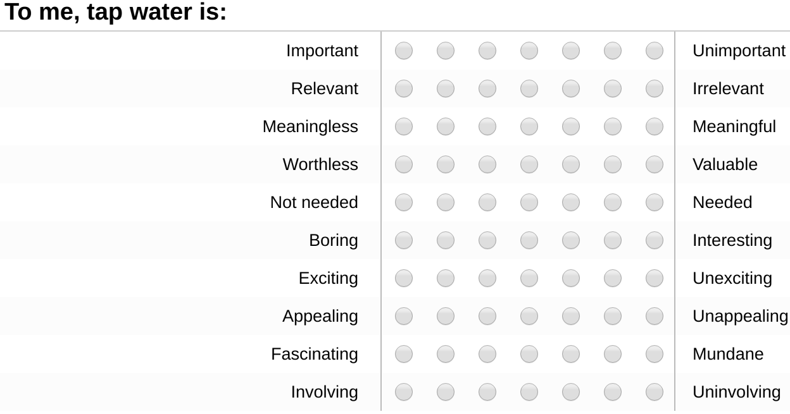
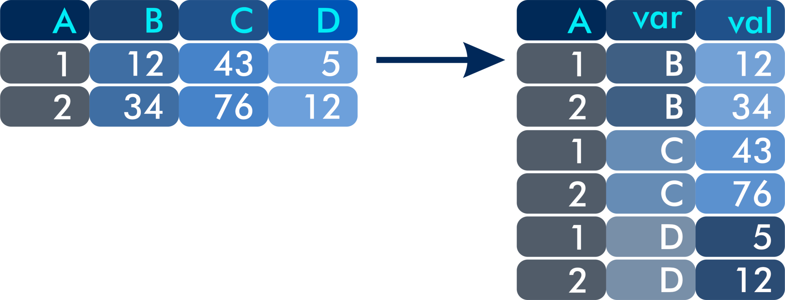
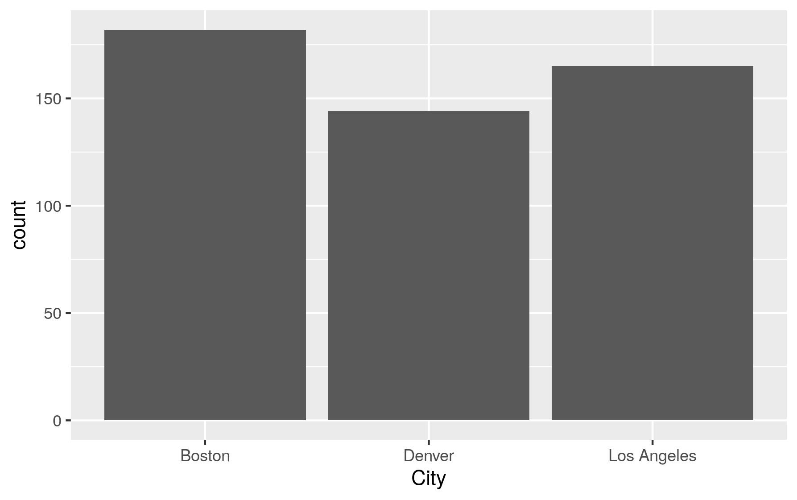

# Welcome to the Tidyerse
One of the most exciting aspects of the R language is that developers can write extensions, the so-called packages or libraries. R has a large community of users who develop code and make it freely available to other users in the form of packages. 

Thousands of specialised packages undertake a vast range of specialised tasks. You can, for example, use R as a GIS and analyse spatial data or implement machine learning. Other packages help you to access data from various sources, such as SQL databases.

The majority of R packages are available on [CRAN](https://cran.r-project.org/), the *Comprehensive R Archive Network*.

## Packages for water management
The CRAN library contains many packages with functions to analyse water. This workshop does not cover any of these packages. The list below gives some examples:

* [baytrends](https://cran.r-project.org/web/packages/baytrends/index.html): Long Term Water Quality Trend Analysis.
* [biotic](https://cran.r-project.org/web/packages/biotic/index.html): Calculation of Freshwater Biotic Indices.
* [CityWaterBalance](https://cran.r-project.org/web/packages/CityWaterBalance/index.html): Track Flows of Water Through an Urban System.
* [driftR](https://cran.r-project.org/web/packages/driftR/index.html): Drift Correcting Water Quality Data.
* [EmiStatR](https://cran.r-project.org/web/packages/EmiStatR/index.html): Emissions and Statistics in R for Wastewater and Pollutants in Combined Sewer Systems.

## The Tidyverse
One of the most popular series of packages is the [Tidyverse](https://www.tidyverse.org/), developed by Kiwi R guru Hadley Wickham and many others.

The Tidyverse packages provide additional functionality to extract, transform, visualise and analyse data. The additional functionality provided by these packages is easier to use than the base R code, and it creates code that is easy to understand.

This case study focuses on cleaning and visualising customer data. The next case study uses Tidyverse to analyse smart metering data.

You can install packages in R with the `install.packages` function. Within RStudio you can install packages in the *Tools* menu. Before you can start using a library, you need to initiate it with the `library()` command.

T> Install the Tidyverse collection of packages using `install.packages(tidyverse)`. When completed, initiate it with `library(tidyverse)`.

Installing the complete Tidyverse can take a little while, depending on your computer and the operating system. If you have problems installing, make sure that you are connected to the internet, and that your firewall or proxy don't block [cloud.r-project.org](https://cloud.r-project.org/).

When you load the Tidyverse, the following packages are loaded by default:
* [dplyr](https://dplyr.tidyverse.org/): Data manipulation.
* [ggplot2](https://ggplot2.tidyverse.org/): Visualise data.
* [forcats](https://forcats.tidyverse.org/): Working with factor variables.
* [purrr](https://purrr.tidyverse.org/): Functional programming. 
* [readr](https://readr.tidyverse.org/): Read and write CSV files.
* [stringr](https://stringr.tidyverse.org/): Manipulate text.
* [tibble](https://tibble.tidyverse.org/): Replacement for data frames.
* [tidyr](https://tidyr.tidyverse.org/): Data transformation.

Some data scientists prefer not to load the complete set of packages and choose to load each one separately to spare computer memory. This course does not discuss the purrr, stringr or forcats libraries. Many other packages are available that follow the principles of the Tidyverse.

The startup message also shows some warnings about conflicts with some of the base functionality, which we can ignore for now. 

The Tidyverse developers frequently update the software. You can see if updates are available, and optionally install them, by running `tidyverse_update()`. You can also update packages in the *Tools > Check for Package Updates* in RStudio.

The next [case study](https://leanpub.com/courses/leanpub/R4H2O/read/5) looks at data collected from tap water consumers in the United States and introduces the Tidyverse principles using this data.

# Case Study 2: Understanding Customer Perception
This second case study uses date from a dissertation on [water utility marketing](http://hdl.handle.net/1959.9/561679). This research included a survey of American tap water consumers to measure their perception of tap water services. The survey included ten questions to measure consumers' involvement with tap water services.

## Consumer Involvement
Consumer involvement is an essential metric in marketing to describe the relevance a product or service has in somebody's life. People who own a car will most likely be highly involved with purchasing and owning the car due to a large amount of money involved and the social role it plays in developing their public self. Consumers will most likely have a much lower level of involvement with the instant coffee they drink than with the clothes they wear. More formally, consumer involvement can be defined as a person's perceived relevance of the object based on inherent needs, values, and interests.

From a managerial point of view, consumer involvement is vital because it is causally related to willingness to pay and perceptions of quality. Consumers with a higher level of involvement are willing to pay more for a service and have a more favourable perception of quality.

Understanding involvement in the context of urban water supply is also important because sustainably managing water as a common pool resource requires the active involvement of all users. The level of consumer involvement depends on a complex array of factors, which are related to psychology, situational factors and the marketing mix of the service provider. The lowest level of involvement is considered a state of inertia, which occurs when people habitually purchase a product without comparing alternatives.

Cult products have the highest possible level of involvement because customers are devoted to the product or brand. Commercial organisations use this knowledge to their advantage by maximising the level of consumer involvement through branding and advertising. This strategy is used effectively by the bottled water industry. Manufacturers focus on enhancing the emotional aspects of their product rather than on enhancing the cognitive aspects. Water utilities tend to use a reversed strategy and emphasise the cognitive aspects of tap water, the pipes, plants and pumps, rather than trying to create an emotional relationship with their consumers.

## Problem Statement
The fact that water is essential to life suggests that consumers of tap water have a high level of involvement with the service. Contrary to this common-sense intuition, practitioner experience and literature state that tap water is a low-involvement service. However, the level of consumer involvement with [tap water services](https://www.researchgate.net/publication/326533830_We_Care_About_Water_Even_If_You_Don%27t_Water_As_a_Low_Involvement_Service) has until now, not been empirically verified. Determine the level of consumer involvement, using the data from the American tap water consumers.

## Methodology
A commercial survey service provider recruited the respondents, who were paid for their participation. The questionnaire consisted of [four pages](resources/session3/customer_survey.pdf), which respondents accessed through a website. 

The first page introduced the research and asked respondents to provide their consent to participate. Respondents who did not provide consent were exited from the survey. Due to the broad geographical spread of potential respondents on the American survey panel, respondents were also required to complete two screening questions. The first question related to their place of residence and the second question asked whether they had tap water at home. Only customers located in Los Angeles, Denver or Boston and those with tap water connections continued to the next page of the questionnaire. Other respondents were excluded from the survey.

The second page consisted of questions about the level of involvement respondents have with tap water. These questions use the Personal Involvement Inventory developed by Judity Zaichkowsky ([1994](https://www.sfu.ca/~zaichkow/JA%252094.pdf)). The involvement items close with an open text item asking customers: "If you have any additional comments about your views on tap water, please enter them below". 

The Personal Involvement Inventory consists of two dimensions:  cognitive involvement (importance, relevance, meaning, value and need) and affective involvement 
(involvement, fascination, appeal, excitement and interest).

The involvement part of the survey uses a semantic differential scale. This method requires respondents to choose on a scale between two antonyms (figure 3.1). This type of survey measures the meaning that people attach to a concept, such as a product or service. The items were presented in a random order to each respondent. The words on the right indicate a high level of involvement. Fiver questions have a reversed polarity, which means that the left side indicates a high level of involvement (Figure 3.1).

{width: 60%}


The penultimate page started with two items related to the customer's relationship with their service provider. Customers were asked to indicate whether they struggle to pay their water bills when they fall due, using a seven-point Likert scale from "Strongly Disagree" to "Strongly Agree". 

The second question asked customers to indicate the frequency at which they contact their utility for support, also using a seven-point Likert scale: 
* Never
* Less than Once a Month
* Once a Month
* 2-3 Times a Month
* Once a Week
* 2-3 Times a Week
* Daily

One of the problems with using paid survey subjects is that they are motivated to complete many surveys, without having much regard for the content. American respondents were therefore also subjected to an attention filter: "If you live in the U.S. select Strongly Agree". The survey was only sent to people within the United States, so everybody should respond equally. Any respondent not answering "Strongly Agree" is excluded from the survey. This approach was used to remove inattentive respondents and assure the reliability of the results. 

The survey closed with eighteen service quality questions, which were measured using a seven-point Likert scale from "Strongly Disagree" to "Strongly Agree". The items were presented in random order. The final item of the questionnaire consisted of an open question which invited customers to provide additional comments about their tap water supplier.

If you are interested reading more about a scientific view of customer experience in water utilities, then you can read *Customer Experience Management for Water Utilities* by Peter Prevos, available from [IWA Publishing](https://www.iwapublishing.com/books/9781780408668/customer-experience-management-water-utilities-marketing-urban-water-supply).

## Analysing the Case Study
The `Customer_Perception_USA.csv` file provided in the `session3` folder is the raw data exported from the [Qualtrics](https://qualtrics.com/) survey platform. This session explains how to clean and visualise the data using the Tidyverse. The code in this section is available in the `casestudy2.R` script. You start the analyses by loading the Tidyverse packages using `library(tidyverse)`.

## Load the data
The readr package of the Tidyverse has an alternative function to read and write CSV files. This function is faster than the base R version. This function looks almost the same, except for the underscore. One of the advantages of this function is that it is better able to guess the correct data format than the base R function.

{format: r, line-numbers: false}
```
rawdata <- read_csv("session2/Customer_Perception_USA.csv")
names(rawdata)
```

We use the `rawdata` variable because we want to keep this data intact as we process it, in case we need to use it again.

In Tidyverse, rectangular data is not a data frame, as in base R code, but a 'tibble'. This odd term is a pun on how the word table sounds in a New Zealand accent.

The first 19 columns contain metadata about the data collections, such as a unique response ID, IP addresses, start and end times, and so on. The next 35 columns contain the actual data. Columns 5 and 56 contain the latitude and longitude of the respondent, based on their IP address. The last field provides information on the accuracy of the location.

X> View the data in the console.

A tibble is like a data frame, but with some extra functionality. When you ask to display it in the console, the text does not scroll away like in the standard version but shows only the first set of columns that fits horizontally and only shows the first ten rows. The text below this summary informs us about the data that is not displayed.

Q> How many rows and columns of data does this data have?

### Clean the data
Looking at the data, we also see that the first two rows contain header information. A tidy data set should only have one header row. Because of the double headers, R thinks that all columns are text.

We need to remove the first row and any irrelevant columns and re-assess the data types to create a clean table.

{format: r, line-numbers: false}
```
customers <- rawdata[-1, ]
customers <- type_convert(customers)
str(customers)
```

The first line of code creates the new `customers` variable by removing the first line of the raw data. It is good practice to keep raw data and processed data in separate variables. The `type_convert` function re-assesses the data to ensure it has the correct types. Using the `str` function, we can see that most columns are now numerical values, which is what we want them to be. 

The next step is to remove any respondents that either:
* Failed the attention filter
* Did not consent
* Does not have tap water
* Does not live in one of the three nominated cities
* Quit the survey before completion

The Qualtrics survey software stores this information in the `term` field. To summarise the content of this field, we can use the basic `table()` function. This function creates a table of all the elements in a vector and gives the number of occurrences.

{format: r, line-numbers: false}
```
table(rawdata$term)
```

You might notice that the total number of items in the table does not match the number of rows. When you view the content of this field, you see many entries with `NA` in them. These are empty values (Not Available). R uses this code to be able to manage missing values better — more about missing values in the next case study.

After reviewing the data, we can conclude that we only want those rows of data that have an `NA` value in the `term` field.

In the dplyr package of Tidyverse, the `filter()` function conditionally chooses rows of a data frame. For example, using `filter(customers, term == "attention")` results in a data frame with only those entries that failed the attention filter. In the filter function, we don't have to repeat the data frame name and can specify the variable name.

In our case we want all values with NA. To find these we need to use a special function, as shown below. The `is.na()` function results in a logical value (TRUE or FALSE) that shows whether the field is not available. Try `is.na(customers$term)` to see the result.

{format: r, line-numbers: false}
```
customers <- filter(customers, is.na(term))
```

The Qualtrics data contains metadata that we don't need for further analysis. The first 19 columns contain information about when the survey was taken and so on and the last two columns are irrelevant. The next step is to filter the data, so we only use the first column as a unique ID and columns 20 to 56.

Q> How would you remove the unnecessary columns using base R code?

In the dplyr package, the `select()` function that works just like the filter function, but for columns. You can use numbers or names to indicate the required columns.

{format: r, line-numbers: false}
```
customers <- select(customers, c(1, 20:56))
```

We are close to a clean data set. The first column has the `city` variable, which at the moment is just the integer 1, 2, or 3. These numbers correspond to the order in the drop-down box in the survey. The options were:

1. Los Angeles
2. Denver
3. Boston. 

First, we create a new tibble to link the numbers with towns, which is then joined to the main data. 

The `left_join` function finds the matching fields in the two sets and then merges the sets. This function keeps all the values in the left data set. The Tidyverse has several other [join functions](https://dplyr.tidyverse.org/reference/join.html) that match values differently. You can also define the fields on which you want to match the data frames.

{format: r, line-numbers: false}
```
cities <- tibble(city = 1:3,
                 city_name = c("Los Angeles", "Denver", "Boston"))
customers <- left_join(customers, cities)
```

This sequence of commands creates a clean data set for further analysis. This code contains a lot of repetition because we change the `customers` variable several times in a sequence. In a spreadsheet, these steps are often merged in one formula:

{format: r, line-numbers: false}
```
left_join(select(filter(type_convert(rawdata[-1, ]), is.na(term)), c(1, 20:56)), cities)
```

While the nested approach takes less space, it is not as easy to understand because you have to read from the inside out instead of from left to right.

The Tidyverse uses a pipe (`%>%`) to simplify this process. A pipe transports the output of one process to the input of the next process. The code used to clean the customer data is now written like this:

{format: r, line-numbers: false}
```
customers <- rawdata[-1, ] %>%
    type_convert() %>%
    filter(is.na(term)) %>%
    select(c(1, 20:56)) %>%
    left_join(cities)
```

Q> Use the pipe construct to exclude the data from Los Angeles from the customer data and only retain the first twelve columns.

We have cleaned the data for the whole survey, but before we continue, we need to take one more step because we are for now only interested in the Personal Involvement Index (PII).

This code selects the `city_name` column and renames it to City. It also selects all columns that start with a lowercase p.

The second line reverses the value of five of the items that were presented in reverse order, as explained in the introduction.

{format: r, line-numbers: false}
```
pii <- select(customers, City = city_name, starts_with("p", ignore.case = FALSE))
pii[, c(2, 3, 8, 9, 10, 11)] <- 8 - pii[, c(2, 3, 8, 9, 10, 11)]
```

## Tidy Data
Although the data for the Personal Involvement Index is now clean, it is not yet 'tidy'.





## Visualise the data
The Tidyverse set of packages contains `ggplot2`, one of the most powerful visualisation tools available. This package implements a layered approach to visualising data, which simplies building complex graphics. This session introduces the basic functionality of ggplot using the consumer involvement data.

The basic ggplot function starts with the name of the data set and then a range of aesthetics. The aesthetics consist of the fields that will be used to visualise the data. The second part tells ggplot which geom to use. A geom is a type of visualisation. The ggplot library has many possible geoms. The example below shows a simple bar plot for the number of respondents from each city.

{format: r, line-numbers: false}
```
ggplot(pii, aes(City)) + geom_bar()
```



This function creates a simple greyscale plot because we only should add colour to a visualisation when it expresses data. You can force ggplot to use a colour by using `geom_bar(fill = "blue")`, or any other colour which you might fancy.

Q> Add your favourite colour to the bar plot.

The ggplot library implements the principles of the Grammar of Graphics. This grammar provides a structured approach to defining data visualisations using four aspects:

* Data and the aesthetic mapping
* Geometric objects (lines, bars and so on)
* Scales
* Facets of the visualisation

We will discuss each of these step[ by step to build a complete visualisation of the PII data.

The ggplot function always takes a data frame or tibble as its first option. In base-R graphics, the data is always a vector, but ggplot uses rectangular data.

The aesthetic mapping defines which variables in the data frame are visualised. The mapping depends on the geometric objects. The aesthetics are at least one variable, for example 


## Assignment
