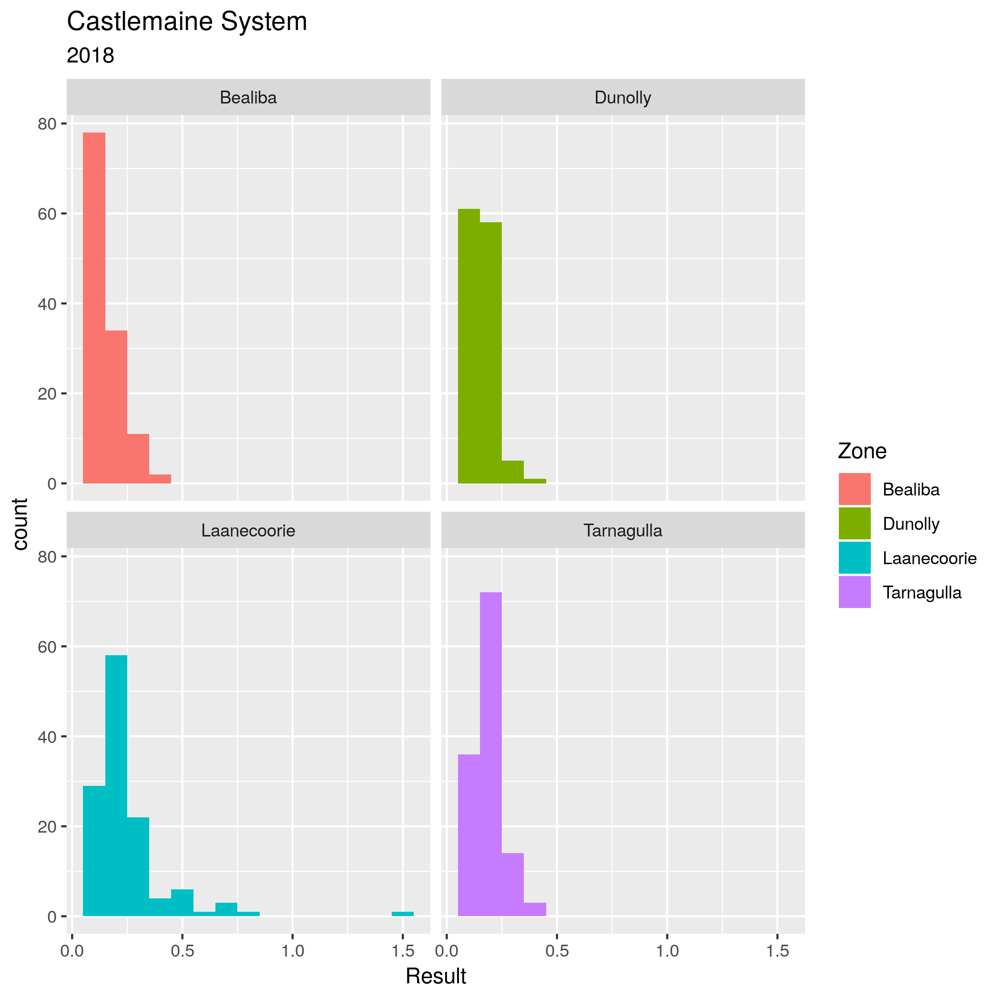

# R for Water Utility Professionals
# Dr Peter Prevos

Managing reliable water services requires not only a sufficient volume of water but also significant amounts of data. Water professionals continuously measure the flow and quality of the water and how customers perceive their service. Data and water are natural partners. Water utilities are awash, or even flooded with data. Data professionals use data pipelines and data lakes and cause data to flow from one place to another.

This GitHub repository contains the instructions, examples and data sets for an introduction to writing data science code for water professionals. This one-day workshop introduces participants to analysing data using the [R language](https://www.r-project.org/about.html) for statistical computing.

This repository is a work-in-progress that will be completed in the second week of July 2019. The instructions for the course will be available as an ebook from the LeanPub website.

The day opens with an introduction to the principles of data science and the R language. The structure of each of the three two-hour sessions of the workshop is:

* Realistic water management examples
* Water management case study
* Suggestions for further study

This workshop is not an exhaustive introduction into data science programming but merely a teaser to inspire water professionals to [ditch the spreadsheet](https://lucidmanager.org/spreadsheets-for-data-science/) and start writing code to create value from data.
 
The contents of this workshop are for a significant part based on articles of the [Lucid Manager](https://lucidmanager.org/hydroinfromatics/) website by Peter Prevos.

# Workshop Contents
Each of the three two-hour session includes a case study using realistic water utility data. The sessions start with a problem statement about the relevant case study. Participants have to load, transform, explore and analyse the data to solve the problem.

## Session 1: Introduction to data science programming
This first session starts with an introduction to the principles and best practice in data science. This session also introduces the basics of the R language to undertake simple statistical analysis.

This session uses water quality laboratory testing data from a drinking water network. Participants use this data to assess descriptive statistics and compliance with regulations.

## Session 2: Processing Data
The Tidyverse is an extension of the R language that provides additional functionality that simplifies analysing data. In the second session, participants learn how to clean and explore data.

The case study for this data are the results of a survey among American consumers about their perception of water services. Participants use this data set to clean, transform and visualise the data.

## Session 3: Analysing data
In the last session, participants will analyse an extensive data set to find anomalies in the water consumption data.

The case study for this session is simulated smart meter data for a water system. This data also contains simulated leaks and other anomalies.

# Prerequisites
To follow participate in this workshop, you need to have some understanding of the issues surrounding water management and experience with analysing data. Experience with writing computer code is helpful, but not required. 

## R and R Studio
You will also need access to a recent version of the R language and RStudio.

The best way to access the R language is by downloading the latest version from the website of the [R Project for Statistical Computing](https://www.r-project.org/). RStudio is an IDE (Integrated Development Environment) that simplifies working with R and data. You can download a free version of this software from the [RStudio](https://www.rstudio.com/) website. Follow the instructions on these websites to complete the installation. You will need to install the R language before you install the IDE.

Alternatively, you can sign-up for a free account to access the [cloud version](https://rstudio.cloud/) of R Studio. This account will give you full access to R Studio and R in your browser without the need to install any software. The cloud version is fully functional but not very fast. Installing R and RStudio on your own laptop is the preferred method.

## Downloading the workshop material
If you are participating in the workshop, you can download the documents by clicking on the 'clone or download' button and unzip the files to your computer. You can open the RStudio project file to begin the workshop and start playing with the data and code.

For those using the cloud version of RStudio, click on the arrow next to the 'New Project' button and select 'New Project from GitHub Repo'. Copy the URL of this repository in the text field and hit enter. After a little while, RStudio will open the project.

If you understand how to use Git, then feel free to fork and clone the repository. Feel free to create an issue or pull request if you find errors or like to provide additional content.
